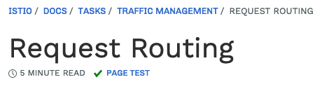

| Site | Status
|------|-------
| istio.io | [](https://app.netlify.com/sites/istio/deploys)
| preliminary.istio.io | [](https://app.netlify.com/sites/preliminary-istio/deploys)
| archive.istio.io | [](https://app.netlify.com/sites/archive-istio/deploys)

## istio.io

This repository contains the source code for [istio.io](https://istio.io) and
[preliminary.istio.io](https://preliminary.istio.io).

Please see the main Istio [README](https://github.com/istio/istio/blob/master/README.md)
file to learn about the overall Istio project and how to get in touch with us. To learn how you can
contribute to any of the Istio components, please
see the Istio [contribution guidelines](https://github.com/istio/community/blob/master/CONTRIBUTING.md).

- [Editing and building](#editing-and-building)
- [Versions and releases](#versions-and-releases)
    - [How versioning works](#how-versioning-works)
    - [Publishing content immediately](#publishing-content-immediately)
    - [Creating a major/minor release](#creating-a-majorminor-release)
    - [Creating a patch release](#creating-a-patch-release)
- [Testing document content](#testing-document-content)
- [Multi-language support](#multi-language-support)
- [Regular maintenance](#regular-maintenance)
- [Custom Pages](./CUSTOM_PAGES.md)

## Editing and building

To learn how to edit and build this repo's content, please refer to
[Creating and Editing Pages](https://preliminary.istio.io/about/contribute/creating-and-editing-pages/).

## Versions and releases

Istio maintains two variations of its public site.

- [istio.io](https://istio.io) is the main site, showing documentation for the current release of the product.
[istio.io/archive](https://istio.io/archive) contains snapshots of the documentation for previous releases of the product. This is useful for customers still using these older releases.

- [preliminary.istio.io](https://preliminary.istio.io) contains the actively updated documentation for the next release of the product.

The user can trivially navigate between the different variations of the site using the gear menu in the top right
of each page. Both sites are hosted on [Netlify](https://netlify.com).

### How versioning works

- Documentation changes are primarily committed to the master branch of istio.io. Changes committed to this branch
are automatically reflected on preliminary.istio.io.

- The content of istio.io is taken from the latest release-XXX branch. The specific branch that
is used is determined by the istio.io [Netlify](https://netlify.com) project's configuration.

### Publishing content immediately

Checking in updates to the master branch will automatically update preliminary.istio.io, and will only be reflected on
istio.io the next time a release is created, which can be several weeks in the future. If you'd like some changes to be
immediately reflected on istio.io, you need to check your changes both to the master branch and to the
current release branch (named `release-<MAJOR>.<MINOR>` such as `release-1.7`).

This process can be taken care of automatically by our infrastructure. If you submit a PR
to the master branch and annotate the PR with the `cherrypick/release-<MAJOR>.<MINOR>` label,
then as soon as your PR is merged into master, it will be merged into the specified release branch.

### Creating a major/minor release

Here are the steps necessary to create a new documentation version. Let's assume the current
version of Istio is 1.6 and you wish to introduce 1.7 which has been under development.

#### When Istio source code is branched

Run `make prepare-1.7.0`, and that's it. This will grab the latest reference docs from the new istio source branch into the `content/en/docs/reference` folder.

#### Approaching the day of the release

1. For a dry run before official release, run `make release-1.7.0-dry-run`, which will only create a new branch `release-1.7-dry-run` and not touch any other branches.

1. On the day of release, run `make release-1.7.0`. This make target will change some variables in `master` and `release-1.6`, and create a new branch `release-1.7` for the new version.

1. Go to the istio.io project on [Netlify](https://netlify.com) and do the following:

    - Change the branch that is built from the previous release's branch to the new release branch, in this case `release-1.7` (or `release-1.7-dry-run` as appropriate).

    - Select the option to trigger an immediate rebuild and redeployment.

    - Once deployment is done, browse istio.io and make sure everything looks good.

1. Go to the [Google Custom Search Engine](https://cse.google.com) and do the following:

    - Download the istio.io CSE context file from the Advanced tab.

    - Add a new FacetItem at the top of the file containing the previous release's version number. In
    this case, this would be `V1.6`.

    - Upload the updated CSE context file to the site.

    - In the Setup section, add a new site that covers the previous release's archive directory. In this
    case, the site URL would be `istio.io/v1.6/*`. Set the label of this site to the name of the
    facet item created above (`V1.6` in this case).

### Creating a patch release

A few days before the patch release, the release managers should notify the Doc WG that the release
is built and is starting it's long running qualification test. At this time, move the doc automation
tests to use the new release to verify automated doc testing passes.

To move to a new release (make sure you are in the patch's release branch):

1. Run `go get istio.io/istio@A.X.Y && go mod tidy`.

1. Create a PR with the `go.*` changes.

Creating a new patch release involves modifying a few files:

1. Edit `data/args.yml` and change the `full_version` field to `"A.X.Y"`. This is only needed for a patch of the `current` release.

1. Complete the release note for the release by editing the markdown file `content/en/news/releases/A.X.x/announcing-A.X.Y/index.md`. This is where you describe the changes in the release. Please look at other existing files for example content and layout.

1. Run `make update_ref_docs` to get the latest reference docs. Normally, this is only needed for a patch of the `current` release. If needed in an earlier release, see [Updating an archive](#updating-an-archive).

### Updating an archive

If the archived version in a newer branch (e.g., `release-1.7:archive/v1.6`) needs to be updated due to changes in the old release branch (`release-1.6` in this case), you can run `make build-old-archive-1.6.0` in the `master` branch, which will re-archive `release-1.6` and substitute it for the previous archive in the `master` branch. If this update needs to be reflected in istio.io, the PR may be cherry-picked to the branch for the `current` release.

### Updating the test reference for a given release stream

The release streams starting with `release-1.6` contain tests for the test content. Each release tests against
a particular istio version/commit. When the release team has a build, `1.x.y`, ready for their long running
tests, they should come to the docs team to have the testing for that release run start running against the
build.

There are two types of builds, `public` and `private`. The normal dev and release builds are built from our
public repos and have images in a publicly accessible repository and are considered `public`. `Private` builds
are those where we can't reveal much before release. Typically it's an advance notice that a release will
happen in two weeks for CVEs. Since we can't reveal anything before the actual release, the source and built
images are in private repos. As the source and images are private, we can't actually move to them until they
are publicly released, and thus there is no early testing of the release in istio.io. The difference for
`private` builds is that the images we test against were never created in the `public` gcr.io repository, so
in that case we use the docker.io images. One may ask why we don't always use the release images from
docker.io. Since we want to test `public` builds before they are released, the images don't yet exist on
docker.io.

For public builds:
1. Get the istio/istio commit that was used for the build from https://gcsweb.istio.io/gcs/istio-release/releases/1.x.y/manifest.yaml file.
1. In the release branch:  Run `go get istio.io/istio@commit && go mod tidy`.

For private builds (this is done after the build is released):
1. In the release branch:  Run `go get istio.io/istio@1.x.y && go mod tidy`.

For both builds, we want to verify that the HUB/TAG are correct in the Makefile.core.mk (they change depending on if using the private or public builds). Look for the section similar to:
```
# If one needs to test before a docker.io build is available (using a public test build),
# the export HUB and TAG can be commented out, and the initial HUB un-commented
HUB ?= gcr.io/istio-testing
# export HUB ?= docker.io/istio
# export TAG ?= 1.7.3
```
For public builds, the `export HUB/TAG`s would be uncommented and have correct values. For private builds,
or the `master` branch, the HUB would be uncommented.

Finally, create and submit a PR with the changes and one can see the test results in the PR. Normally,
the PR won't actually merge until the release is released (sometimes there are multiple builds for a
release).

## Testing document content

Many documents on the Istio site demonstrate features using commands that may or may not continue to work as
Istio evolves from release to release. To ensure the documented instructions stay up to date with as little
continuous manual testing as possible, we have created a framework to automate the testing of these documents.

Every page on [istio.io](https://istio.io) that can be tested includes a `PAGE TEST` indication under
the page title. For example:



A green checkmark indicates an automated test is available for the page. The page is up to date and working as
documented.

A grey X, on the other hand, means that there is no automated test available for the page, yet.
We'd appreciate it if you'd like to help create one! Our goal is to eventually have an automated test in place
for every testable document published on the Istio site.

See the [tests README](tests/README.md) for more information.

## Multi-language support

The site is translated into multiple languages. Source of truth is the English content, while other languages are
derived and so tend to lag behind slightly. Each site language gets its own fully self-contained content directory
and translation table file. Languages are identified using their international 2-letter language code. The main
site content is located in `content/<language code>` (e.g. `content/en`), and the translation table is a TOML-format
file in `i18n\<language code>.toml` (e.g. `i18n/en.toml`).

Getting started with translation is fairly simple:

- Create a full copy of the `content/en` directory for your language. For example, you'd copy `content/en` to `content/fr` if you
were doing a French translation.

- Update all the links in your new content directory to point to your content directory instead of to the English content.
For example, if you were doing a French translation you would change links such as `[a doc](/docs/a/b/c)` to
`[a doc](/fr/docs/a/b/c)`.

- Remove all the `aliases` directives in the front-matter of all content pages. Aliases are used when moving a page
to a new location, so they're not desirable for brand new content.

- Create a copy of the `i18n/en.toml` file for your language. For example, you'd copy `i18n/en.toml` to `i18n/fr.toml` if you were doing
a French translation. This file contains the text that is displayed by the site infrastructure for things like menus, and other
standard material.

- Edit the file `hugo.toml` to list your new language. Search for the `[languages]` entry and just add a new entry. This
tells the Hugo site generator to process your content.

- Edit the file `scripts/lint_site.sh` and search for `check_content`. Add another call to `check_content` for your
new content directory. This ensures that the linting rules apply to your new content.

- Edit the file `src/ts/lang.ts` and add your new language. This will add your language to the language toggle button that is
available on preliminary.istio.io and will make it so your language will be supported in the language selection menu.

- Get an Istio GitHub administrator to create a new maintainer team for your language. For French, this would be
`WG - Docs Maintainers/French`.

- Edit the file `CODEOWNERS` and add entries for your language to give the new team you've created ownership over
the translated content and translation table file.

You can then commit all of these changes and you can start translating the content and the translation file in a purely
incremental fashion. When you build the site, you'll find your content at `<url>/<language code>`. For example, once you've
checked everything in, you should be able to get to your content at `https://preliminary.istio.io/fr` if you were doing a
French translation.

Once your translation is complete and you're ready to publish it to the world, there are a few other changes you need to make:

- Edit the file `layouts/index.redir`. Search for `translated sites` and add a line for your language. This will cause
users coming to the site for the first time to be automatically redirected to the translated content suitable for them.
For French, this would be:

    ```
    /  /fr   302  Language=fr
    ```

- Edit fhe file `layouts/partials/headers.html`. Search for `switch-lang` and you'll find the definitions for the language selection
menu. Add a line for your new language.

And that's it.

## Regular maintenance

We have a number of checks in place to ensure a number of invariants are maintained in order to
help the site's overall quality. For example, we disallow checking in broken links and we do spell
checking. There are some things which are hard to systematically check through automation and instead
require a human to review on in a while to ensure everything's doing well.

It's a good idea to run through this list before every major release of the site:

- Ensure that references to the Istio repos on GitHub don't hardcode branch names. Search for any uses of `/release-1` or `/master`
throughout all the markdown files and replace those with  instead, which produces a version-appropriate
branch name.

- Review the .spelling file for words that shouldn't be in there. Type names in particular tend to creep in here. Type names should
not be in the dictionary and should instead be shown with `backticks`. Remove the entries from the dictionary and fix any spell
checking errors that emerge.

- Ensure proper capitalization. Document titles need to be fully capitalized (e.g. "This is a Valid Title"),
while section headings should use first letter capitalization only (e.g. "This is a valid heading").

- Ensure that preformatted text blocks that reference files from the Istio GitHub repos use the @@ syntax
to produce links to the content. See [here](https://istio.io/about/contribute/creating-and-editing-pages/#links-to-github-files)
for context.
