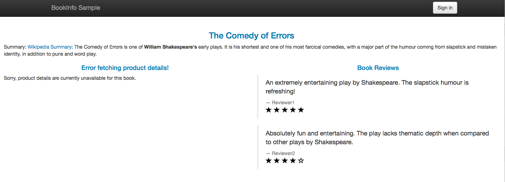
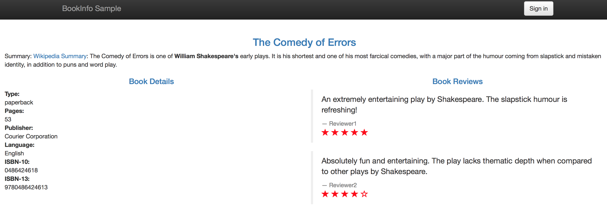
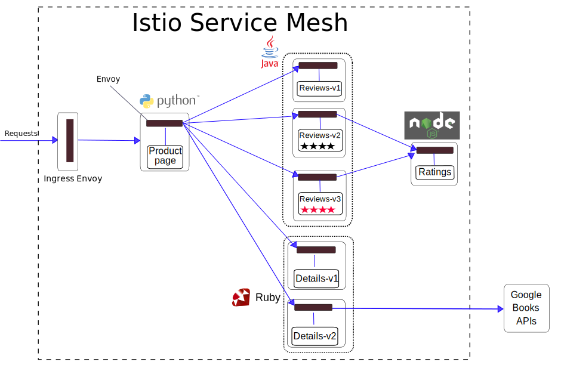



In many cases, not all the parts of a microservices-based application reside in a Service Mesh. Sometimes, the microservices-based applications use functionality provided by legacy systems that reside outside the Mesh. We may want to migrate these systems to the Service Mesh gradually. Until these systems are migrated, they must be accessed by the applications inside the mesh. In other cases, the applications use web services provided by external organizations, often over the World Wide Web.

In this blog post I will modify [Istio Bookinfo Sample Application]({{home}}/docs/guides/bookinfo.html) to fetch book details from an external web service ([Google Books APIs](https://developers.google.com/books/docs/v1/getting_started)). I will show how to enable external HTTPS traffic in Istio by using an Egress Rule. I will explain the current issues related to the Egress Traffic control in Istio.

## Bookinfo Sample Application with External Details Web Service

### Initial Setting
To demonstrate the scenario of consuming an external web service, I will start with a Kubernetes cluster with [Istio installed]({{home}}/docs/setup/kubernetes/quick-start.html#installation-steps). Then I will deploy [Istio Bookinfo Sample Application]({{home}}/docs/guides/bookinfo.html). This application uses the _details_ microservice to fetch book details, for example the number of pages and the publisher. The original _details_ microservice provides the book details without consulting any external service.

The example commands in this blog post will work with Istio version 0.2+, with or without [Mutual TLS](https://istio.io/docs/concepts/security/mutual-tls.html) enabled.

The Bookinfo configuration files required for the scenario of this post appear starting from [Istio release version 0.5](https://github.com/istio/istio/releases/tag/0.5.0).
The Bookinfo configuration files reside in the `samples/bookinfo/kube` directory of the Istio release archive.

I will copy here the end-to-end architecture of the application from the original [Bookinfo Guide]({{home}}/docs/guides/bookinfo.html).

<figure>
<figcaption>The Original Bookinfo  Application</figcaption></figure>

### Bookinfo with Details Version 2
Let's add a new version of the _details_ microservice, _v2_, that fetches the book details from [Google Books APIs](https://developers.google.com/books/docs/v1/getting_started).

```bash
kubectl apply -f <(istioctl kube-inject -f samples/bookinfo/kube/bookinfo-details-v2.yaml)
```

The updated architecture of the application now looks as follows:
<figure>
<figcaption>The Bookinfo Application with details v2</figcaption></figure>

Note that the Google Books web service is outside the Istio Service Mesh whose boundaries are marked by a dashed line.

Now let's direct all the traffic to the version _v2_ of the _details_ microservice, using the following Route Rule:

```bash
cat <<EOF | istioctl create -f -
apiVersion: config.istio.io/v1alpha2
kind: RouteRule
metadata:
  name: details-v2
  namespace: default
spec:
  destination:
    name: details
  route:
  - labels:
      version: v2
EOF
```

Let's access the web page of the application, after [determining the ingress IP and Port]({{home}}/docs/guides/bookinfo.html#determining-the-ingress-ip-and-port).

Oops... Instead of the book details we have _Error fetching product details_ message displayed:
<figure>
<figcaption>Error Fetching Product Details Displayed</figcaption></figure>


Good news is that our application did not crash. With a good microservice design we do not have **failure propagation**. In our case the failing _details_ microservice does not cause the _productpage_ microservice to fail. Most of the functionality of the application is still provided despite the failure in the _details_ microservice. We have **graceful service degradation**: as you can see, the reviews and the ratings are displayed correctly, and the application is still useful.

Hmm, so what might have gone wrong? Ah... The answer is that I forgot to enable traffic from inside the mesh to an external service, in this case to the Google Books web service. By default, the Istio sidecar proxies ([Envoy proxies](https://www.envoyproxy.io)) **block all the traffic to destinations outside the cluster**. To enable such traffic, we must define an [Egress Rule]({{home}}/docs/reference/config/istio.routing.v1alpha1.html#EgressRule).

### Egress Rule for Google Books Web Service
No worries, let's define an **Egress Rule** and fix our application.
```bash
cat <<EOF | istioctl create -f -
apiVersion: config.istio.io/v1alpha2
kind: EgressRule
metadata:
  name: googleapis
  namespace: default
spec:
  destination:
      service: "*.googleapis.com"
  ports:
      - port: 443
        protocol: https
EOF
```

Now accessing the web page of the application displays the book details without error:

<figure>
<figcaption>Book Details Displayed Correctly</figcaption></figure>

Note that our Egress Rule allows traffic to any domain matching _*.googleapis.com_, on port 443, using the HTTPS protocol. Let's assume for the sake of example that the applications in our Istio Service Mesh must access multiple subdomains of _gooogleapis.com_, for example _www.googleapis.com_ and also _fcm.googleapis.com_. Our rule will allow traffic to both _www.googleapis.com_ and _fcm.googleapis.com_, since both of them match  _*.googleapis.com_. This **wildcard** feature allows us to enable traffic to multiple domains by a single Egress Rule.

We can query our Egress Rules:
```bash
istioctl get egressrules
```

and see our new Egress Rule in the output:
```bash
NAME		KIND					NAMESPACE
googleapis	EgressRule.v1alpha2.config.istio.io	default
```

We can delete our Egress Rule:
```bash
istioctl delete egressrule googleapis -n default
```

and see in the output of _istioctl delete_ that the Egress Rule is deleted:
```
Deleted config: egressrule googleapis
```

Accessing the web page after deleting the Egress Rule will produce the same error that we experienced before, namely _Error fetching product details_. As we can see, the Egress Rules are defined **dynamically**, as many other Istio configuration artifacts. The Istio Operators can decide dynamically which domains they allow the microservices to access. They can enable and disable traffic to the external domains on the fly, without redeploying the microservices.

## Issues with Istio Egress Traffic Control
### TLS Origination by Istio
There is a caveat to the story. In HTTPS, all the HTTP details (hostname, path, headers etc.) are encrypted, so Istio cannot know the destination domain of the encrypted requests. Well, Istio could know the destination domain by the  [SNI](https://tools.ietf.org/html/rfc3546#section-3.1) (_Server Name Indication_) field. This feature is not yet implemented in Istio. Therefore, currently Istio cannot perform filtering of HTTPS requests based on the destination domains.

To allow Istio to perform filtering of egress requests based on domains, the microservices must issue HTTP requests. Istio then will open HTTPS connection to the destination (perform TLS origination). The code of the microservices must be written differently or configured differently, according to whether the microservice runs inside or outside an Istio Service Mesh. This contradicts the Istio Design Goal of [Maximizing Transparency]({{home}}/docs/concepts/what-is-istio/goals.html). Tough luck, sometimes we must compromise...

The diagram below shows how the HTTPS traffic to external services is performed. On the top, a microservice outside an Istio Service Mesh
sends regular HTTPS requests, encrypted end-to-end. On the bottom, the same microservice inside an Istio Service Mesh must send unencrypted HTTP requests inside a pod, which are intercepted by the sidecar Envoy proxy. The sidecar proxy performs TLS origination, so the traffic between the pod and the external service is encrypted.

<figure>
<figcaption>HTTPS traffic to external services, from outside vs. from inside an Istio Service Mesh</figcaption></figure>

Here is how we code this behavior in the [the Bookinfo details microservice code](https://github.com/istio/istio/blob/master/samples/bookinfo/src/details/details.rb), using Ruby [net/http module](https://docs.ruby-lang.org/en/2.0.0/Net/HTTP.html):
```ruby
uri = URI.parse('https://www.googleapis.com/books/v1/volumes?q=isbn:' + isbn)
http = Net::HTTP.new(uri.host, uri.port)
...
unless ENV['WITH_ISTIO'] === 'true' then
     http.use_ssl = true
end
```

Note that the port is derived by the `URI.parse` from the URI's schema (https://) to be `443`, the default HTTPS port. The microservice, when running inside an Istio Service Mesh, must issue HTTP requests to the port `443`, the port the external service listens to.

When `WITH_ISTIO` environment variable is defined, the request is performed without SSL (plain HTTP).

We set `WITH_ISTIO` environment variable to _"true"_ in the [kubernetes deployment of _details v2_](https://github.com/istio/istio/blob/master/samples/bookinfo/kube/bookinfo-details-v2.yaml), the `container` spec:
```yaml
env:
- name: WITH_ISTIO
  value: "true"
```

#### Relation to Istio Mutual TLS
Note that the TLS origination in this case is unrelated to [the mutual TLS](https://istio.io/docs/concepts/security/mutual-tls.html) applied by Istio. The TLS origination for the external services will work, whether the Istio mutual TLS is enabled or not. The **mutual** TLS secures service-to-service communication **inside** the Service Mesh and provides each service with strong a identity. In the case of the **external services**, we have **one-way** TLS, the same mechanism used to secure communication between a web browser and a web server. TLS is applied to the communication with external services in order to verify the identity of the external server and to encrypt the traffic.

### Malicious Microservices Threat
Another issue is that the Egress Rules are currently **not a security feature**, they only **enable** traffic to external services. For HTTP based protocols, the rules are based on domains. Istio does not check that the destination IP of the request matches the _Host_ header. It means that a malicious microservice inside a Service Mesh could trick Istio to allow traffic to a malicious IP. The trick is to set one of the domains allowed by some existing Egress Rule as the _Host_ header of the malicious request.

Securing egress traffic is currently not supported in Istio and should be performed elsewhere, for example by a firewall or by an additional proxy outside Istio. Right now we in Istio are working to enable applying Mixer security policies on the egress traffic and to prevent the attack described above.

### No Tracing, Telemetry and No Mixer Checks
Note that currently no tracing and telemetry information can be collected for the Egress traffic. Mixer policies cannot be applied. We are working to fix this in the future Istio releases.

## Future Work
In my next blog posts I will demonstrate Istio Egress Rules for TCP traffic and will show examples of combining Routing Rules and Egress Rules.

In Istio, we are working on making Istio egress traffic more secure, and in particular on enabling tracing, telemetry and Mixer checks for the egress traffic.

## Conclusion
In this blog post I demonstrated how the microservices in an Istio Service Mesh can consume external web services via HTTPS. By default, Istio blocks all the traffic to the hosts outside the cluster. To enable such traffic, Egress Rules must be created for the Service Mesh. It is possible to access the external sites by HTTPS, however the microservices must issue HTTP requests while Istio will perform TLS origination. Currently, no tracing, telemetry and Mixer checks are enabled for the egress traffic. Egress Rules are currently not a security feature, so additional mechanisms are required for securing egress traffic. We, in Istio, are working to enable logging/telemetry and security policies for the egress traffic in the future releases.

To read more about Istio Egress Traffic control, see [Control Egress Traffic Task]({{home}}/docs/tasks/traffic-management/egress.html).
