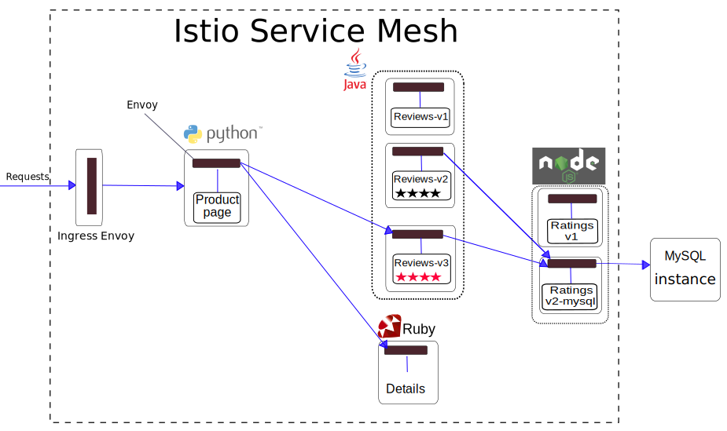
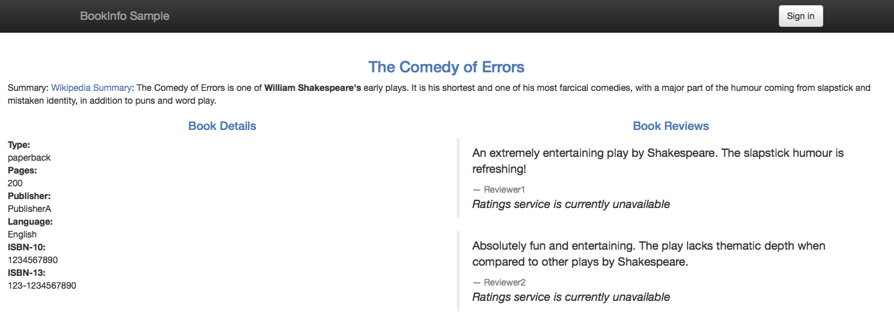
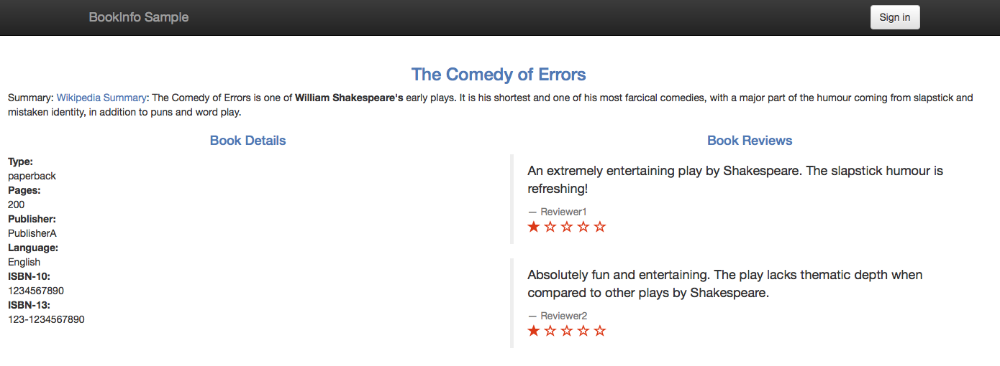



In my previous blog post, [Consuming External Web Services]({{home}}/blog/2018/egress-https.html), I described how external services can be consumed by in-mesh Istio applications via HTTPS. In this post, I will demonstrate how in-mesh Istio applications can consume external applications over TCP. I will use the [Istio Bookinfo Sample Application]({{home}}/docs/guides/bookinfo.html), the version in which the ratings data is persisted in a MySQL database. I will deploy this database outside of the cluster and will configure the _ratings_ microservice to use it. I will define an [egress rule]({{home}}/docs/reference/config/istio.routing.v1alpha1.html#EgressRule) to allow the in-mesh applications access the external database.

## Bookinfo Sample Application with External Ratings Database
First, I set up a MySQL database instance to hold book ratings data, outside my Kubernetes cluster. Then I modify the [Bookinfo Sample Application]({{home}}/docs/guides/bookinfo.html) to use my database.

### Setting up the Database for Ratings Data
For this task I set up an instance of [MySQL](https://www.mysql.com). Any MySQL instance would do, I use [Compose for MySQL](https://www.ibm.com/cloud/compose/mysql). As a MySQL client to feed the ratings data, I use `mysqlsh` ([MySQL Shell](https://dev.mysql.com/doc/refman/5.7/en/mysqlsh.html)).

1. To initialize the database, I run the following command entering the password when prompted. The command is performed with the credentials of the  `admin` user, created by default by [Compose for MySQL](https://www.ibm.com/cloud/compose/mysql).
   ```bash
   curl -s https://raw.githubusercontent.com/istio/istio/master/samples/bookinfo/src/mysql/mysqldb-init.sql | mysqlsh \
   --sql -u admin -p --host <the database host> --port <the database port> --ssl-mode=REQUIRED
   ```

   _**OR**_

   When using the `mysql` client and a local MySQL database, I would run:
   ```bash
   curl -s https://raw.githubusercontent.com/istio/istio/master/samples/bookinfo/src/mysql/mysqldb-init.sql | mysql -u root -p
   ```

2. Then I create a user with the name _bookinfo_ and grant it _SELECT_ privilege on the `test.ratings` table:
   ```bash
   mysqlsh --sql --ssl-mode=REQUIRED -u admin -p --host <the database host> --port <the database port>  \
   -e "CREATE USER 'bookinfo' IDENTIFIED BY '<password you choose>'; GRANT SELECT ON test.ratings to 'bookinfo';"
    ```

    _**OR**_

   For `mysql` and the local database, the command would be:
   ```bash
   mysql -u root -p -e "CREATE USER 'bookinfo' IDENTIFIED BY '<password you choose>'; GRANT SELECT ON test.ratings to 'bookinfo';"
   ```
   Here I apply the [principle of least privilege](https://en.wikipedia.org/wiki/Principle_of_least_privilege). It means that I do not use my _admin_ user in the Bookinfo application. Instead, for Bookinfo application I create a special user with minimal privileges, in this case only the `SELECT` privilege and only on a single table.

   After running the command to create the user, I will clean my bash history by checking the number of the last command and running `history -d <the number of the command that created the user>`. I do not want the password of the new user to be stored in the bash history. If I would use mysql, I would remove the last command from `~/.mysql_history` file as well. Read more about password protection of the newly created user in [MySQL documentation](https://dev.mysql.com/doc/refman/5.5/en/create-user.html).

3. I inspect the created ratings to see that everything worked as expected:
   ```bash
   mysqlsh --sql --ssl-mode=REQUIRED -u bookinfo -p --host <the database host> --port <the database port> \
   -e "select * from test.ratings;"
   Enter password:
   +----------+--------+
   | ReviewID | Rating |
   +----------+--------+
   |        1 |      5 |
   |        2 |      4 |
   +----------+--------+
   ```

   _**OR**_

   For `mysql` and the local database:
   ```bash
   mysql -u bookinfo -p -e "select * from test.ratings;"
   Enter password:
   +----------+--------+
   | ReviewID | Rating |
   +----------+--------+
   |        1 |      5 |
   |        2 |      4 |
   +----------+--------+
   ```

4. I set the ratings temporarily to 1 to provide a visual clue when our database is used by the Bookinfo _ratings_ service:
   ```bash
   mysqlsh --sql --ssl-mode=REQUIRED -u admin -p --host <the database host> --port <the database port>  \
   -e "update test.ratings set rating=1; select * from test.ratings;"
   Enter password:
   +----------+--------+
   | ReviewID | Rating |
   +----------+--------+
   |        1 |      1 |
   |        2 |      1 |
   +----------+--------+
   ```

   _**OR**_

   For `mysql` and the local database:
   ```bash
   mysql -u root -p -e "update test.ratings set rating=1; select * from  test.ratings;"
   Enter password:
   +----------+--------+
   | ReviewID | Rating |
   +----------+--------+
   |        1 |      1 |
   |        2 |      1 |
   +----------+--------+
   ```
   I used the _admin_ user (and _root_ for the local database) in the last command since the _bookinfo_ user does not have the _UPDATE_ privilege on the `test.ratings` table.

Now I am ready to deploy a version of the Bookinfo application that will use my database.

### Initial Setting of Bookinfo Application
To demonstrate the scenario of using an external database, I start with a Kubernetes cluster with [[Istio Bookinfo Sample Application]({{home}}/docs/guides/bookinfo.html) installed]({{home}}/docs/setup/kubernetes/quick-start.html#installation-steps). Then I deploy [Istio Bookinfo Sample Application]({{home}}/docs/guides/bookinfo.html). This application uses the _ratings_ microservice to fetch book ratings, a number between 1 and 5. The ratings are displayed as stars per each review. There are several versions of the _ratings_ microservice. Some use [MongoDB](https://www.mongodb.com), others use [MySQL](https://www.mysql.com) as their database.

The example commands in this blog post work with Istio version 0.3+, with or without [Mutual TLS](https://istio.io/docs/concepts/security/mutual-tls.html) enabled.

### Use the Database for Ratings Data in Bookinfo Application
Let me remind you the end-to-end architecture of the application from the original [Bookinfo Guide]({{home}}/docs/guides/bookinfo.html).

<figure>
<figcaption>The Original Bookinfo  Application</figcaption></figure>

First, I modify the deployment spec of a version of the _ratings_ microservice that uses a MySQL database, to use my database instance. The spec is in `samples/bookinfo/kube/bookinfo-ratings-v2-mysql.yaml` of an Istio release archive. I edit the following lines:

```yaml
- name: MYSQL_DB_HOST
  value: mysqldb
- name: MYSQL_DB_PORT
  value: "3306"
- name: MYSQL_DB_USER
  value: root
- name: MYSQL_DB_PASSWORD
  value: password
```
I replace the values in the snippet above, specifying the database host, port, user and password. Note that the correct way to work with passwords in container's environment variables in Kubernetes is [to use secrets](https://kubernetes.io/docs/concepts/configuration/secret/#using-secrets-as-environment-variables). For this example task only, I write the password directly in the deployment spec. **Do not do it** in a real environment! No need to mention that `"password"` should not be used as a password.

Second, I apply the modified spec to deploy the version of the _ratings_ microservice, _v2-mysql_, that will use my database.

```bash
$ kubectl apply -f <(istioctl kube-inject -f samples/bookinfo/kube/bookinfo-ratings-v2-mysql.yaml)
deployment "ratings-v2-mysql" created
```

Third, I route all the traffic destined to the _reviews_ service, to its _v3_ version. I do this to ensure that the _reviews_ service always calls the _ratings_ service. In addition, I route all the traffic destined to the _ratings_ service to _ratings v2-mysql_ that uses my database. I add routing for both services above by adding two [route rules](https://istio.io/docs/reference/config/istio.routing.v1alpha1.html). These rules are specified in `samples/bookinfo/kube/route-rule-ratings-mysql.yaml` of an Istio release archive.

```bash
$ istioctl create -f samples/bookinfo/kube/route-rule-ratings-mysql.yaml
Created config route-rule/default/ratings-test-v2-mysql at revision 1918799
Created config route-rule/default/reviews-test-ratings-v2 at revision 1918800
```

The updated architecture appears below. Note that the blue arrows mark the traffic allowed by the route rules we added. According to the route rules, the traffic is allowed to _reviews v3_ and _ratings v2-mysql_.

<figure>
<figcaption>The Bookinfo Application with with ratings v2-mysql, an external MySQL database</figcaption></figure>

Note that the MySQL database is outside the Istio service mesh, or more precisely outside the Kubernetes cluster. The boundary of the service mesh is marked by a dotted line.

### Access the Webpage
Let's access the webpage of the application, after [determining the ingress IP and port]({{home}}/docs/guides/bookinfo.html#determining-the-ingress-ip-and-port).

We have a problem... Instead of the rating stars we have the _Ratings service is currently unavailable_ message displayed per each review:
<figure>
<figcaption>The Ratings service is currently unavailable messages</figcaption></figure>

We have the same problem as in [Consuming External Web Services]({{home}}/blog/2018/egress-https.html), namely all the traffic outside the Kubernetes cluster, both TCP and HTTP, is blocked by default by sidecar proxies. To enable such traffic for TCP, an egress rule for TCP must be defined.

### Egress Rule for an External MySQL instance
TCP egress rules come to our rescue:
```bash
cat <<EOF | istioctl create -f -
apiVersion: config.istio.io/v1alpha2
kind: EgressRule
metadata:
  name: mysql
  namespace: default
spec:
  destination:
      service: <MySQL instance IP>
  ports:
      - port: <MySQL instance port>
        protocol: tcp
EOF
```

Note that for a TCP egress rule, we specify `tcp` as the protocol of a port of the rule. Also note that we use an IP of the external service instead of its domain name. I will talk more about TCP Egress Rules [below](#egress-rules-for-tcp-traffic). For now, let's verify that the egress rule we added fixed the problem.

It worked! Accessing the web page of the application displays the ratings without error:

<figure>
<figcaption>Book Ratings Displayed Correctly</figcaption></figure>

Note that we see one star rating for the both displayed reviews, as expected. I changed the ratings to be one star to provide us a visual clue that our external database is indeed used.

As with egress rules for HTTP/HTTPS, we can delete and create egress rules for TCP using `istioctl`, dynamically.

## Motivation for Egress TCP Traffic Control
Some in-mesh Istio applications must access external services, for example legacy systems. In many cases, the access is not performed over HTTP or HTTPS protocols. Other TCP protocols are used, for example database specific protocols [MongoDB Wire Protocol](https://docs.mongodb.com/manual/reference/mongodb-wire-protocol/) and [MySQL CLient/Server Protocol](https://dev.mysql.com/doc/internals/en/client-server-protocol.html) to communicate with external databases.

Note that in case of access to external HTTPS services, as described in the [control egress TCP traffic]({{home}}/docs/tasks/traffic-management/egress.html) task, an application must issue HTTP requests to the external service. The Envoy sidecar proxy attached to the pod or the VM, will intercept the requests and will open an HTTPS connection to the external service. The traffic will be unencrypted inside the pod or the VM, but it will leave the pod or the VM encrypted.

However, sometimes this approach cannot work due to the following reasons:
* The code of the application is configured to use an HTTPS URL and cannot be changed
* The code of the application uses some library to access the external service and that library uses HTTPS only
* There are compliance requirements that do not allow unencrypted traffic, even if the traffic is unencrypted only inside the pod or the VM

In this case, HTTPS can be treated by Istio as _opaque TCP_ and can be handled in the same way as other TCP non-HTTP protocols.

Next let's see how we define egress rules for TCP traffic.

## Egress Rules for TCP Traffic
The egress rules for enabling TCP traffic to a specific port must specify `TCP` as the protocol of the port. Additional non-HTTP TCP protocol currently supported is `MONGO`, the [MongoDB Wire Protocol](https://docs.mongodb.com/manual/reference/mongodb-wire-protocol/).

For the `destination.service` field of the rule, an IP or a block of IPs in [CIDR](https://tools.ietf.org/html/rfc2317) notation must be used.

To enable TCP traffic to an external service by its hostname, all the IPs of the hostname must be specified. Each IP must be specified by a CIDR block or as a single IP, each block or IP in a separate egress rule.

Note that all the IPs of an external service are not always known. To enable TCP traffic by IPs, as opposed to the traffic by a hostname, only the IPs that are used by the applications must be specified.

Also note that the IPs of an external service are not always static, for example in the case of [CDNs](https://en.wikipedia.org/wiki/Content_delivery_network). Sometimes the IPs are static most of the time, but can be changed from time to time, for example due to infrastructure changes. In these cases, if the range of the possible IPs is known, you should specify the range by CIDR blocks, by multiple egress rules if needed, as in the case of `wikipedia.org`,  described in [Control Egress TCP Traffic Task]({{home}}/docs/tasks/traffic-management/egress-tcp.html). If the range of the possible IPs is not known, egress rules for TCP cannot be used and [the external services must be called directly](https://istio.io/docs/tasks/traffic-management/egress.html#calling-external-services-directly), circumventing the sidecar proxies.

## Cleanup
1. Drop the _test_ database and the _bookinfo_ user:
   ```bash
   mysqlsh --sql --ssl-mode=REQUIRED-u admin -p --host <the database host> --port <the database port> -e "drop database test; drop user bookinfo;"
   ```

   _**OR**_

   For `mysql` and the local database:
   ```bash
   mysql -u root -p -e "drop database test; drop user bookinfo;"
   ```
2. Remove the route rules:
  ```bash
  $ istioctl delete -f samples/bookinfo/kube/route-rule-ratings-mysql.yaml
  Deleted config: route-rule/default/ratings-test-v2-mysql
  Deleted config: route-rule/default/reviews-test-ratings-v2
  ```
3. Undeploy _ratings v2-mysql_:
  ```bash
  $ kubectl delete -f <(istioctl kube-inject -f samples/bookinfo/kube/bookinfo-ratings-v2-mysql.yaml)
  deployment "ratings-v2-mysql" deleted
  ```

4. Delete the egress rule:
```bash
$ istioctl delete egressrule mysql -n default
Deleted config: egressrule mysql
```

## Future Work
In my next blog posts I will show examples of combining routing rules and egress rules, and also examples of accessing external services via Kubernetes _ExternalName_ services.

## Conclusion
In this blog post I demonstrated how the microservices in an Istio service mesh can consume external services via TCP. By default, Istio blocks all the traffic, TCP and HTTP, to the hosts outside the cluster. To enable such traffic for TCP, TCP egress rules must be created for the service mesh.

## Further Reading
To read more about Istio egress traffic control:
* for TCP, see [Control Egress TCP Traffic Task]({{home}}/docs/tasks/traffic-management/egress-tcp.html)
* for HTTP/HTTPS, see [Control Egress Traffic Task]({{home}}/docs/tasks/traffic-management/egress.html)
