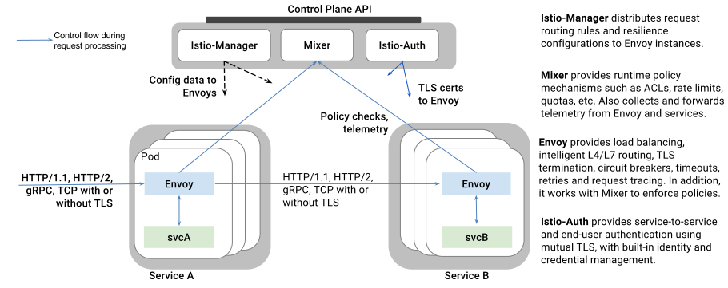


This page presents an architectural overview for the Istio service mesh.




## High-level architecture

### The sidecar model

As monolithic applications are decomposed into a distributed system of microservices that scale dynamically, classic distributed system problems such as 
service discovery, load balancing, and failure recovery become increasingly import to solve uniformly. As the application gains more agility, it transitions
towards a process wherein updates are made to different parts of the application at different times. Developers need the ability to experiment with 
different features in production, or deploy canary releases, without impacting the system as a whole. Operators need to enforce organization-wide policies, 
such as global rate limits, ACLs, etc., without requiring updates to each microservice.

Today, these problems are tackled piecemeal within the industry. Language-specific libraries, such as Ribbon/Hystrix from Netflix’s OSS stack, are used to 
satisfy basic necessities such as discovery, load balancing and circuit breaking. In a polyglot application, organizations need to maintain 
language-specific libraries for every language being used, dramatically increasing the maintenance cost.

A host of API management tools are typically bolted onto the edge of the infrastructure to provide subscription, metering, API metrics monitoring, rate 
limiting, etc. Continuous delivery and experimentation of new features in production is restricted to edge services using an edge proxy (e.g., Zuul/Nginx). 
Policy enforcement between mid-tier services is difficult or impossible as libraries provide little control over how traffic flows between microservices.

Compared to using language-specific libraries, the out-of-process transparent proxy approach has a much lower maintenance overhead. A single proxy 
implementation can be shared across all services in an organization. This single  implementation can be optimized for performance while providing a variety 
of functions beneficial to all services in the application. It eliminates the need for applications to be rebuilt whenever new functionality is available. 
Support for continuous delivery, policy enforcement, and in-depth monitoring of service health can be engineered into the proxy and leveraged across 
different services (edge & middle-tier) with minimal effort on behalf of the application developer.  As the proxy can act as both an edge proxy as well as a
middle-tier router, middle-tier services can also take advantage of the continuous delivery and policy enforcement features provided. By offloading all 
aspects of communication, failure recovery, and policy enforcement to the proxy, the application logic is dramatically simplified.

### Envoy

Istio uses the Envoy proxy, a high-performance proxy developed in C++, to mediate all inbound and outbound traffic for all services in the service mesh. 
Istio leverages Envoy’s many built-in features such as dynamic service discovery, load balancing, TLS termination, HTTP/2 & gRPC proxying, circuit breakers,
health checks, staged rollouts with %-based traffic split, fault injection, and rich metrics. In addition, Istio extends Envoy to interact with Mixer to 
enable policy enforcement and to report telemetry.

### Mixer

Mixer is responsible for enforcing access control and usage policies across the service mesh and collects telemetry data from the Envoy proxy and other 
services. The proxy extracts request level attributes which are sent to Mixer for evaluation. More information on the attribute extraction and policy 
evaluation can be found here. Mixer includes a flexible plugin model enabling it to interface with a variety of host environments and backends, abstracting 
the Envoy proxy and Istio-managed services from these details.

### Istio-Manager

Istio-Manager serves as an interface between the user and Istio, collecting and validating configuration and propagating it to the various Istio components. 
It abstracts environment-specific implementation details from the Mixer and Envoy, providing them with an abstract representation of the user’s services 
that is independent of the underlying platform. In addition, traffic management rules (i.e. generic layer-4 rules and layer-7 HTTP/gRPC routing rules) can 
be programmed at runtime via Istio-Manager.

### Istio-Auth

Istio-Auth provides strong service-to-service and end-user authentication using mutual TLS, with built-in identity and credential management.
It can be used to upgrade unencrypted traffic in the service mesh, and provides operators the ability to enforce policy based
on service identity rather than network controls. Future releases of Istio will add fine-grained access control and auditing to control
and monitor who accesses your service, API, or resource, using a variety of access control mechanisms, including attribute and
role-based access control as well as authorization hooks.




