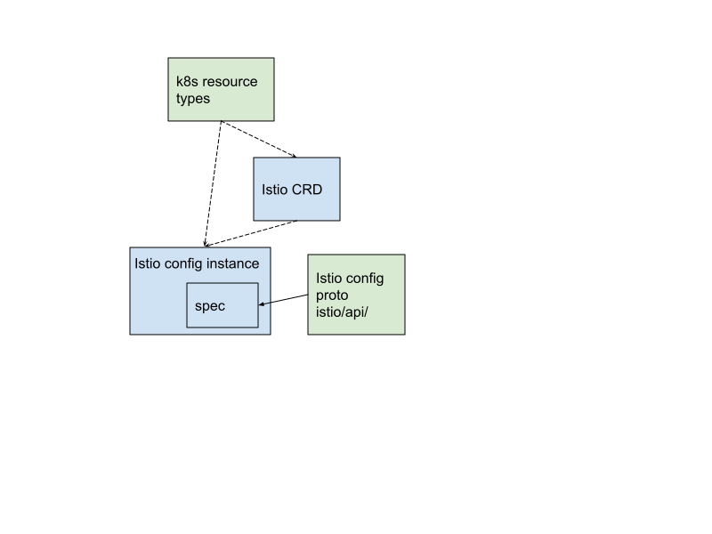

Istio config is a conglomerate of config aspects. Each config aspects is
corresponding to an kubernetes resource. The organization of resources is "flat"
on files representation. The Kubernetes API server stores the config data
according to name and namespace in the hierarchy.

Istio config is completely built on Kubernetes resources. Besides a small set of
installation scripts or docker yaml for other environments), Istio config are
only three kinds:

## Types
A set of configs are for custom defined resources types (CRD). Custom resource spec proto is defined in https://github.com/istio/api.

## Instances
The rest are config instances for a certain type. There is no inheritance or abstraction relationships.

## ConfigMap
ConfigMap is the original Istio config solution. The config is read by Pilot. It
currently contains mesh wide envoy configs and security configs. We try to keep
a minimal set of configs in ConfigMap.

This graph shows the derivative relationships between Istio configuration data
objects.
<figure>
<figcaption>Istio Config Data Model</figcaption></figure>
