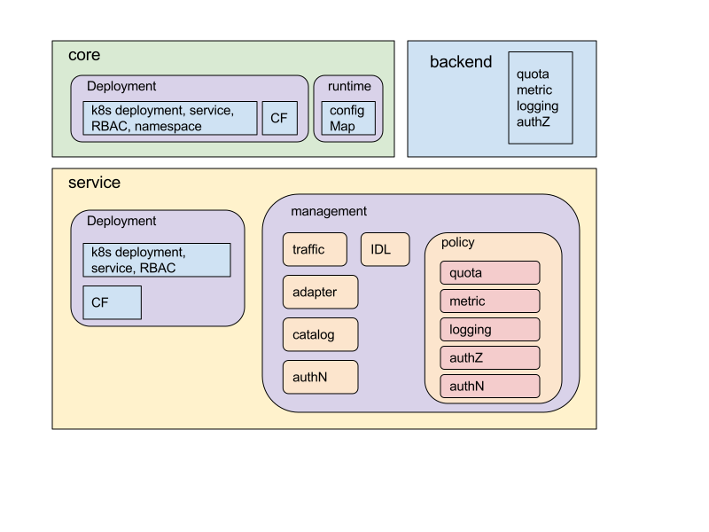

Current Istio config is component oriented. Each component exposes a separate
config spec to the Istio end user. These are what we refer to as Mixer config,
or Pilot config, etc. Another way to look at the config space is to catagorize
them with functions. This graph lays out the catagorization of Istio config and
their relationships. Please find specific config terminology defined in
[Glossary]({{home}}/glossary).

<figure>
<figcaption>Istio Config Functional Space</figcaption></figure>
