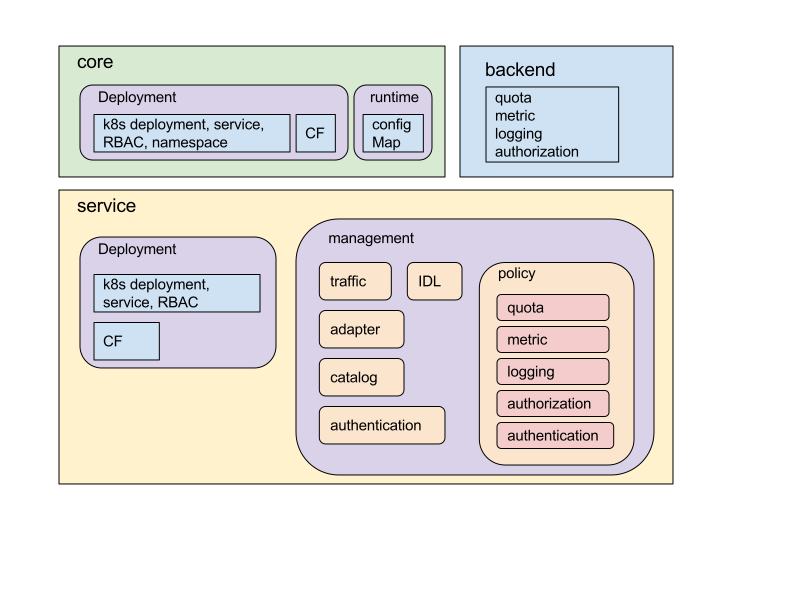



Istio configuration is component oriented. Each component exposes independently
evolved configuration resources to the Istio end user, such as Mixer
configuration.  Another way to understand the configuration is through their
functionality and the entities where they apply on.  Three entities in Istio
receive configurations for mesh functions, core components, mesh services, and
infrastructure backends.  Part of the configuration is static, for installing
the services to the platform. Part of the configuration is dyanmic, for
managinng Istio services (traffic/data) as an application to the platform.
[Deployment configuration](#deployment-configuration) contains all the static
portion. For a Kubernetes installation, all of them are represented as
Kubernetes build-in resources.  The rest are the dynamic configuration, which
defines mesh runtime and service management traffic and policies.
Infrastructure backends that power Istio service management features are
configured as independent services. The following diagram illustrates such
concept. You can find all the configuration terms on this page.

<figure>
<figcaption>Istio Configuration Taxonomy</figcaption></figure>

## Adapter configuration

Configs used by Mixer adapters to forward service management runtime request to
infrastructure backends. Adapter configuration may contain infrastructure backend configuration
runtime paramters, access credentials, and policy definitions. See
[details]({{home}}/docs/reference/config/mixer/adapters).

## API management configuration

Configs for service API management, including [IDL configuration](#idl-configuration) and
[policy configuration](#policy-configuration).

## Authentication configuration

Defines how to mutually identify and establish a secure connection to a
service. The identification includes service identity and end-user
(per-request) identity. Secure communication includes traffic within the mesh
and across mesh boundaries, such as mTLS configurations. Per request authentication
configuration live in Proxy such as JWT token validation.

## Authorization configuration

Istio service resource access policy definition, such as Istio RBAC, defining
who can access which.

## Backend configuration

Backend configuration is not part of [Istio configuration](#istio-configuration). These are the
configurations for Istio infrastructure backends. Backend configuration defines the
management resources, such as quota, monitoring that will be used to accept
runtime control requests from Istio through Mixer adapters. Backend configuration may
live in cloud vendors.

## Catalog configuration

Config for service to expose a standard Open Service Broker Interface (OSBI)
and provide Istio automatic multi-tenancy (AMT) feature. 

## Component configuration

Refer to service [management configuration](#management-configuration) for each Istio core
service component: Proxy, Mixer, Broker, Auth.

## Core configuration

Istio core component configurations. Typically the configurations to install Pilot, Proxy,
Mixer, Broker. Currently it only includes [deployment
configuration](#deployment-configuration). Once Istio components are managed as mesh services
("Istio on Istio"), it will include [management configuration](#management-configuration).

## Deployment configuration

The configuration to deploy Istio component or services. These are environment
specific. On Kubernetes, they are deployment, namespace, service, RBAC,
configMap resources. 

## IDL configuration

Service interface definition, such as API IDL, protocol.

## Istio configuration

Joint space of [core configuration](#core-configuration) and [service configuration](#service-configuration).
Mesh operator can read/write these configurations through [istioctl]({{home}}/docs/reference/commands/istioctl.html).

## Logging configuration

Define log entries, format, and input data.

## Management configuration

The configuration that defines and manages the traffic sent to a service. This
includes [traffic configuration](#traffic-configuration), [catalog configuration](#catalog-configuration),
[IDL configuration](#idl-configuration), [authentication configuration](#authentication-configuration),
[adapter configuration](#adapter-configuration), and [policy configuration](#policy-configuration).

## Mesh configuration

Mesh configuration refers to a particular scoped [service configuration](#service-configuration)
that applies to all services in a mesh.

## Metric configuration

Define metric types, metric instances, and metric rules. 

## Namespace configuration

Namespace configuration refers to a particular scoped [service
configuration](#service-configuration) that applies to all services in a namespace.

## Policy configuration

Define service management policies, including [quota configuration](#quota-configuration),
[metric configuration](#metric-configuration), [logging configuration](#logging-configuration), and
[authorization configuration](#authorization-configuration).

## Quota configuration

Define quota types and quota policies.

## Runtime configuration

Istio mesh runtime configurations, mostly for configuring Envoy runtime. They are
currently configured through configMap resources. See
[details]({{home}}/docs/reference/config/service-mesh.html). 

## Security configuration

Define Istio service security aspects including [authentication
configuration](#authentication-configuration) and [authorization configuration](#authorization-configuration).

## Service configuration

The configurations that apply to a mesh service, to install or control the data flow
that passes in/out of the service. Service configuration includes service [deployment
configuration](#deployment-configuration) and service [management
configuration](#management-configuration). The configurations can be scoped to apply to more than
one service.

## Traffic configuration

Also refered as networking configuration. Defines the mesh service network. This
includes routing rules, destination policy, ingress rules, and egress rules.
See [details]({{home}}/docs/reference/config/traffic-rules).
