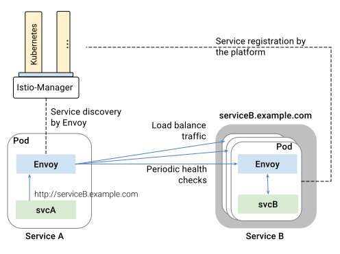

Istio relies on the platform to automatically register pods/containers to
their respective services, as they come online. Envoy performs service
discovery and refreshes its load balancing pools accordingly.

As illustrated in the figure above, services in the mesh access each other
using their DNS names. All HTTP traffic bound to a service is automatically
re-routed through Envoy. Envoy distributes the traffic across instances in
the load balancing pool. While Envoy supports several 
[sophisticated load balancing algorithms](https://lyft.github.io/envoy/docs/intro/arch_overview/load_balancing.html), 
Istio currently allows three load balancing modes: 
round robin, random, and weighted least request.

In addition to load balancing, Envoy periodically checks the health of each
instance in the pool. Envoy follows a circuit breaker style pattern to
classify instances as unhealthy or healthy based on their failure rates for
the the health check API call. In other words, when the number of health
check failures for a given instance exceeds a pre-specified threshold, it
will be ejected from the load balancing pool.
