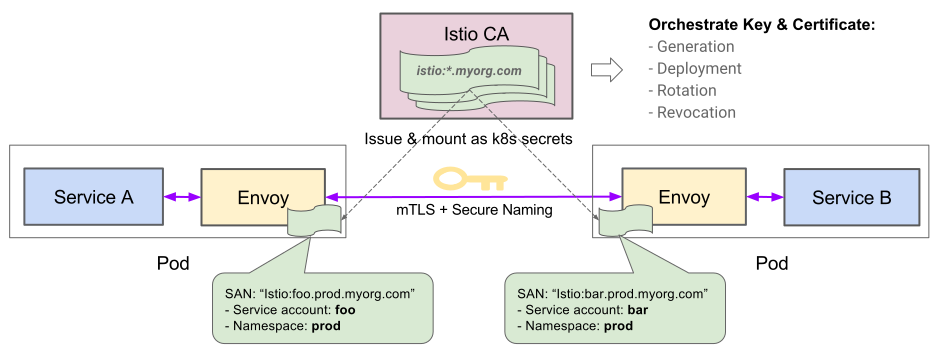

## Overview

Istio Auth's aim is to enhance the security of microservices and their communication without requiring service code changes. It is responsible for:

*   Providing each service with a strong identity that represents its role to enable interoperability across clusters and clouds

*   Securing service to service communication

*   Providing a key management system to automate key and certificate generation, distribution, rotation, and revocation

In future versions it will also provide:

*   Securing end-user to service communication

*   Fine-grained authorization and auditing to control and monitor who accesses your services, apis, or resources

*   Multiple authorization mechanisms: [ABAC](https://en.wikipedia.org/wiki/Attribute-Based_Access_Control), [RBAC](https://en.wikipedia.org/wiki/Role-based_access_control), Authorization hooks

## Architecture

The figure below shows the Istio Auth architecture, which includes three components: identity, key management, and communication security. It describes how Istio Auth is used to secure service-to-service communication between service A, running as service account "foo", and service B, running as service account "bar".

<figure>
<figcaption>Istio Auth Architecture</figcaption></figure>

## Components

### Identity

When running on Kubernetes, Istio Auth uses [Kubernetes service accounts](https://kubernetes.io/docs/tasks/configure-pod-container/configure-service-account/) to identify who runs the service because of the following reasons:

*   A service account is **the identity (or role) a workload runs as**, which represents that workload's privileges. For systems requiring strong security, the amount of privilege for a workload should not be identified by a random string (i.e., service name, label, etc), or by the binary that is deployed.

    *   For example, let's say we have a workload pulling data from a multi-tenant database. If Alice ran this workload, she will be able to pull a different set of data than if Bob ran this workload.

*   Service accounts enable strong security policies by offering the flexibility to identify a machine, a user, a workload, or a group of workloads (different workloads can run as the same service account).

*   The service account a workload runs as won't change during the lifetime of the workload.

*   Service account uniqueness can be ensured with domain name constraint

### Communication security

Service-to-service communication is tunneled through the client side [Envoy](https://envoyproxy.github.io/envoy/) and the server side Envoy. End-to-end communication is secured by:

*   Local TCP connections between the service and Envoy

*   Mutual TLS connections between proxies

*   Secure Naming: during the handshake process, the client side Envoy checks that the service account provided by the server side certificate is allowed to run the target service

### Key management

Istio Auth provides a per-cluster CA (Certificate Authority) to automate key and certificate management. It performs four key operations:

*   Generate a [SPIFFE](https://spiffe.github.io/docs/svid) key and certificate pair for each service account

*   Distribute a key and certificate pair to each pod according to the service account

*   Rotate keys and certificates periodically

*   Revoke a specific key and certificate pair when necessary

## Workflow

Istio Auth workflow consists of two phases, deployment and runtime. This section covers both of them.

### Deployment phase

1.  Istio CA watches Kubernetes API Server, creates a [SPIFFE](https://spiffe.github.io/docs/svid) key and certificate pair for each of the existing and new service accounts, and sends them to API Server. 

1.  When a pod is created, API Server mounts the key and certificate pair according to the service account using [Kubernetes secrets](https://kubernetes.io/docs/concepts/configuration/secret/).

1.  [Pilot]({{home}}/docs/concepts/traffic-management/pilot.html) generates the config with proper key and certificate and secure naming information, 
which
 defines what service account(s) can run a certain service, and passes it to Envoy. 

### Runtime phase

1.  The outbound traffic from a client service is rerouted to its local Envoy. 

1.  The client side Envoy starts a mutual TLS handshake with the server side Envoy. During the handshake, it also does a secure naming check to verify that the service account presented in the server certificate can run the server service. 

1.  The traffic is forwarded to the server side Envoy after mTLS connection is established, which is then forwarded to the server service through local TCP connections.

## Best practices

In this section, we provide a few deployment guidelines and then discuss a real-world scenario. 

### Deployment guidelines

*   If there are multiple service operators (a.k.a. [SREs](https://en.wikipedia.org/wiki/Site_reliability_engineering)) deploying different services in a cluster (typically in a medium- or large-size cluster), we recommend creating a separate [namespace](https://kubernetes.io/docs/tasks/administer-cluster/namespaces-walkthrough/) for each SRE team to isolate their access. For example, you could create a "team1-ns" namespace for team1, and "team2-ns" namespace for team2, such that both teams won't be able to access each other's services.

*   If Istio CA is compromised, all its managed keys and certificates in the cluster may be exposed. We *strongly* recommend running Istio CA on a dedicated namespace (for example, istio-ca-ns), which only cluster admins have access to.

### Example

Let's consider a 3-tier application with three services: photo-frontend, photo-backend, and datastore. Photo-frontend and photo-backend services are managed by the photo SRE team while the datastore service is managed by the datastore SRE team. Photo-frontend can access photo-backend, and photo-backend can access datastore. However, photo-frontend cannot access datastore.

In this scenario, a cluster admin creates 3 namespaces: istio-ca-ns, photo-ns, and datastore-ns. Admin has access to all namespaces, and each team only has 
access to its own namespace. The photo SRE team creates 2 service accounts to run photo-frontend and photo-backend respectively in namespace photo-ns. The 
datastore SRE team creates 1 service account to run the datastore service in namespace datastore-ns. Moreover, we need to enforce the service access control 
in [Istio Mixer]({{home}}/docs/concepts/policy-and-control/mixer.html) such that photo-frontend cannot access datastore.

In this setup, Istio CA is able to provide keys and certificates management for all namespaces, and isolate microservice deployments from each other.

## Future work

*   Fine-grained authorization and auditing

*   Secure Istio components (Mixer, Pilot, etc.)

*   Inter-cluster service-to-service authentication

*   End-user to service authentication using JWT/OAuth2/OpenID_Connect

*   Support GCP service account and AWS service account

*   Non-http traffic (MySql, Redis, etc.) support

*   Unix domain socket for local communication between service and Envoy

*   Middle proxy support

*   Pluggable key management component
