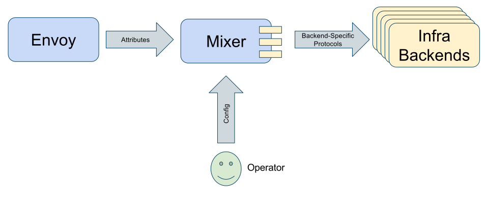



This page describes Mixer's configuration model.

## Background

Istio is a sophisticated system with hundreds of independent features. An Istio deployment can be a sprawling
affair potentially involving dozens of services, with a swarm of Envoy proxies and Mixer instances to
support them. In large deployments, many different operators, each with different scopes and areas of responsibility,
may be involved in managing the overall deployment.

Mixer's configuration model makes it possible to exploit all of its capabilities and flexibility, while
remaining relatively simple to use. The model's scoping features enable large
support organizations to collectively manage complex deployments with ease. Some of the model's key
features include:

- **Designed for Operators**. Service operators control all operational and policy
aspects of a Mixer deployment by manipulating configuration records.

- **Scoped**. Configuration is described hierarchically, enabling both coarse global control as well
as fine-grained local control.

- **Flexible**. The configuration model is built around Istio's [attributes](./attributes.html),
enabling operators unprecedented control over the policies used and telemetry produced within a deployment.

- **Robust**. The configuration model is designed to provide maximum static correctness guarantees to help reduce
the potential for bad configuration changes leading to service outages.

- **Extensible**. The model is designed to support Istio's overall extensibility story. New or custom
[adapters](./mixer.html#adapters)
can be added to Istio and be fully manipulated using the same general mechanisms as existing adapters.

## Concepts

Mixer is an attribute processing machine. Requests arrive at Mixer with a set of [*attributes*](./attributes.html),
and based on these attributes, Mixer generates calls to a variety of infrastructure backends. The set of
attributes determines which backend Mixer calls for a given request and what parameters
each is given. In order to hide the details of individual backends, Mixer uses modules
known as [*adapters*](./mixer.html#adapters).

<figure>
<figcaption>Attribute Machine</figcaption></figure>

Mixer's configuration has two central responsibilities:

- Describe which adapters are being used and how they operate.
- Describe how to map request attributes into adapter parameters.

Configuration is expressed using a YAML format built around five core
abstractions:

|Concept                     |Description
|----------------------------|-----------
|[Adapters](#adapters)       | Low-level operationally-focused configuration for individual mixer adapters.
|[Aspects](#aspects)         | High-level intent-focused configuration for individual mixer adapters.
|[Descriptors](#descriptors) | Description of parameters used with individual aspects.
|[Scopes](#scopes)           | Mechanism to select which aspects and descriptors to use based on a request's attributes.
|[Manifests](#manifests)     | Description of various static characteristics of an Istio deployment.

The following sections explain these concepts in detail.

### Adapters

[Adapters](./mixer.html#adapters) are the foundational work horses that the Istio mixer is built around. Adapters
encapsulate the logic necessary to interface Mixer with specific external infrastructure backends such as [Prometheus](https://prometheus.io),
[New Relic](https://newrelic.com), or [Stackdriver](https://cloud.google.com/logging). Individual adapters
generally need to be provided some basic operational parameters in order to do their work. For example, a logging adapter may need
to know the IP address and port where it's log data should be pumped.

Mixer can use a suite of adapters, and each requires separate configuration parameters.
Here's an example showing how to configure an adapter:

```yaml
adapters:
  - name: myListChecker     # user-defined name for this block of config
    kind: lists             # kind of aspect this adapter can be used with
    impl: ipListChecker     # name of the particular adapter component to use
    params:
      publisherUrl: https://mylistserver:912
      refreshInterval: 60s
```

The `name` field gives a name to the block of adapter configuration so it can be referenced from elsewhere. The
`kind` field indicates the [aspect kind](#aspects) that this configuration applies to.
The `impl` field gives the name of the adapter being configured. Finally, the `params` section is where the
actual adapter-specific configuration parameters are specified. In this case, this is configuring the URL the 
adapter should use in its queries and defines the interval at which it should refresh its local caches.

For each available adapter implementation, you can define any number of independent configuration blocks. This allows the 
same adapter
to be used multiple times within a single deployment. Depending on the situation, such as which service is involved, one
configuration block will be used versus another. For example, here are two more configuration blocks that can coexist
with the previous one:

```yaml
adapters:
  - name: mySecondaryListChecker
    kind: lists
    impl: ipListChecker
    params:
      publisherUrl: https://mysecondlistserver:912
      refreshInterval: 3600s
  - name: myTernaryListChecker
    kind: lists
    impl: genericListChecker
    params:
      listEntries:
        "400"
        "401"
        "402"
```

And yet one more:

```yaml
adapters:
  - name: myMetricsCollector
    kind: metrics
    impl: prometheus
```

This configures an adapter that reports data to the Prometheus system. This adapter doesn't
require any custom parameters and so doesn't have a `params` stanza.

Each adapter defines its own particular format of configuration data. The exhaustive set of
adapters and their specific configuration formats can be found [here]({{home}}/docs/reference/config/mixer/adapters/).

### Aspects

Aspects define high-level configuration (what is sometimes called intent-based configuration),
independent of the particular implementation details of a specific adapter type. Whereas adapters focus
on *how* to do something, aspects focus on *what* to do.

Let's look at the definition of an aspect:

```yaml
aspects:
- kind: lists               # the aspect's kind
  adapter: myListChecker    # the adapter to use to implement this aspect 
  params:
    blacklist: true
    checkExpression: source.ip
```

The `kind` field distinguishes the behavior of the aspect being defined. The supported kinds
of aspects are shown in the following table.

|Kind             |Description
|-----------------|-----------
|quotas           |Enforce quotas and rate limits.
|metrics          |Produce metrics.
|lists            |Enforce simple whitelist- or blacklist-based access control.
|access-logs      |Produces fixed-format access logs for every request.
|application-logs |Produces flexible application logs for every request.
|attributes       |Produces supplementary attributes for every request.
|denials          |Systematically produces a predictable error code.

In the example above, the aspect declaration specifies the `lists` kind which indicates
we're configuring an aspect whose purpose is to enable the use of whitelists or
blacklists as a simple form of access control.

The `adapter` field indicates the block of adapter configuration to associate with this
aspect. Aspects are always associated with specific adapters in this way, since an
adapter is responsible for actually carrying out the work represented by an aspect's
configuration. In this particular case, the specific adapter chosen determines the
list to use in order to perform the aspect's list checking function.

By separating aspect configuration from adapter configuration, it makes it possible to 
easily change the adapter used to implement a particular aspect's behavior without having
to change the aspect itself. Additionally, many aspects can reference the same adapter
configuration.

The `params` stanza is where you enter kind-specific configuration parameters. In
the case of the `lists` kind, the configuration parameters specify whether the list
is a blacklist (entries on the list lead to denials) as opposed to a whitelist
(entries not on the list lead to denials). The `checkExpression` field indicates the
attribute to use at request time to get the symbol to check against the associated
adapter's list

Here's another aspect, this time it is a `metrics` aspect:

```yaml
aspects:
- kind: metrics
  adapter: myMetricsCollector
  params:
    metrics:
    - descriptorName: request_count
      value: "1"
      labels:
        source: source.name
        destination: destination.name
        service: api.name
        responseCode: response.code
```

This defines an aspect that produces metrics which are sent to the myMetricsCollector adapter,
which was defined previously. The `metrics` stanza defines the set of metrics that are 
generated during request processing for this aspect. The `descriptorName` field specifies
the name of a *descriptor* which is a separate configuration block, described [below](#descriptors), which declares
the kind of metric this is. The `value` field and the four label fields describe which attributes to use
at request time in order to produce the metric.

Each aspect kind defines its own particular format of configuration data. The exhaustive set of
aspect configuration formats can be found [here]({{home}}/docs/reference/config/mixer/aspects/).
    
#### Attribute expressions

Mixer features a number of independent [request processing phases](./mixer.html#request-phases).
The *Attribute Processing* phase is responsible for ingesting a set of attributes and producing the adapter parameters 
necessary to invoke individual adapters. The phase operates by evaluating a series of *attribute expressions*.

We've already seen a few simple attribute expressions in the previous examples. Specifically:

```yaml
  source: source.name
  destination: destination.name
  service: api.name
  responseCode: response.code
```

The sequences on the right-hand side of the colons are the simplest forms of attribute expressions.
They only consist of attribute names. In the above, the `source` label will be assigned the value
of the `source.name` attribute. Here's an example of a conditional expression:

```yaml
  service: api.name | destination.name 
```

With the above, the service label will be assigned the value of the api.name attribute, or if that attribute
is not defined, it will be assigned the value of the destination.name attribute.

The attributes that can be used in attribute expressions must be defined in an 
[*attribute manifest*](#manifests) for the deployment. Within the manifest, each attribute has
a type which represents the kind of data that the attribute carries. In the
same way, attribute expressions are also typed, and their type is derived from
the attributes in the expression and the operators applied to these attributes.

The type of an attribute expression is used to ensure consistency in which attributes
are used in what situation. For example, if a metric descriptor specifies that
a particular label is of type INT64, then only attribute expressions that produce a
64-bit integer can be used to fill-in that label. This is the case for the `responseCode`
label above.

Refer to the [attribute expression reference]({{home}}/docs/reference/config/mixer/expression-language.html) for details.

#### Selectors

Selectors are annotations applied to an aspect to determine whether the aspect applies for
any given request. Selectors use attribute expressions which produce a boolean value. If the
expression returns `true` then the associated aspect applies. Otherwise, it is ignored and
has no effect.

Let's add a selector to the previous aspect example:

```yaml
aspects:
- selector: destination.service == "MyService"
  kind: metrics
  adapter: myMetricsCollector
  params:
    metrics:
    - descriptorName: request_count
      value: "1"
      labels:
        source: source.name
        destination: destination.name
        service: api.name
        responseCode: response.code
```

The `selector` field above defines an expression that returns `true` if the
`destination.service` attributes equals "MyService". If the expression returns `true`, then
the aspect definition takes effect for the given request, otherwise it's like the aspect
was not defined.

### Descriptors

Descriptors are used to prepare Mixer, its adapters, and its infrastructure backends to receive
particular types of data. For example, declaring a set of metric descriptors tells Mixer
the type of data different metrics will carry and the set of labels used to identity different
instances of these metric.

There are different types of descriptors, each associated with particular
aspect kinds:

|Descriptor Type     |Aspect Kind     |Description
|--------------------|----------------|-----------
|Metric Descriptor   |metrics         |Describes what an individual metric looks like. 
|Log Entry Descriptor|application-logs|Describes what an individual log entry looks like.
|Quota Descriptor    |quotas          |Describes what an individual quota looks like.

Here's an example metric descriptor:

```yaml
metrics:
  - name: request_count
    kind: COUNTER
    value: INT64
    displayName: "Request Count"
    description: Request count by source, destination, service, and code
    labels:
      source: STRING
      destination: STRING
      service: STRING
      responseCode: INT64
```

The above is declaring that the system can produce metrics called `request_count`.
Such metrics will hold 64-bit integer values and be managed as absolute counters. Each
metric reported will have four labels, two specifying the source and
destination names, one being the service name, the other being the response code for the request.
Given this descriptor, Mixer
can ensure that generated metrics are always properly formed, can arrange for efficient
storage for these metrics, and can ensure infrastructure backends are ready to accept
these metrics. The `displayName` and `description` fields are optional and 
are communicated to infrastructure backends which can use the text to enhance their
metric visualization interfaces.

Explicitly defining descriptors and creating adapter parameters using them is akin to types and objects in a traditional
programming language. Doing so enables a few important scenarios:

- Having the set of descriptors explicitly defined enables Istio to program infrastructure backends to accept traffic produced
by Mixer. For example, a metric descriptor provides all the information needed to program an infrastructure backend to accept metrics
that conform to the descriptor's shape (it's value type and its set of labels).

- Descriptors can be referenced and reused from multiple aspects.

The different descriptor types are detailed in [here]({{home}}/docs/reference/config/mixer/mixer-config.html).

### Scopes

An Istio deployment can be responsible for managing a large number of services. Organizations
often have dozens or hundreds of interacting services, and Istio's mission is to make it easy to
manage them all. Mixer's configuration model is designed to support different operators that
manage different parts of an Istio deployment without stepping on each other's toes, while allowing
them to have control over their areas, but not other's.

Here's how this all works:

- The various configuration blocks described in the previous sections (adapters, aspects, and descriptors) are always defined
within the context of a hierarchy.
 
- The hierarchy is represented by DNS-style dotted names. Like DNS, the hierarchy starts with the rightmost element in
the dotted name.
 
- Each configuration block is associated with a *scope* and a *subject* which are both dotted names 
representing locations within the hierarchy:

  - A scope represents the authority that created the configuration block. Authorities
  higher up in the hierarchy are more powerful than those lower in it.
  
  - The subject represents the location of the block of state within the hierarchy. The subject
  is necessarily always at or below the level of the scope within the hierarchy.

- If multiple blocks of config have the same subject, the blocks associated with the highest scope 
in the hierarchy always take precedence.

The individual elements that make up the hierarchy depend on the specifics of the Istio deployment.
A Kubernetes deployment likely uses Kubernetes namespaces as the hierarchy against which Istio configuration
state is deployed. For example, a valid scope might be `svc.cluster.local` while a subject might be
`myservice.ns.svc.cluster.local`

The scoping model is designed to pair up with an access control model to constrain which human is allowed to
create configuration blocks for particular scopes. Operators which have the authority to create
blocks at a scope higher in the hierarchy can impact all configuration associated with lower scopes. Although this is the design
intent, Mixer configuration doesn't yet support access control on its configuration so there are no actual constraints on which
operator can manipulate which scope.

#### Resolution

When a request arrives, Mixer goes through a number of [request processing phases](./mixer.html#request-phases).
The Resolution phase is concerned with identifying the exact configuration blocks to use in order to
process the incoming request. For example, a request arriving at Mixer for service A likely has some configuration differences
with requests arriving for service B. Resolution is about deciding which config to use for a request.

Resolution depends on a well-known attribute to guide its choice, a so-called *identity attribute*.
The value of this attribute is a dotted name which determines where Mixer begins to look in the
hierarchy for configuration blocks to use for the request.

Here's how it all works:

1. A request arrives and Mixer extracts the value of the identity attribute to produce the current
lookup value.

2. Mixer looks for all configuration blocks whose subject matches the lookup value.

3. If Mixer finds multiple blocks that match, it keeps only the block that has the highest scope.

4. Mixer truncates the lowest element from the lookup value's dotted name. If the lookup value is
not empty, then Mixer goes back to step 2 above.

All the blocks found in this process are combined together to form the final effective configuration that is used to
evaluate the current request.

### Manifests

Manifests capture invariants about the components involved in a particular Istio deployment. The only
kind of manifest supported at the moment are *attribute manifests* which are used to define the exact
set of attributes produced by individual components. Manifests are supplied by component producers
and inserted into a deployment's configuration.

Here's part of the manifest for the Istio proxy:

```yaml
manifests:
  - name: istio-proxy
    revision: "1"
    attributes:
      source.name:
        valueType: STRING
        description: The name of the source.
      destination.name:
        valueType: STRING
        description: The name of the destination
      source.ip:
        valueType: IP_ADDRESS
        description: Did you know that descriptions are optional?
      origin.user:
        valueType: STRING
      request.time:
        valueType: TIMESTAMP
      request.method:
        valueType: STRING
      response.code:
        valueType: INT64
```

## Examples

You can find fully formed examples of Mixer configuration by visiting the [Guides]({{home}}/docs/guides). As
a specific example, here is the [Default configuration](https://github.com/istio/mixer/blob/master/testdata/configroot/scopes/global/subjects/global/rules.yml).
