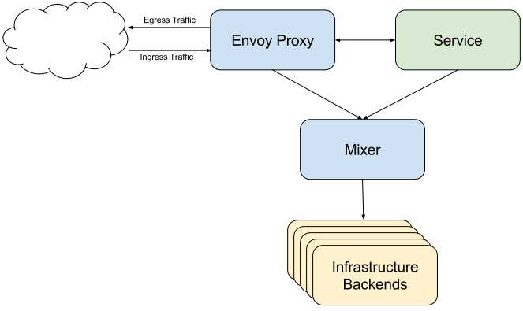
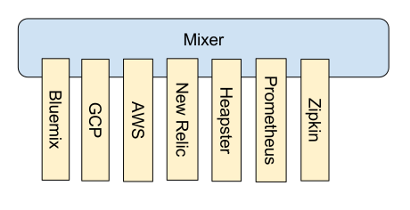
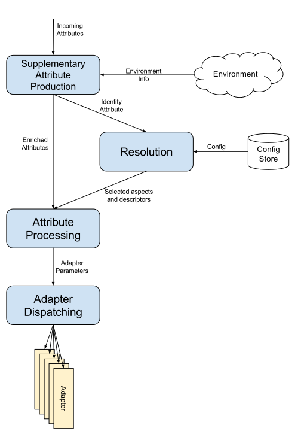

The page explains Mixer's role and general architecture.

## Background

Mixer provides the control plane abstractions necessary to support most real-world multi-tenant services,
such as precondition checks, telemetry reporting, and quota management. Envoy delegates precondition
checking (permissions, whitelist, etc) to Mixer and dispatches its telemetry data 
to Mixer, which proceeds to repackage and redirect the data towards configured infrastructure backends.

Services within the Istio mesh can also directly integrate with Mixer. For example, services may wish to provide rich telemetry
for particular operations beyond what Envoy automatically collects. Or services may use Mixer for resource-oriented quota
management. Services that leverage Mixer in this way are abstracted from environment-specific control plane details, greatly
easing the process of hosting the code in different environments (different clouds and on-prem). (Please note that 
as of the Alpha release of Istio, only Envoy can call Mixer directly.)

Mixer Traffic Flow

Mixer provides three core features:

- **Precondition Checking**. Enables callers to verify a number of preconditions before responding to an incoming request from a service consumer. 
Preconditions can include whether the service consumer is properly authenticated, is on the service's whitelist, passes ACL checks, and more.

- **Telemetry Reporting**. Enables services to report logging and monitoring. In the future, it will also enable tracing and billing
streams intended for both the service operator as well as for service consumers.

- **Quota Management**. Enables services to allocate and free quota on a number of dimensions, Quotas are used as a relatively simple resource
management tool to provide some fairness between service consumers when contending for limited resources. Rate limits are
examples of quotas.

These mechanisms are applied based on a set of [attributes](./attributes.html) that are
materialized for every request into Mixer. Within Istio, Envoy depends heavily on Mixer. Services running within the mesh
can also use Mixer to report telemetry or manage quotas. (Note: as of Istio Alpha, only Envoy can call Mixer.)

## Adapters

Mixer is a highly modular and extensible component. One of it's key functions is to abstract
away the details of different policy and telemetry backend systems, allowing Envoy and Istio-based
services to be agnostic of those backends, which keeps them portable.

Mixer's flexibility in dealing with different infrastructure backends is achieved by having a general-purpose
plug-in model. Individual plug-ins are known as *adapters* and they allow
Mixer to interface to different infrastructure backends that deliver core functionality, such as logging, monitoring, quotas, ACL
checking, and more. Adapters enable Mixer to expose a single consistent API, independent of the backends in use.
The exact set of adapters used at runtime is determined through configuration and can easily be extended
to target new or custom infrastructure backends.

## Configuration state

Mixer's core runtime methods (`Check`, `Report`, and `Quota`) all accept a set of attributes on input and
produce a set of attributes on output. The work that the individual methods perform is dictated by the set of input
attributes, as well as by Mixer's current configuration. To that end, the service operator is responsible
for:

- Configuring the set of *aspects* that the deployment uses. An aspect is essentially a chunk of configuration
state that configures an adapter (adapters being binary plugins as described [below](#adapters)).

- Establishing the types of adapter parameters that Mixer can manipulate. These
types are described in configuration through a set of *descriptors* (as described [here](./mixer-config#descriptors))

- Creating rules to map the attributes of every incoming request into a 
specific set of aspects and adapter parameters.

The above configuration state is required to have Mixer know what to do with incoming attributes
and dispatch to the appropriate infrastructure backends.

Refer [here](./mixer-config.html) for detailed information on Mixer's configuration model.

## Request phases

When a request comes in to Mixer, it goes through a number of distinct handling phases:

- **Supplementary Attribute Production**. The first thing that happens in Mixer is to run a globally configured
set of adapters that are responsible for introducing new attributes. These attributes are combined with the attributes
from the request to form the total set of attributes for the operation.

- **Resolution**. The second phase is to evaluate the set of attributes to determine the effective 
configuration to apply for the request. See [here](./mixer-config.html#resolution) for information on how resolution works. The effective
configuration determines the set of aspects and descriptors available to handle the request in the
subsequent phases.

- **Attribute Processing**. The third phase takes the total set of attributes
and produces a set of *adapter parameters*. Attribute processing is initially
configured through a simple declarative form as described [here](./mixer-config.html).

- **Adapter Dispatching**. The Resolution phase establishes the set of available aspects and the Attribute
Processing phase creates a set of adapter parameters. The Adapter Dispatching phase invokes the adapters
associated with each aspect and passes them those parameters.

Request Phases

## Scripting

> This section is preliminary and subject to change. We're still experimenting with the concept of scripting in Mixer.

Mixer's attribute processing phase is implemented via a scripting language (exact language *TBD*). 
The scripts are provided a set of attributes and are responsible for producing the adapter parameters and dispatching
control to individual configured adapters.

For common uses, the operator authors adapter parameter production rules via a relatively simple declarative format
and expression syntax. Mixer ingests such rules and produces a script that performs the necessary runtime work
of accessing the request's incoming attributes and producing the requisite adapter parameters.

For advanced uses, the operator can bypass the declarative format and author directly in the scripting
language. This is more complex, but provides ultimate flexibility.

