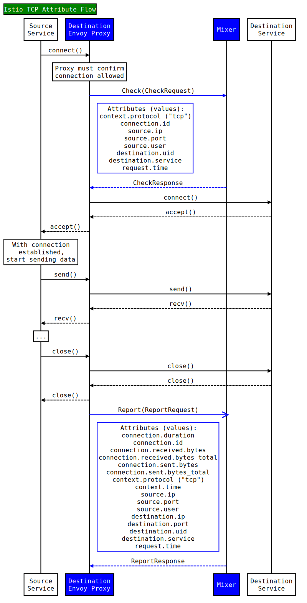

This page provides an overview of the support within Istio for TCP services.

## Overview

As of the 0.2 release, Istio supports adding TCP services to an Istio Service
Mesh. Pilot provides support for generating Envoy configuration. That
configuration sets up filters for calling into Mixer for connection
establishment and to report traffic telemetry. Istio Auth supports TCP
services, enabling mTLS connections between services.

## TCP Attributes

Several tcp-specific attributes enable TCP policy and control within Istio.
These attributes are generated by server-side Envoy proxies and forwarded to
Mixer at both connection establishment and connection close. Additionally,
context attributes provide the ability to distinguish between `http` and `tcp`
protocols within policies.

<figure>
<figcaption>TCP Attribute Flow</figcaption></figure>

## Examples

### Access control

The following configuration establishes basic access control for an example
MongoDB service, based on `source.ip`. Here, we only allow TCP connections to
the mongodb service coming from `10.1.10.1`.

```yaml
apiVersion: "config.istio.io/v1alpha2"
kind: rule
metadata:
  name: mongoaccessctl
  namespace: istio-system
spec:
  match: 'context.protocol == "tcp" 
          && destination.service == "mongodb.default.svc.cluster.local"
          && source.ip != ip("10.1.10.1")'
  actions:
  - handler: denyall.denier
    instances:
    - denyrequest.checknothing
```

NOTE: This example configuration assumes that a handler named `denyall.denier`
and an instance named `denyrequest.checknothing` have already been configured
elsewhere within the system.

### Telemetry collection

The following configuration enables collection of a metric that records the
amount of data (in bytes) transmitted to all TCP services within the mesh. The
metric is dimensioned by source and destination service and version.

```yaml
apiVersion: "config.istio.io/v1alpha2"
kind: metric
metadata:
  name: tcpbytesent
  namespace: istio-system
spec:
  value: connection.sent.bytes | 0
  dimensions:
    source_service: source.service | "unknown"
    source_version: source.labels["version"] | "unknown"
    destination_service: destination.service | "unknown"
    destination_version: destination.labels["version"] | "unknown"
  monitored_resource_type: '"UNSPECIFIED"'
```