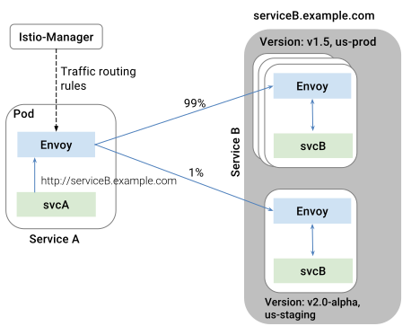
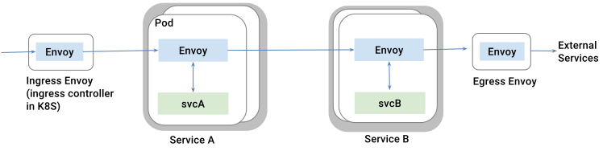

The Istio model of a service is independent of how it is represented
in the underlying platform (Kubernetes, Mesos, CloudFoundry,
etc.). Platform-specific adapters are responsible for populating the
internal model representation with various fields, from the metadata found
in the platform.

## Multiple versions of a service

Istio introduces the concept of a service version, which is a finer-grained
way to subdivide service instances by versions (`v1`, `v2`) or environment
(`staging`, `prod`). These variants are not necessarily different API
versions: they could be iterative changes to the same service, deployed in
different environments (prod, staging, dev, etc.). Common scenarios where
this occurs include A/B testing, canary rollouts, etc. Istio's [traffic
management rules](./rules-configuration.html) can refer to the service versions, to provide
additional control over traffic between services.

## Communication between services

As illustrated in the figure above, clients of a service have no knowledge
of different versions of the service. They can continue to access the
services using the hostname/IP address of the service. Envoy sidecar/proxy
intercepts and forwards all requests/responses between the client and the
service.

The actual choice of the service version is determined dynamically by Envoy
based on the routing rules set forth by the operator. This model enables
the application code to decouple itself from the evolution of its dependent
services, while providing other benefits as well (see
[Mixer](./mixer.html)). Routing rules allow Envoy to select a version based
on criterion such as (headers, url, etc.), tags associated with
source/destination and/or by weights assigned to each version.

Note that Istio does not provide a DNS. Applications can try to resolve the
FQDN using the DNS service present in the underlying platform (kube-dns,
mesos-dns, etc.).

## Ingress and Egress Envoys

Istio assumes that all traffic entering and leaving the istio service mesh
transits through Envoy proxies. By deploying the Envoy proxy in front of
services, operators can conduct A/B testing, deploy canary services,
etc. for user-facing services. Similarly, by routing traffic to external
web services (e.g., accessing Maps API, or a video service API) via Envoy,
operators can add failure recovery features such as circuit breakers,
impose rate limits via the Mixer, and provide authentication using
Istio-Auth service.

