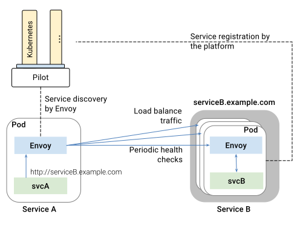

This page describes how Istio load balances traffic across instances of a
service in a service mesh.

**Service registration:** Istio assumes the presence of a service registry
to keep track of the pods/VMs of a service in the application. It also
assumes that new instances of a service are automatically registered with
the service registry and unhealthy instances are automatically removed.
Platforms such as Kubernetes, Mesos already provide such functionality for
container-based applications. A plethora of solutions exist for VM-based
applications.

**Service Discovery:** Pilot consumes information from the service
registry and provides a platform-agnostic service discovery
interface. Envoy instances in the mesh perform service discovery and 
dynamically update their load balancing pools accordingly.

<figure>
<figcaption>Discovery and Load Balancing</figcaption></figure>

As illustrated in the figure above, services in the mesh access each other
using their DNS names. All HTTP traffic bound to a service is automatically
re-routed through Envoy. Envoy distributes the traffic across instances in
the load balancing pool. While Envoy supports several
[sophisticated load balancing algorithms](https://www.envoyproxy.io/docs/envoy/latest/intro/arch_overview/load_balancing),
Istio currently allows three load balancing modes:
round robin, random, and weighted least request.

In addition to load balancing, Envoy periodically checks the health of each
instance in the pool. Envoy follows a circuit breaker style pattern to
classify instances as unhealthy or healthy based on their failure rates for
the health check API call. In other words, when the number of health
check failures for a given instance exceeds a pre-specified threshold, it
will be ejected from the load balancing pool. Similarly, when the number of
health checks that pass exceed a pre-specified threshold, the instance will
be added back into the load balancing pool. You can find out more about Envoy's
failure-handling features in [Handling Failures](./handling-failures.html).

Services can actively shed load by responding with a HTTP 503 to a health
check. In such an event, the service instance will be immediately removed
from the caller's load balancing pool.
