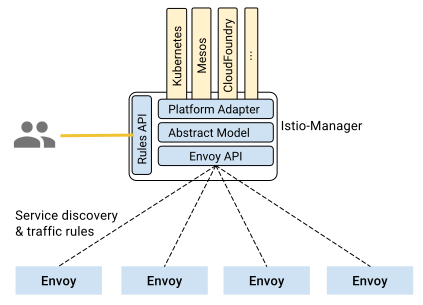

Istio-Manager service is responsible for the lifecycle of
Envoy instances deployed across the Istio service mesh. It exposes
APIs for [service discovery](https://lyft.github.io/envoy/docs/configuration/cluster_manager/sds_api.html), dynamic updates to [load balancing pools](https://lyft.github.io/envoy/docs/configuration/cluster_manager/cds.html) and
[routing tables](https://lyft.github.io/envoy/docs/configuration/http_conn_man/rds.html). These API decouple Envoy from
platform-specific nuances, simplifying the design and increasing
portability across platforms.

As illustrated in the figure above, Istio-Manager maintains a canonical representation of services in the
mesh that is independent of the underlying platform. Platform-specific
adapters in the manager are responsible for populating this canonical model
appropriately. For example, the Kubernetes adapter in the Istio-Manager
implements the necessary controllers to watch the Kubernetes API server for
changes to the pod registration information, ingress resources, and third
party resources that store traffic management rules. This data is
translated into the canonical representation. Envoy-specific configuration
is generated based on the canonical representation.

Operators can specify high-level traffic management rules through the
[Istio-Manager's Rules API (TBD)](). These rules are translated into low-level
configurations and distributed to Envoy instances via the discovery API.
