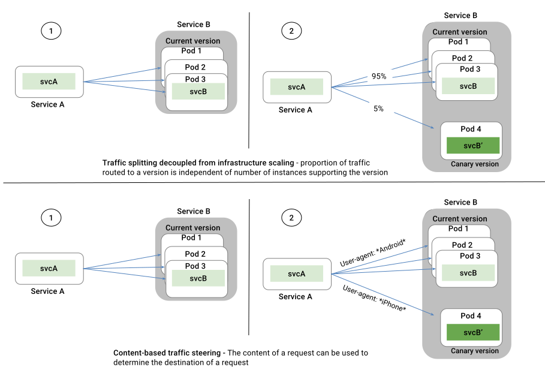

Existing container orchestration platforms like Kubernetes, and Mesos, and
other microservice frameworks allow operators to control when a particular
set of pods/VMs should receive traffic (e.g., by adding/removing specific
labels). Unlike existing techniques, Istio decouples traffic flow and infrastructure
scaling. 

As illustrated in the figure above, Istio allows operators to control what
percentage of traffic should be routed to these pods or which requests
(e.g., those containing specific headers) should be routed. These
capabilities are available for both edge and mid-tier services, benefiting
all development teams (not just those working on user-facing services).

For instance, these capabilities allow operators to control the exact
percentage of traffic that each canary release should receive, irrespective
of the size of a canary deployment. Dark launches can be easily
orchestrated in production while restricting traffic to a specific set of
authenticated test users. Operators can safely test these new versions
before beginning a canary deployment.

Decoupling traffic flow from infrastructure scaling allows Istio to provide
a variety of traffic management features that reside outside the
application code. Features include dynamic
[request routing](../tasks/request-routing.html) for A/B testing, canary releases,
gradual rollouts, etc., [failure recovery](./handling-failures.html)
using timeouts, retries, circuit breakers, and finally
[fault injection](./fault-injection.html) to test compatibility of
failure recovery policies across services. These capabilities are realized
through the Envoy sidecars/proxies deployed across the service mesh.
