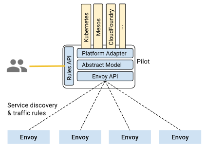

Pilot is responsible for the lifecycle of Envoy instances deployed
across the Istio service mesh.

<figure>
<figcaption>Pilot Architecture</figcaption></figure>

As illustrated in the figure above, Pilot maintains a canonical
representation of services in the mesh that is independent of the underlying
platform. Platform-specific adapters in Pilot are responsible for
populating this canonical model appropriately. For example, the Kubernetes
adapter in Pilot implements the necessary controllers to watch the
Kubernetes API server for changes to the pod registration information, ingress
resources, and third party resources that store traffic management rules.
This data is translated into the canonical representation. Envoy-specific
configuration is generated based on the canonical representation.

Pilot exposes APIs for [service discovery](https://envoyproxy.github.io/envoy/configuration/cluster_manager/sds_api.html),
dynamic updates to [load balancing pools](https://envoyproxy.github.io/envoy/configuration/cluster_manager/cds.html)
and [routing tables](https://envoyproxy.github.io/envoy/configuration/http_conn_man/rds.html).
These APIs decouple Envoy from platform-specific nuances, simplifying the
design and increasing portability across platforms.

Operators can specify high-level traffic management rules through 
[Pilot's Rules API]({{home}}/docs/reference/config/traffic-rules/). These rules are translated into low-level
configurations and distributed to Envoy instances via the discovery API.
