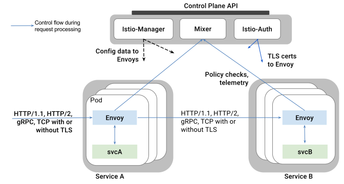

This document introduces Istio: an open platform to connect, manage, and secure microservices. Istio provides an easy way to create a network of deployed services with load balancing, service-to-service authentication, monitoring, and more, without requiring any changes in service code. You add Istio support to services by deploying a special sidecar proxy throughout your environment that intercepts all network communication between microservices, configured and managed using Istio's control plane functionality.

Istio currently only supports service deployment on Kubernetes, though other environments will be supported in future versions.

For detailed conceptual information about Istio components see our other [Concepts]({{home}}/docs/concepts/) guides.

## Why use Istio?

Istio addresses many of the challenges faced by developers and operators as monolithic applications transition towards a distributed microservice architecture. The term **service mesh** is often used to describe the network of
microservices that make up such applications and the interactions between them. As a service mesh grows in size and complexity, it can become harder to understand
and manage. Its requirements can include discovery, load balancing, failure recovery, metrics, and monitoring, and often more complex operational requirements 
such as A/B testing, canary releases, rate limiting, access control, and end-to-end authentication.

Istio provides a complete solution to satisfy the diverse requirements of microservice applications by providing
behavioral insights and operational control over the service mesh as a whole. It provides a number of key capabilities uniformly across a
network of services:

- **Traffic Management**. Control the flow of traffic and API calls between services, make calls more reliable, and make the network more robust in the face
of adverse conditions.
 
- **Observability**. Gain understanding of the dependencies between services and the nature and flow of traffic between them, providing the ability to quickly identify issues.

- **Policy Enforcement**. Apply organizational policy to the interaction between services, ensure access policies are enforced and resources are fairly 
distributed among consumers. Policy changes are made by configuring the mesh, not by changing application code.

- **Service Identity and Security**. Provide services in the mesh with a verifiable identity and provide the ability to protect service traffic
as it flows over networks of varying degrees of trustability.

In addition to these behaviors, Istio is designed for extensibility to meet diverse deployment needs:

- **Platform Support**. Istio is designed to run in a variety of environments including ones that span Cloud, on-premise, Kubernetes, Mesos etc. We’re 
initially focused on Kubernetes but are working to support other environments soon.

- **Integration and Customization**. The policy enforcement component can be extended and customized to integrate with existing solutions for 
ACLs, logging, monitoring, quotas, auditing and more.

These capabilities greatly decrease the coupling between application code, the underlying platform, and policy. This decreased coupling not only makes 
services easier to implement, but also makes it simpler for operators to move application deployments between environments or to new policy schemes. 
Applications become inherently more portable as a result.

## Architecture

An Istio service mesh is logically split into a **data plane** and a **control plane**.

- The **data plane** is composed of a set of intelligent
proxies (Envoy) deployed as sidecars that mediate and control all network communication between microservices.

- The **control plane** is responsible for managing and 
configuring proxies to route traffic, as well as enforcing policies at runtime.

The following diagram shows the different components that make up each plane:

<figure>
<figcaption>Istio Architecture</figcaption></figure>

### Envoy

Istio uses an extended version of the [Envoy](https://lyft.github.io/envoy/) proxy, a high-performance proxy developed in C++, to mediate all inbound and outbound traffic for all services in the service mesh. 
Istio leverages Envoy’s many built-in features such as dynamic service discovery, load balancing, TLS termination, HTTP/2 & gRPC proxying, circuit breakers,
health checks, staged rollouts with %-based traffic split, fault injection, and rich metrics.

Envoy is deployed as a **sidecar** to the relevant service in the same Kubernetes pod. This allows Istio to extract a wealth of signals about traffic behavior as [attributes]({{home}}/docs/concepts/policy-and-control/attributes.html), which in turn it can use in [Mixer]({{home}}/docs/concepts/policy-and-control/mixer.html) to enforce policy decisions, and be sent to monitoring systems to provide information about the behavior of the entire mesh. The sidecar proxy model also allows you to add Istio capabilities to an existing deployment with no need to rearchitect or rewrite code. You can read more about why we chose this approach in our [Design Goals]({{home}}/docs/concepts/what-is-istio/goals.html).

### Mixer

[Mixer]({{home}}/docs/concepts/policy-and-control/mixer.html) is responsible for enforcing access control and usage policies across the service mesh and collecting telemetry data from the Envoy proxy and other 
services. The proxy extracts request level [attributes]({{home}}/docs/concepts/policy-and-control/attributes.html), which are sent to Mixer for evaluation. More information on this attribute extraction and policy 
evaluation can be found in [Mixer Configuration]({{home}}/docs/concepts/policy-and-control/mixer-config.html). Mixer includes a flexible plugin model enabling it to interface with a variety of host environments and infrastructure backends, abstracting the Envoy proxy and Istio-managed services from these details.

### Pilot

[Pilot]({{home}}/docs/concepts/traffic-management/pilot.html) serves as an interface between the user and Istio, collecting and validating configuration and propagating it to the various Istio components.
It abstracts environment-specific implementation details from Mixer and Envoy, providing them with an abstract representation of the user’s services 
that is independent of the underlying platform. In addition, traffic management rules (i.e. generic layer-4 rules and layer-7 HTTP/gRPC routing rules) can 
be programmed at runtime via Pilot.

### Istio-Auth

[Istio-Auth]({{home}}/docs/concepts/network-and-auth/auth.html) provides strong service-to-service and end-user authentication using mutual TLS, with built-in identity and credential management.
It can be used to upgrade unencrypted traffic in the service mesh, and provides operators the ability to enforce policy based
on service identity rather than network controls. Future releases of Istio will add fine-grained access control and auditing to control
and monitor who accesses your service, API, or resource, using a variety of access control mechanisms, including attribute and
role-based access control as well as authorization hooks.

## What's next

* Learn about Istio's [design goals](./goals.html).

* Explore and try deploying our [sample application]({{home}}/docs/samples/bookinfo.html).

* Read about Istio components in detail in our other [Concepts]({{home}}/docs/concepts/) guides.

* Learn how to deploy Istio with your own services using our [Tasks]({{home}}/docs/tasks/) guides.
