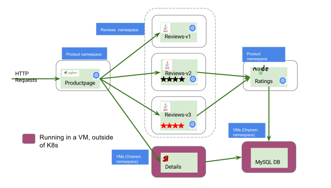



This sample deploys the Bookinfo services across Kubernetes and a set of
Virtual Machines, and illustrates how to use Istio service mesh to control
this infrastructure as a single mesh.

> Note: this guide is still under development and only tested on Google Cloud Platform.
  On IBM Bluemix or other platforms where overlay network of Pods is isolated from VM network,
  VMs cannot initiate any direct communication to Kubernetes Pods even when using Istio.

## Overview


<figure>
<figcaption>BookInfo Application with Istio Mesh Expansion</figcaption></figure>

<!-- source of the drawing https://docs.google.com/drawings/d/1gQp1OTusiccd-JUOHktQ9RFZaqREoQbwl2Vb-P3XlRQ/edit -->


## Before you begin

* Setup Istio by following the instructions in the
  [Installation guide]({{home}}/docs/setup/kubernetes/quick-start.html).

* Deploy the [BookInfo]({{home}}/docs/guides/bookinfo.html) sample application.

* Create a VM named 'db' in the same project as Istio cluster, and [Join the Mesh]({{home}}/docs/setup/kubernetes/mesh-expansion.html).

## Running mysql on the VM

We will first install mysql on the VM, and configure it as a backend for the ratings service.

On the VM:
```bash
  sudo apt-get update && apt-get install ...
  # TODO copy or link the istio/istio test script
```

## Registering the mysql service with the mesh

### Machine admin
First step is to configure the VM sidecar, by adding the service port and restarting the sidecar.

On the DB machine:
```bash

  sudo echo "ISTIO_INBOUND_PORTS=..." > /var/lib/istio/envoy/sidecar.env
  sudo chown istio-proxy /var/lib/istio/envoy/sidecar.env
  sudo systemctl restart istio
 # Or
  db$ sudo istio-pilot vi /var/lib/istio/envoy/sidecar.env
  # add mysql port to the "ISTIO_INBOUND_PORTS" config
  ```

###  Cluster admin

  If you previously run the mysql bookinfo on kubernetes, you need to remove the k8s mysql service:

  ```bash
  kubectl delete service mysql
  ```

  Run istioctl to configure the service (on your admin machine):

  ```bash
  istioctl register mysql PORT IP
  ```

  Note that the 'db' machine does not need and should not have special kubernetes priviledges.

## Using the mysql service

The ratings service in bookinfo will use the DB on the machine. To verify it works, you can
modify the ratings value on the database.

More details here soon.
See the [MySQL](https://github.com/istio/istio/blob/master/samples/rawvm/README.md) document in the meantime.
