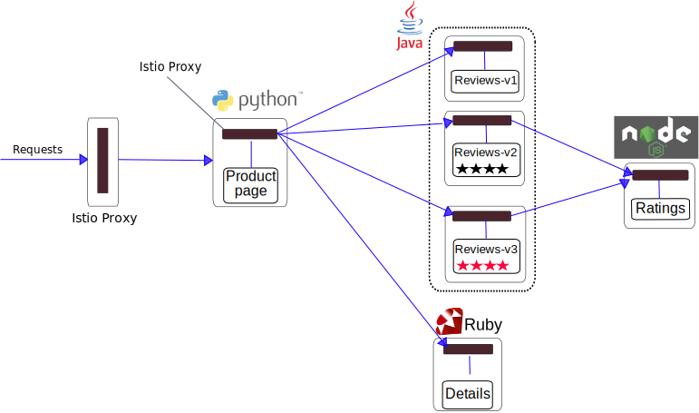
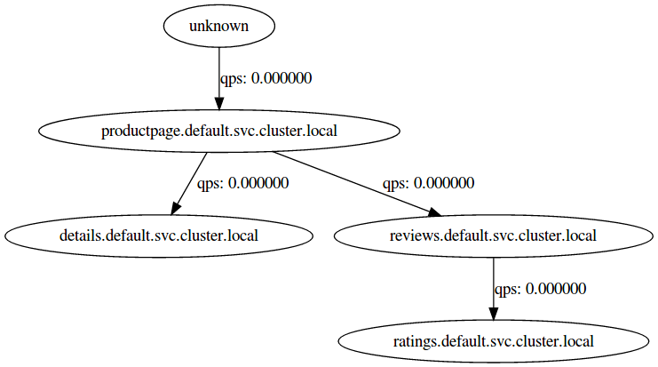



This sample deploys a simple application composed of four separate microservices which will be used
to demonstrate various features of the Istio service mesh.

## Before you begin
* If you use GKE, please ensure your cluster has at least 4 standard GKE nodes.

* Setup Istio by following the instructions in the
[Installation guide]({{home}}/docs/tasks/installing-istio.html).

## Overview

In this sample we will deploy a simple application that displays information about a
book, similar to a single catalog entry of an online book store. Displayed
on the page is a description of the book, book details (ISBN, number of
pages, and so on), and a few book reviews.

The BookInfo application is broken into four separate microservices:

* *productpage*. The productpage microservice calls the *details* and *reviews* microservices to populate the page.
* *details*. The details microservice contains book information.
* *reviews*. The reviews microservice contains book reviews. It also calls the *ratings* microservice.
* *ratings*. The ratings microservice contains book ranking information that accompanies a book review.

There are 3 versions of the reviews microservice:

* Version v1 doesn't call the ratings service.
* Version v2 calls the ratings service, and displays each rating as 1 to 5 black stars.
* Version v3 calls the ratings service, and displays each rating as 1 to 5 red stars.

The end-to-end architecture of the application is shown below.


This application is polyglot, i.e., the microservices are written in different languages.

## Start the application

1. Change directory to the root of the Istio installation directory.

1. Source the Istio configuration file:

   ```bash
   source istio.VERSION
   ```

1. Bring up the application containers:

   ```bash
   kubectl apply -f <(istioctl kube-inject -f samples/apps/bookinfo/bookinfo.yaml)
   ```

   The above command launches four microservices and creates the gateway
   ingress resource as illustrated in the diagram above.
   The reviews microservice has 3 versions: v1, v2, and v3.

   > Note that in a realistic deployment, new versions of a microservice are deployed
   over time instead of deploying all versions simultaneously.

   Notice that the `istioctl kube-inject` command is used to modify the `bookinfo.yaml`
   file before creating the deployments. This injects Envoy into Kubernetes resources
   as documented [here]({{home}}/docs/reference/commands/istioctl.html#istioctl-kube-inject).
   Consequently, all of the microservices are now packaged with an Envoy sidecar
   that manages incoming and outgoing calls for the service. The updated diagram looks
   like this:

   

1. Confirm all services and pods are correctly defined and running:

   ```bash
   kubectl get services
   ```

   which produces the following output:
   
   ```bash
   NAME                       CLUSTER-IP   EXTERNAL-IP   PORT(S)              AGE
   details                    10.0.0.31    <none>        9080/TCP             6m
   istio-ingress              10.0.0.122   <pending>     80:31565/TCP         8m
   istio-manager              10.0.0.189   <none>        8080/TCP             8m
   istio-mixer                10.0.0.132   <none>        9091/TCP,42422/TCP   8m
   kubernetes                 10.0.0.1     <none>        443/TCP              14d
   productpage                10.0.0.120   <none>        9080/TCP             6m
   ratings                    10.0.0.15    <none>        9080/TCP             6m
   reviews                    10.0.0.170   <none>        9080/TCP             6m
   ```

   and

   ```bash
   kubectl get pods
   ```
   
   which produces
   
   ```bash
   NAME                                        READY     STATUS    RESTARTS   AGE
   details-v1-1520924117-48z17                 2/2       Running   0          6m
   istio-ingress-3181829929-xrrk5              1/1       Running   0          8m
   istio-manager-175173354-d6jm7               2/2       Running   0          8m
   istio-mixer-3883863574-jt09j                2/2       Running   0          8m
   productpage-v1-560495357-jk1lz              2/2       Running   0          6m
   ratings-v1-734492171-rnr5l                  2/2       Running   0          6m
   reviews-v1-874083890-f0qf0                  2/2       Running   0          6m
   reviews-v2-1343845940-b34q5                 2/2       Running   0          6m
   reviews-v3-1813607990-8ch52                 2/2       Running   0          6m
   ```

1. Determine the gateway ingress URL:

   ```bash
   kubectl get ingress -o wide
   ```
   
   ```bash
   NAME      HOSTS     ADDRESS                 PORTS     AGE
   gateway   *         130.211.10.121          80        1d
   ```
   ```bash
   export GATEWAY_URL=130.211.10.121:80
   ```

   If your Kubernetes cluster is running in an environment that supports external load balancers, like for instance GKE, and the Istio ingress service was able
   to obtain an External IP, the ingress' resource IP Address will be equal to the ingress' service External IP.
   You can directly use that IP Address in your browser to access the http://$GATEWAY_URL/productpage.

   If the service did not obtain an External IP, the ingress' IP Address will display a list of NodePort addresses.
   You can use any of these addresses to access the ingress, but if the cluster has a firewall, you will also need to create a firewall rule
   to allow TCP traffic to the NodePort. For instance, in GKE, create a firewall rule with these commands:
   ```bash
   kubectl get svc istio-ingress -o jsonpath='{.spec.ports[0].nodePort}'
   ```
   ```bash
   31201
   ```
   ```bash
   gcloud compute firewall-rules create allow-book --allow tcp:31201
   ```

   If loadbalancers are not supported, or the ADDRESS field remains empty, use the service NodePort instead:
   ```bash
   export GATEWAY_URL=$(kubectl get po -l istio=ingress -o jsonpath={.items[0].status.hostIP}):$(kubectl get svc istio-ingress -o jsonpath={.spec.ports[0].nodePort})
   ```

1. Confirm that the BookInfo application is running by opening in your browser http://$GATEWAY_URL/productpage , or with the following `curl` command:

   ```bash
   curl -o /dev/null -s -w "%{http_code}\n" http://$GATEWAY_URL/productpage
   ```
   ```bash
   200
   ```

1. If you enabled auth and want to play with it, you can use curl from one envoy to send request to other services. For example, you want to ssh into the envoy container of details service, and send request to other services by curl. There are several steps:
   
   Step 1: get the details pod name
   ```bash
   kubectl get pods -l app=details 
   ```
   ```bash
   NAME                          READY     STATUS    RESTARTS   AGE
   details-v1-4184313719-5mxjc   2/2       Running   0          23h
   ```

   Make sure the pod is "Running".

   Step 2: ssh into the envoy container 
   ```bash
   kubectl exec -it details-v1-4184313719-5mxjc -c proxy /bin/bash 
   ```

   Step 3: make sure the key/cert is in /etc/certs/ directory
   ```bash
   ls /etc/certs/ 
   ```
   ```bash
   cert-chain.pem   key.pem 
   ``` 
   
   Step 4: send requests to another service, for example, productpage.
   ```bash
   curl https://productpage:9080 -v --key /etc/certs/key.pem --cert /etc/certs/cert-chain.pem -k
   ```
   ```bash
   ...
   < HTTP/1.1 200 OK
   < content-type: text/html; charset=utf-8
   < content-length: 1867
   < server: envoy
   < date: Thu, 11 May 2017 18:59:42 GMT
   < x-envoy-upstream-service-time: 2
   ...
   ```
   The service name and port are defined [here](https://github.com/istio/istio/blob/master/samples/apps/bookinfo/bookinfo.yaml).
   
   Note that '-k' option above is to disable service cert verification. Otherwise the curl command will not work. The reason is that in Istio cert, there is no service name, which is the information curl needs to verify service identity. To verify service identity, Istio uses service account, please refer to [here](https://istio.io/docs/concepts/network-and-auth/auth.html) for more information.

1. If you have installed the Istio addons, in particular the servicegraph addon, from the
   [Installation guide]({{home}}/docs/tasks/installing-istio.html), a generated servicegraph
   of the cluster is available.
   
   Get the external IP Address (and port) of the servicegraph service:
   ```bash
   kubectl get svc servicegraph 
   ```
   ```bash
   NAME           CLUSTER-IP      EXTERNAL-IP       PORT(S)          AGE
   servicegraph   10.75.240.195   104.196.248.114   8088:32556/TCP   23m
   ```

   The servicegraph service provides both a textual (JSON) representation (via `/graph`)
   and a graphical visualization (via `/dotviz`) of the underlying servicegraph.
   
   To view the graphical visualization, visit `http://EXTERNAL-IP:PORT/dotviz` (here: 
   http://104.196.248.114:8088/dotviz). After the single `curl` request from an earlier step, 
   the resulting image will look something like:
   
   
   
   The servicegraph should show very low (or zero) QPS values, as only a single request has been sent. The
   service uses a default time window of 5 minutes for calculating moving QPS averages. Send a consistent 
   flow of traffic through the example application and refresh the servicegraph to view updated QPS values 
   that match the generated level of traffic.


## What's next

Now that you have the BookInfo sample up and running, you can use Istio to control traffic routing,
inject faults, rate limit services, etc..

* To get started, check out the [request routing task]({{home}}/docs/tasks/request-routing.html)

* When you're finished experimenting with the BookInfo sample, you can uninstall it as follows:

1. Delete the routing rules and terminate the application pods

   ```bash
   samples/apps/bookinfo/cleanup.sh
   ```

1. Confirm shutdown

   ```bash
   istioctl get route-rules   #-- there should be no more routing rules
   kubectl get pods           #-- the BookInfo pods should be deleted
   ```
