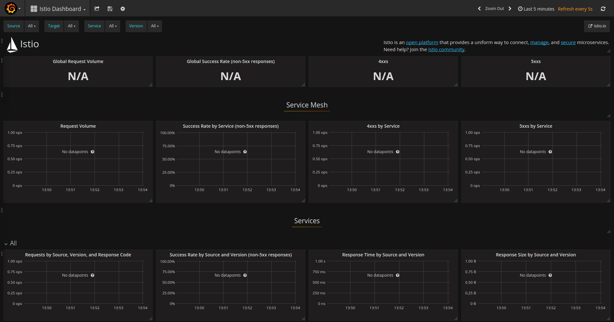
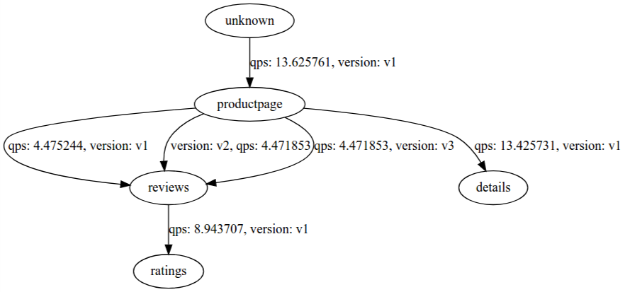



Quick Start instructions to install and configure Istio in a Kubernetes cluster.


## Prerequisites

The following instructions assume you have access to a Kubernetes **1.7.4 or newer** cluster
with [RBAC (Role-Based Access Control)](https://kubernetes.io/docs/admin/authorization/rbac/) enabled.

  > Note: If you installed Istio 0.1.x,
  > [uninstall](https://istio.io/v-0.1/docs/tasks/installing-istio.html#uninstalling)
  > it completely before installing the newer version (including the Istio sidecar
  > for all Istio enabled application pods).

* Depending on your Kubernetes provider:
  * To install Istio locally, install the latest version of
    [Minikube](https://kubernetes.io/docs/getting-started-guides/minikube/) (version 0.22.1 or later).

  * If you are using
    [Google Container Engine](https://cloud.google.com/container-engine),
    find out your cluster name and zone, and fetch credentials for kubectl:

    ```bash
    gcloud container clusters get-credentials <cluster-name> --zone <zone> --project <project-name>
    ```

  * If you are using
    [IBM Bluemix Container Service](https://www.ibm.com/cloud-computing/bluemix/containers),
    find out your cluster name, and fetch credentials for kubectl:

    ```bash
    $(bx cs cluster-config <cluster-name>|grep "export KUBECONFIG")
    ```

  * If you are using [Openshift Origin](https://www.openshift.org) version
    3.7 or later, Openshift by default does not allow containers running
    with uid 0, you can enable this for Istio's service accounts for
    ingress and egress as follows:

    ```bash
    oc adm policy add-scc-to-user anyuid -z istio-ingress-service-account -n istio-system
    oc adm policy add-scc-to-user anyuid -z istio-egress-service-account -n istio-system
    ```  

* Install or upgrade the Kubernetes CLI
  [kubectl](https://kubernetes.io/docs/tasks/tools/install-kubectl/) to
  match the version supported by your cluster (version 1.7 or newer for CRD
  support).

## Installation steps

Starting with the {{ site.data.istio.version }} release, Istio is installed in its own `istio-system` namespace,
and can manage micro-services from all other namespaces.

1. Go to the [Istio release](https://github.com/istio/istio/releases) page, to download the installation file corresponding to your OS or run
   ```bash
   curl -L https://git.io/getIstio | sh -
   ```
   to download and extract the latest stable release automatically (on MacOS and Ubuntu).

1. Extract the installation file, and change directory to the location where the files were extracted. The following instructions
   are relative to this installation directory.
   The installation directory contains:
    * Installation `.yaml` files for Kubernetes in `install/`
    * Sample applications in `samples/`
    * The `istioctl` client binary in the `bin/` directory. `istioctl` is used when manually injecting Envoy as a sidecar proxy, and useful for creating routing rules and policies.
    * The `istio.VERSION` configuration file.

1. Add the `istioctl` client to your PATH.
   For example, run the following commands on a Linux or MacOS system:

   ```bash
   export PATH=$PWD/bin:$PATH
   ```

1. Install Istio's core components.  Choose one of the two _**mutually exclusive**_ options below:

    a. Install Istio without enabling [authentication]({{home}}/docs/concepts/network-and-auth/auth.html) between sidecars with [mutual TLS authentication](https://en.wikipedia.org/wiki/Mutual_authentication).
    We recommend this option for clusters with existing applications, applications where services with Istio sidecar need to be able to communicate with other non-Istio Kubernetes services, as well as
    applications that use [liveliness and readiness probes](https://kubernetes.io/docs/tasks/configure-pod-container/configure-liveness-readiness-probes/), headless services, or statefulsets.

      ```bash
      kubectl apply -f install/kubernetes/istio.yaml
      ```

    _**OR**_

    b. Install Istio and enable [authentication]({{home}}/docs/concepts/network-and-auth/auth.html) between sidecars with [mutual TLS authentication](https://en.wikipedia.org/wiki/Mutual_authentication):

     ```bash
     kubectl apply -f install/kubernetes/istio-auth.yaml
     ```

   Both options create the `istio-system` namespace along with the required RBAC permissions, and deploy Istio-Pilot, Istio-Mixer, Istio-Ingress, Istio-Egress, and Istio-CA (Certificate Authority).

1. *Optional:* If your cluster has Kubernetes alpha features enabled, and you wish to enable transparent injection of sidecar, please install the Istio-Initializer:

    ```bash
     kubectl apply -f install/kubernetes/istio-initializer.yaml
     ```

1. *Optional:* Install addons for metric collection and/or request tracing as described in the following sections.

### Enabling metrics collection

To collect and view metrics provided by Mixer, install [Prometheus](https://prometheus.io),
as well as the [Grafana](https://grafana.com/grafana/download) and/or ServiceGraph addons.

```bash
kubectl apply -f install/kubernetes/addons/prometheus.yaml
kubectl apply -f install/kubernetes/addons/grafana.yaml
kubectl apply -f install/kubernetes/addons/servicegraph.yaml
```
You can find out more about how to use these tools in [Collecting Metrics and Logs]({{home}}/docs/tasks/metrics-logs.html).

#### Verifying the Grafana dashboard

The Grafana addon provides an Istio dashboard visualization of the metrics (request rates, success/failure rates) in the cluster. Once you've installed Grafana, check that you can access the dashboard.

Configure port-forwarding for the `grafana` service, as follows:

  ```bash
  kubectl port-forward $(kubectl get pod -l app=grafana -o jsonpath='{.items[0].metadata.name}') 3000:3000 &
  ```

Then point your web browser to [http://localhost:3000/dashboard/db/istio-dashboard](http://localhost:3000/dashboard/db/istio-dashboard). The dashboard should look something like this:

<figure>
<figcaption>Grafana Istio Dashboard</figcaption></figure>

#### Verifying the ServiceGraph service

The ServiceGraph addon provides a textual (JSON) representation and a graphical visualization of the service interaction graph for the cluster. Like Grafana, you can access the servicegraph service using port-forwarding, service nodePort, or (if external load balancing is available) external IP. In this case the service name is `servicegraph` and the port to access is 8088:

```bash
kubectl port-forward $(kubectl get pod -l app=servicegraph -o jsonpath='{.items[0].metadata.name}') 8088:8088 &
```

The ServiceGraph service provides both a textual (JSON) representation (via `/graph`) and a graphical visualization (via `/dotviz`) of the underlying service graph. To view the graphical visualization (assuming that you have configured port forwarding as per the previous snippet), open your browser at: [http://localhost:8088/dotviz](http://localhost:8088/dotviz).

After running some services -- for example, after installing the [BookInfo]({{home}}/docs/samples/bookinfo.html)  sample application and generating some load on the application (e.g., executing `curl` requests in a `while` loop) -- the resulting service graph should look something like this:

<figure>
<figcaption>BookInfo Service Graph</figcaption></figure>


## Verifying the installation

1. Ensure the following Kubernetes services were deployed: "istio-pilot", "istio-mixer", "istio-ingress", "istio-egress",
   "istio-ca", and, optionally, "grafana", "prometheus' and "servicegraph".

   ```bash
   kubectl get svc -n istio-system
   ```
   ```bash
   NAME            CLUSTER-IP      EXTERNAL-IP       PORT(S)                       AGE
   grafana         10.83.252.16    <none>            3000:30432/TCP                5h
   istio-egress    10.83.247.89    <none>            80/TCP                        5h
   istio-ingress   10.83.245.171   35.184.245.62     80:32730/TCP,443:30574/TCP    5h
   istio-pilot     10.83.251.173   <none>            8080/TCP,8081/TCP             5h
   istio-mixer     10.83.244.253   <none>            9091/TCP,9094/TCP,42422/TCP   5h
   kubernetes      10.83.240.1     <none>            443/TCP                       36d
   prometheus      10.83.247.221   <none>            9090:30398/TCP                5h
   servicegraph    10.83.242.48    <none>            8088:31928/TCP                5h
   ```

   Note that if your cluster is running in an environment that does not support an external load balancer
   (e.g., minikube), the `EXTERNAL-IP` of `istio-ingress` will say `<pending>` and you will need to access the
   application using the service NodePort, or use port-forwarding instead.

2. Check the corresponding Kubernetes pods were deployed and all containers are up and running:
   "istio-pilot-\*", "istio-mixer-\*", "istio-ingress-\*", "istio-egress-\*", "istio-ca-\*" ,
   and, optionally, "grafana-\*", "prometheus-\*' and "servicegraph-\*".

   ```bash
   kubectl get pods -n istio-system
   ```
   ```bash
   grafana-3836448452-vhc1v         1/1       Running   0          5h
   istio-ca-3657790228-j21b9        1/1       Running   0          5h
   istio-egress-1684034556-fhw89    1/1       Running   0          5h
   istio-ingress-1842462111-j3vcs   1/1       Running   0          5h
   istio-pilot-2275554717-93c43     2/2       Running   0          5h
   istio-mixer-2104784889-20rm8     1/1       Running   0          5h
   prometheus-3067433533-wlmt2      1/1       Running   0          5h
   servicegraph-3127588006-pc5z3    1/1       Running   0          5h
   ```


## Deploy your application

You can now deploy your own application, or one of the sample applications provided with the installation,
for example [BookInfo]({{home}}/docs/samples/bookinfo.html). Note that the application should use HTTP/1.1
or HTTP/2.0 protocol for all its HTTP traffic; HTTP/1.0 is not supported.

Unless you installed the Istio-Initializer as shown above, when deploying the application, you must
use [istioctl kube-inject]({{home}}/docs/reference/commands/istioctl.html#istioctl-kube-inject) to automatically inject
Envoy containers in your application pods:

```bash
kubectl create -f <(istioctl kube-inject -f <your-app-spec>.yaml)
```

## Uninstalling

1. If you installed Istio addons, uninstall them:

   ```bash
   kubectl delete -f install/kubernetes/addons/
   ```


1. Uninstall Istio core components. For the {{ site.data.istio.version }} release, the uninstall will delete the RBAC permissions, the `istio-system` namespace, and hierarchically all resources under it.
   It is safe to ignore errors for non-existent resources, since they may have been deleted hierarchically.

   * If Istio was installed with mutual TLS authentication disabled:

     ```bash
     kubectl delete -f install/kubernetes/istio.yaml
     ```

   * If Istio was installed with mutual TLS authentication enabled:

     ```bash
     kubectl delete -f install/kubernetes/istio-auth.yaml
     ```

1. Delete Istio's [Kubernetes CRDs](https://kubernetes.io/docs/tasks/access-kubernetes-api/extend-api-custom-resource-definitions/):

   ```bash
   kubectl get crd -o 'jsonpath={.items[*].metadata.name}' | grep config\.istio\.io | xargs kubectl delete crd
   ```

## What's next

* See the sample [BookInfo]({{home}}/docs/samples/bookinfo.html) application.

* See how to [test Istio Auth]({{home}}/docs/tasks/istio-auth.html).
