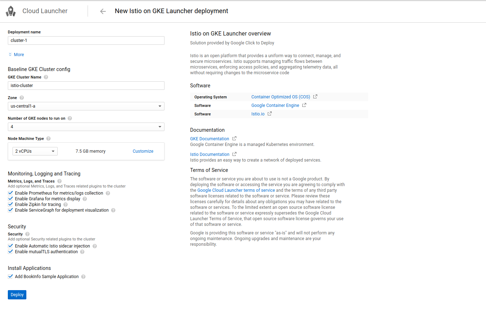
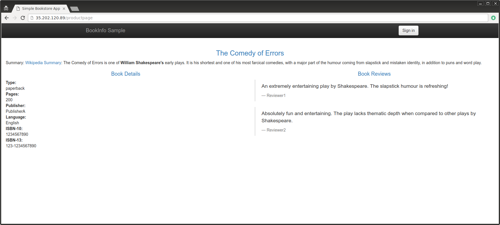
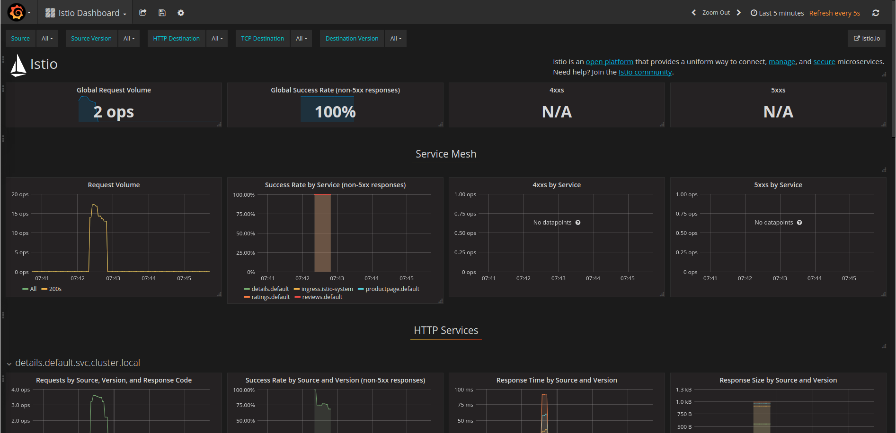
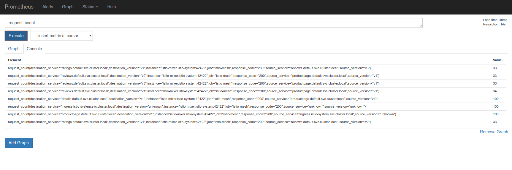
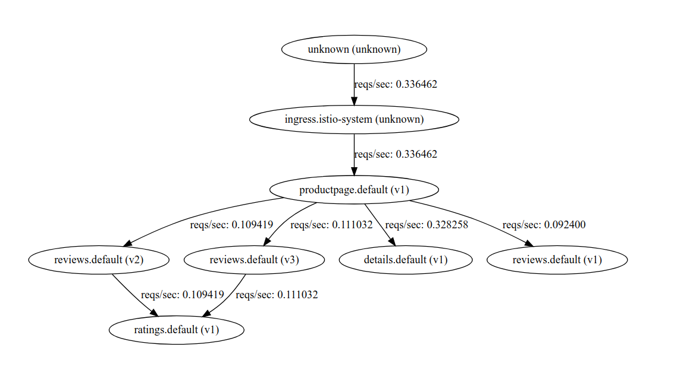
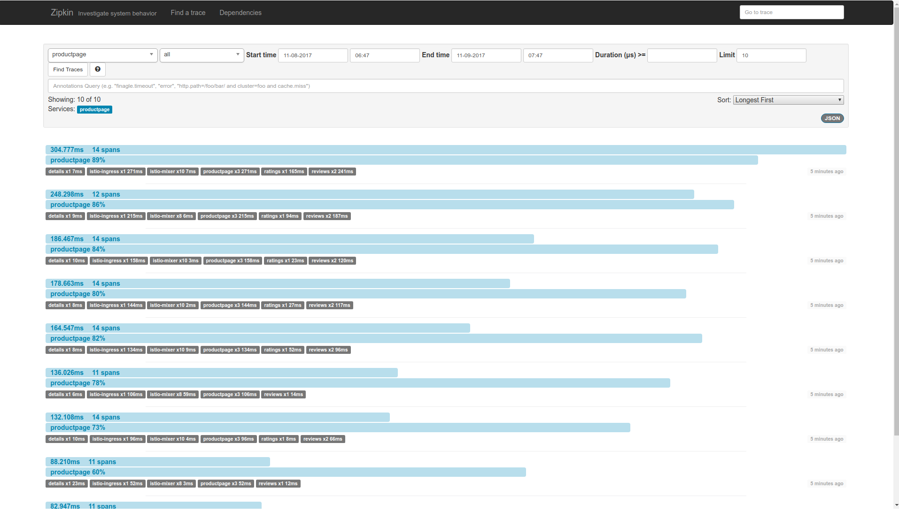




Quick Start instructions to install and run Istio in [Google Container Engine](https://cloud.google.com/container-engine/){:target="_blank"} (GKE) using [Google Cloud Deployment Manager](https://cloud.google.com/deployment-manager/){:target="_blank"}.

This Quick Start creates a new GKE cluster, installs Istio and then deploys the [BookInfo](https://istio.io/docs/guides/bookinfo.html){:target="_blank"} sample application.   It is essentially
all the steps detailed in [Istio Kubernetes Intaller](https://istio.io/docs/setup/kubernetes/quick-start.html) combined with Deployment Manager.

> **Note:** The default install will create a GKE [**ALPHA** Cluster](https://cloud.google.com/container-engine/docs/alpha-clusters){:target="_blank"} that allows for [automatic sidecar injection](https://istio.io/docs/setup/kubernetes/sidecar-injection.html#automatic-sidecar-injection){:target="_blank"}.  As it is an Alpha Cluster,
it does not support automatic node or master upgrades and will only run for 30days.

## Prerequisites

This sample requires a valid Google Cloud Platform project with billing enabled.  If you have not signed already, you could enroll for a $300 US [Free Trial](https://cloud.google.com/free/){:target="_blank"} credit.

You will also need to install and configure [gcloud SDK](https://cloud.google.com/sdk/docs/){:target="_blank"} on your local workstation and include kubectl additional component:

```
gcloud components install kubectl
```

Verify gcloud is configured with your login and the project you are using:
```
gcloud config list
```

If you do not wish to install the gcloud client, you can use  [Google Cloud Shell](https://cloud.google.com/shell/docs/){:target="_blank"} to perform most tasks.
If you choose to use Cloud Shell, you can port forward and proxy using its [Web Preview](https://cloud.google.com/shell/docs/using-web-preview#previewing_the_application){:target="_blank"} feature.  For example, to access Grafana from Cloud Shell, change the kubectl port mapping from 3000:3000 to 8080:3000.  You can simultaneously preview four other consoles via Web Preview proxied on ranges 8080 to 8084.  

**NOTE:**  At the moment, you must set your default service account to include:

- ```roles/container.admin```  (Container Engine Admin)
- ```Editor```  (on by default)

To set this, navigate to the IAM section of the [Cloud Console](https://console.cloud.google.com/iam-admin/iam/project){:target="_blank"} and find your default GCE/GKE service account in the following form to set that permission:
```
projectNumber-compute@developer.gserviceaccount.com
```

## Setup

### Launch Deployment Manager

Once you have an account and project enabled, simply proceed to the following link 

- [Istio GKE Deployment Manager](https://accounts.google.com/signin/v2/identifier?service=cloudconsole&passive=1209600&osid=1&continue=https%3A%2F%2Fconsole.cloud.google.com%2Flauncher%2Fconfig%3Ftemplateurl%3Dhttps%3A%2F%2Fraw.githubusercontent.com%2Fsalrashid123%2Fistio_dm%2Fmaster%2Fephemeral_VM%2Fcluster.jinja&followup=https%3A%2F%2Fconsole.cloud.google.com%2Flauncher%2Fconfig%3Ftemplateurl%3Dhttps%3A%2F%2Fraw.githubusercontent.com%2Fsalrashid123%2Fistio_dm%2Fmaster%2Fephemeral_VM%2Fcluster.jinja&flowName=GlifWebSignIn&flowEntry=ServiceLogin){:target="_blank"}

Its recommended to leave the the defaults on as the rest of the Quick Start demonstrates each feature.

Click ``'Deploy'``



> **NOTE:** Deployment will take upto 5minutes.

### Bootstrap gcloud

Once Deployment completes, on your workstation with gcloud installed:

Bootstrap kubectl for the cluster you just created:

Confirm the cluster is running and istio is enabled:
```
gcloud container clusters list
```
```
NAME           ZONE           MASTER_VERSION                    MASTER_IP       MACHINE_TYPE   NODE_VERSION  NUM_NODES  STATUS
istio-cluster  us-central1-a  1.7.8-gke.0 ALPHA (29 days left)  130.211.216.64  n1-standard-2  1.7.8-gke.0   3          RUNNING
```

In this case, the cluster name is ```istio-cluster```

Bootstrap to the cluster

```
gcloud container clusters get-credentials istio-cluster --zone=us-central1-a
```

## Verify installation

Verify istio is installed it its own namespace

```
kubectl get deployments,ing -n istio-system
```
```
NAME                       DESIRED   CURRENT   UP-TO-DATE   AVAILABLE   AGE
deploy/grafana             1         1         1            1           3m
deploy/istio-ca            1         1         1            1           3m
deploy/istio-ingress       1         1         1            1           3m
deploy/istio-initializer   1         1         1            1           3m
deploy/istio-mixer         1         1         1            1           3m
deploy/istio-pilot         1         1         1            1           3m
deploy/prometheus          1         1         1            1           3m
deploy/servicegraph        1         1         1            1           3m
deploy/zipkin              1         1         1            1           3m
```


If you deployed BookInfo, confirm that it is also installed:


```
kubectl get deployments,ing
```
```
NAME                    DESIRED   CURRENT   UP-TO-DATE   AVAILABLE   AGE
deploy/details-v1       1         1         1            1           3m
deploy/productpage-v1   1         1         1            1           3m
deploy/ratings-v1       1         1         1            1           3m
deploy/reviews-v1       1         1         1            1           3m
deploy/reviews-v2       1         1         1            1           3m
deploy/reviews-v3       1         1         1            1           3m

NAME          HOSTS     ADDRESS         PORTS     AGE
ing/gateway   *         35.202.120.89   80        3m
```

Note down the IP and Port assigned to BookInfo product page. (in the example above, its ```35.202.120.89:80```.


### Access BookInfo Application

Setup environment variable for the external IP address:

```
kubectl get ingress -o wide
```
```
export GATEWAY_URL=35.202.120.89
```

Verify you can access the BookInfo ```http://${GATEWAY_URL}/productpage```:



Now send some traffic to it:
```
for i in {1..100}; do curl -o /dev/null -s -w "%{http_code}\n" http://${GATEWAY_URL}/productpage; done
```

### Verify Installed Istio plugins


- Grafana

Setup a tunnel to Grafana

```
kubectl -n istio-system port-forward $(kubectl -n istio-system get pod -l app=grafana -o jsonpath='{.items[0].metadata.name}') 3000:3000 &
```
then 
```
 http://localhost:3000/dashboard/db/istio-dashboard
```
You should see some statistics for the requests  you just sent earlier:



For more details [About the Grafana Add-on](/docs/tasks/telemetry/using-istio-dashboard.html#about-the-grafana-add-on).


- Prometheus

Prometheus will get installed with Grafana.  You can view the istio and appliation metrics through the console:

```
kubectl -n istio-system port-forward $(kubectl -n istio-system get pod -l app=prometheus -o jsonpath='{.items[0].metadata.name}') 9090:9090 &
```

View the console: at

```
 http://localhost:9090/graph 
```



For more details [About the Prometheus Add-on](/docs/tasks/telemetry/querying-metrics.html#about-the-prometheus-add-on).

- ServiceGraph

Setup a tunnel to ServiceGraph
```
kubectl -n istio-system port-forward $(kubectl -n istio-system get pod -l app=servicegraph -o jsonpath='{.items[0].metadata.name}') 8088:8088 &
```
You should see the BookInfo service topology at 

```
http://localhost:8088/dotviz
```



For more details, see [About the SeriviceGrpah Add-on](/docs/tasks/telemetry/servicegraph.html#about-the-servicegraph-add-on).

- Tracing

Setup a tunnel to Zipkin:

```
kubectl port-forward -n istio-system $(kubectl get pod -n istio-system -l app=zipkin -o jsonpath='{.items[0].metadata.name}') 9411:9411 &
```

You should see the trace statistics sent earlier:

```
http://localhost:9411
```




For more details on tracing see [Understanding what happened](/docs/tasks/telemetry/distributed-tracing.html#understanding-what-happened).

- Additional Guides

You can run any of the other [Guides](/docs/guides/) but you will need to install ```istioctl``.  You can either [install](/docs/setup/kubernetes/quick-start.html#installation-steps) it directly on our workstation or within Cloud Shell


## Uninstalling

Navigate to the Deployments section of the Cloud Console:
- [https://console.cloud.google.com/deployments](https://console.cloud.google.com/deployments){:target="_blank"}

Select the deployment and click delete.

> Note: Deployment Manager will remove GKE artifacts but items such as Ingress and LoadBalancers will remain.
You can delete those artifacts by again going to the cloud console under ["Network Services-->LoadBalancers"](https://console.cloud.google.com/net-services/loadbalancing/loadBalancers/list){:target="_blank"}