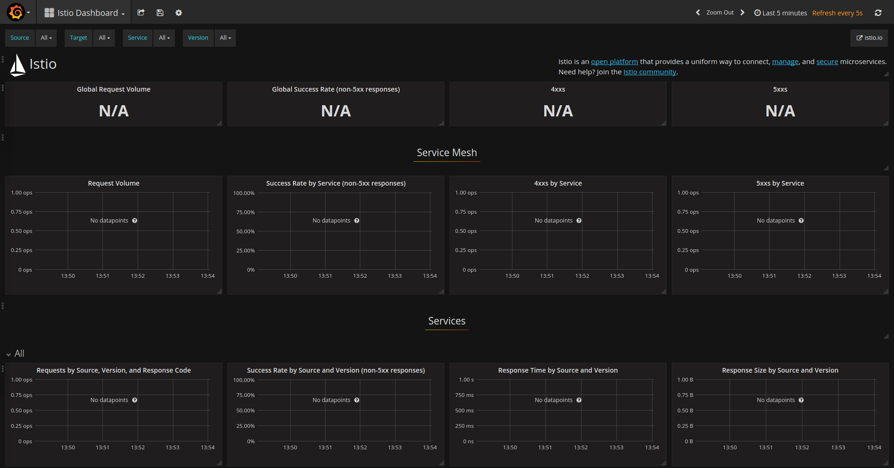



This page shows how to install and configure Istio in a Kubernetes cluster.

## Prerequisites

* The following instructions assume you have access to a Kubernetes cluster. To install Kubernetes locally,
  try [minikube](https://kubernetes.io/docs/getting-started-guides/minikube/).

* If you are using [Google Container Engine](https://cloud.google.com/container-engine), find out your cluster
  name and zone, and fetch credentials for kubectl:
  
  ```bash
  gcloud container clusters get-credentials <cluster-name> --zone <zone> --project <project-name>
  ```

* If you are using [IBM Bluemix Container Service](https://www.ibm.com/cloud-computing/bluemix/containers), find out your cluster name, and fetch credentials for kubectl:

  ```bash
  $(bx cs cluster-config <cluster-name>|grep "export KUBECONFIG")
  ```
  
* Install the Kubernetes client [kubectl](https://kubernetes.io/docs/tasks/tools/install-kubectl/), or upgrade to the latest
  version supported by your cluster.

* If you previously installed Istio on this cluster, please uninstall first by following the
  [uninstalling]({{home}}/docs/tasks/installing-istio.html#uninstalling) steps at the end of this page.

## Installation steps

For the {{ site.data.istio.version }} release, Istio must be installed in the same Kubernetes namespace as the applications. 
Instructions below will deploy Istio in the
default namespace. They can be modified for deployment in a different namespace.

1. Go to the [Istio release](https://github.com/istio/istio/releases) page, to download the installation file corresponding to your OS or run 
   ```bash
   curl -L https://git.io/getIstio | sh -
   ``` 
   to download and extract the latest release automatically (on MacOS and Ubuntu).

1. Extract the installation file, and change directory to the location where the files were extracted. The following instructions 
   are relative to this installation directory.
   The installation directory contains:
    * yaml installation files for Kubernetes
    * sample apps
    * the `istioctl` client binary, needed to inject Envoy as a sidecar proxy, and useful for creating routing rules and policies.
    * the istio.VERSION configuration file.

1. Add the `istioctl` client to your PATH if you download the installation file from [Istio release](https://github.com/istio/istio/releases).
   For example, run the following commands on a Linux or MacOS system:

   ```bash
   export PATH=$PWD/bin:$PATH
   ```

1. Run the following command to determine if your cluster has 
   [RBAC (Role-Based Access Control)](https://kubernetes.io/docs/admin/authorization/rbac/) enabled:

   ```bash
   kubectl api-versions | grep rbac
   ```
   * If the command displays an error, or does not display anything, it means the cluster does not support RBAC, and you can proceed to step 5 below.
   
   * If the command displays 'beta' version, or both 'alpha' and 'beta', please apply istio-rbac-beta.yaml configuration as show below:
   
   *(Note: If you deploy Istio in another namespace than the `default` namespace, replace the `namespace: default` line 
   in all ClusterRoleBinding resources with the actual namespace.)*
   
   ```bash
   kubectl apply -f install/kubernetes/istio-rbac-beta.yaml
   ```
   If you get an error
   ```
   Error from server (Forbidden): error when creating "install/kubernetes/istio-rbac-beta.yaml": clusterroles.rbac.authorization.k8s.io "istio-pilot" is forbidden: attempt to grant extra privileges: [{[*] [istio.io] [istioconfigs] [] []} {[*] [istio.io] [istioconfigs.istio.io] [] []} {[*] [extensions] [thirdpartyresources] [] []} {[*] [extensions] [thirdpartyresources.extensions] [] []} {[*] [extensions] [ingresses] [] []} {[*] [] [configmaps] [] []} {[*] [] [endpoints] [] []} {[*] [] [pods] [] []} {[*] [] [services] [] []}] user=&{user@example.org [...]
   ```
   You need to add the following: (replace the name with your own)
   ```
   kubectl create clusterrolebinding myname-cluster-admin-binding --clusterrole=cluster-admin --user=myname@example.org
   ```
   
   * If the command displays only 'alpha' version, please apply istio-rbac-alpha.yaml configuration:
   
   *(Note: If you deploy Istio in another namespace than the `default` namespace, replace the `namespace: default` line 
      in all ClusterRoleBinding resources with the actual namespace.)*
      
   ```bash
   kubectl apply -f install/kubernetes/istio-rbac-alpha.yaml
   ```

1. Install Istio's core components .
   There are two mutually exclusive options at this stage:

    * Install Istio without enabling [Istio Auth]({{home}}/docs/concepts/network-and-auth/auth.html) feature:

      ```bash
      kubectl apply -f install/kubernetes/istio.yaml
      ```
   
      This command will install Pilot, Mixer, Ingress-Controller, Egress-Controller core components.

   * Install Istio and enable [Istio Auth]({{home}}/docs/concepts/network-and-auth/auth.html) feature
   (This deploys a CA in the namespace and enables
   [mTLS](https://en.wikipedia.org/wiki/Mutual_authentication) between the services):

     ```bash
     kubectl apply -f install/kubernetes/istio-auth.yaml
     ```
     This command will install Pilot, Mixer, Ingress-Controller, and Egress-Controller, and the Istio CA (Certificate Authority).

1. *Optional:* Install addons for metric collection and/or request tracing as described in the following sections.

### Enabling metrics collection

To collect and view metrics provided by Mixer, install [Prometheus](https://prometheus.io),
as well as the [Grafana](https://grafana.com/grafana/download) and/or ServiceGraph addons.

```bash
kubectl apply -f install/kubernetes/addons/prometheus.yaml
kubectl apply -f install/kubernetes/addons/grafana.yaml
kubectl apply -f install/kubernetes/addons/servicegraph.yaml
```
You can find out more about how to use these tools in [Collecting Metrics and Logs](./metrics-logs.html).

#### Verifying the Grafana dashboard

The Grafana addon provides an Istio dashboard visualization of the metrics (request rates, success/failure rates) in the cluster. Once you've installed Grafana, check that you can access the dashboard.

Configure port-forwarding for the `grafana` service, as follows:

  ```bash
  kubectl port-forward $(kubectl get pod -l app=grafana -o jsonpath='{.items[0].metadata.name}') 3000:3000 &
  ```

Then point your web browser to [http://localhost:3000/dashboard/db/istio-dashboard](http://localhost:3000/dashboard/db/istio-dashboard). The dashboard should look something like this:

<figure>
<figcaption>Grafana Istio Dashboard</figcaption></figure>

#### Verifying the ServiceGraph service

The ServiceGraph addon provides a textual (JSON) representation and a graphical visualization of the service interaction graph for the cluster. Like Grafana, you can access the servicegraph service using port-forwarding, service nodePort, or (if external load balancing is available) external IP. In this case the service name is `servicegraph` and the port to access is 8088:

```bash
kubectl port-forward $(kubectl get pod -l app=servicegraph -o jsonpath='{.items[0].metadata.name}') 8088:8088 &
```

The ServiceGraph service provides both a textual (JSON) representation (via `/graph`) and a graphical visualization (via `/dotviz`) of the underlying service graph. To view the graphical visualization (assuming that you have configured port forwarding as per the previous snippet), open your browser at: [http://localhost:8088/dotviz](http://localhost:8088/dotviz). 

After running some services -- for example, after installing the [BookInfo]({{home}}/docs/samples/bookinfo.html)  sample application and generating some load on the application (e.g., executing `curl` requests in a `while` loop) -- the resulting service graph should look something like this:

<figure>
<figcaption>BookInfo Service Graph</figcaption></figure>


### Enabling request tracing with Zipkin

To enable and view distributed request tracing, install the [Zipkin](http://zipkin.io) addon:

```bash
kubectl apply -f install/kubernetes/addons/zipkin.yaml
```

Zipkin can be used to analyze the request flow and timing of an Istio application and to help identify bottlenecks. You can find out more about how to access the Zipkin dashboard and use Zipkin in [Distributed Request Tracing]({{home}}/docs/tasks/zipkin-tracing.html).

## Verifying the installation

1. Ensure the following Kubernetes services were deployed: "istio-pilot", "istio-mixer", "istio-ingress", "istio-egress",
   "istio-ca" (if Istio Auth is enabled), and, optionally, "grafana", "prometheus', "servicegraph" and "zipkin".

   ```bash
   kubectl get svc
   ```
   ```bash
   NAME            CLUSTER-IP      EXTERNAL-IP       PORT(S)                       AGE
   grafana         10.83.252.16    <none>            3000:30432/TCP                5h
   istio-egress    10.83.247.89    <none>            80/TCP                        5h
   istio-ingress   10.83.245.171   35.184.245.62     80:32730/TCP,443:30574/TCP    5h
   istio-pilot     10.83.251.173   <none>            8080/TCP,8081/TCP             5h
   istio-mixer     10.83.244.253   <none>            9091/TCP,9094/TCP,42422/TCP   5h
   kubernetes      10.83.240.1     <none>            443/TCP                       36d
   prometheus      10.83.247.221   <none>            9090:30398/TCP                5h
   servicegraph    10.83.242.48    <none>            8088:31928/TCP                5h
   zipkin          10.83.241.77    <none>            9411:30243/TCP                5h
   ```

   Note that if your cluster is running in an environment that does not support an external load balancer
   (e.g., minikube), the `EXTERNAL-IP` of `istio-ingress` will say `<pending>` and you will need to access the
   application using the service NodePort or port-forwarding instead.

2. Check the corresponding Kubernetes pods were deployed and all containers are up and running:
   "istio-pilot-\*", "istio-mixer-\*", "istio-ingress-\*", "istio-egress-\*", "istio-ca-\*" (if Istio Auth is enabled),
   and, optionally, "grafana-\*", "prometheus-\*', "servicegraph-\*" and "zipkin-\*".

   ```bash
   kubectl get pods
   ```
   ```bash
   grafana-3836448452-vhc1v         1/1       Running   0          5h
   istio-ca-3657790228-j21b9        1/1       Running   0          5h
   istio-egress-1684034556-fhw89    1/1       Running   0          5h
   istio-ingress-1842462111-j3vcs   1/1       Running   0          5h
   istio-pilot-2275554717-93c43     2/2       Running   0          5h
   istio-mixer-2104784889-20rm8     1/1       Running   0          5h
   prometheus-3067433533-wlmt2      1/1       Running   0          5h
   servicegraph-3127588006-pc5z3    1/1       Running   0          5h
   zipkin-4057566570-k9m42          1/1       Running   0          5h
   ```

## Deploy your application

You can now deploy your own application, or one of the sample applications provided with the installation,
for example [BookInfo]({{home}}/docs/samples/bookinfo.html). Note that the application should use HTTP/1.1
or HTTP/2.0 protocol for all its HTTP traffic; HTTP/1.0 is not supported.

When deploying the application, you must
use [istioctl kube-inject]({{home}}/docs/reference/commands/istioctl.html#istioctl-kube-inject) to automatically inject
Envoy containers in your application pods:

```bash
kubectl create -f <(istioctl kube-inject -f <your-app-spec>.yaml)
```

## Uninstalling

1. Uninstall Istio core components:

   * If Istio was installed without Istio auth feature:

     ```bash
     kubectl delete -f install/kubernetes/istio.yaml
     ```

   * If Istio was installed with auth feature enabled:

     ```bash
     kubectl delete -f install/kubernetes/istio-auth.yaml
     ```

2. Uninstall RBAC Istio roles:

   * If beta version was installed:

     ```bash
     kubectl delete -f install/kubernetes/istio-rbac-beta.yaml
     ```

   * If alpha version was installed:

     ```bash
     kubectl delete -f install/kubernetes/istio-rbac-alpha.yaml
     ```

3. If you installed Istio addons, uninstall them:

   ```bash
   kubectl delete -f install/kubernetes/addons/
   ```

4. Delete Istio Kubernetes [TPRs](https://kubernetes.io/docs/tasks/access-kubernetes-api/extend-api-third-party-resource):

   ```bash
   kubectl delete istioconfigs --all
   kubectl delete thirdpartyresource istio-config.istio.io
   ```

## What's next

* See the sample [BookInfo]({{home}}/docs/samples/bookinfo.html) application.

* See how to [test Istio Auth]({{home}}/docs/tasks/istio-auth.html).
