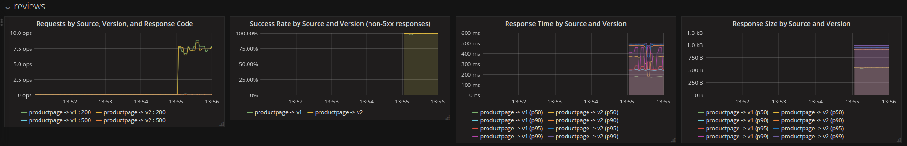



This task shows how to configure Mixer to automatically gather telemetry
for a service within a cluster. At the end of this task, a new metric and
a new log stream will be enabled for calls to a specific service within your
cluster.

The [BookInfo]({{home}}/docs/samples/bookinfo.html) sample application is used
as the example application throughout this task.

## Before you begin
* [Install Istio](./installing-istio.html) in your kubernetes
  cluster and deploy an application.

* Configure your environment to support calling `istioctl mixer`.
  This may require setting up port-forwarding for the Mixer Config API as described in the
  [reference docs]({{home}}/docs/reference/commands/istioctl.html#istioctl-mixer) for `istioctl mixer`.

* Configure your environment to support accessing the Istio dashboard, as described in the 
  [Installation Guide](./installing-istio.html). This requires installing the optional add-ons
  ([Prometheus](https://prometheus.io) and [Grafana](https://grafana.com/)), as well as verifying access to
  the dashboard. The Istio dashboard will be used to verify task success.

## Collecting new telemetry data

1. Create a new YAML file to hold configuration for
   the new metric and log stream that Istio will generate and collect
   automatically.

   Save the following as `new_rule.yaml`:
   <pre data-src="https://raw.githubusercontent.com/istio/istio/release-0.1/samples/apps/bookinfo/mixer-rule-additional-telemetry.yaml"></pre>

1. Pick a target service for the new rule.

   If using the BookInfo sample, select `reviews.default.svc.cluster.local`. 
   A fully-qualified domain name for the service is required in the following steps.

1. Validate that the selected service has no service-specific rules
   already applied.

   ```bash
   istioctl mixer rule get reviews.default.svc.cluster.local reviews.default.svc.cluster.local
   ```

   The expected output is:

   ```bash
   Error: the server could not find the requested resource
   ```

   If your selected service has service-specific rules, update `new_rule.yaml`
   to include the existing rules appropriately. Append the rule from `new_rule.yaml`
   to the existing `rules` block and save the updated content back over `new_rule.yaml`.

1. Push the new configuration to Mixer for a specific service.

   ```bash
   istioctl mixer rule create reviews.default.svc.cluster.local reviews.default.svc.cluster.local -f new_rule.yaml
   ```

1. Send traffic to that service.

   For the BookInfo sample, visit `http://$GATEWAY_URL/productpage` in your web browser or
   issue the following command:

   ```bash
   curl http://$GATEWAY_URL/productpage
   ```

   For purposes of this task, please refresh the page several times or issue the curl
   command a few times to generate traffic.

1. Verify that the new metric is being collected.
   
   Setup port-forwarding for Grafana:
   
   ```bash
   kubectl port-forward $(kubectl get pod -l app=grafana -o jsonpath='{.items[0].metadata.name}') 3000:3000 &
   ```

   Then open the Istio dashboard in a web browser: [http://localhost:3000/dashboard/db/istio-dashboard](http://localhost:3000/dashboard/db/istio-dashboard)
   
   One of the rows in the dashboard will be named "reviews". If that row is not visible, please refresh the dashboard page. The "reviews" row
   contains a graph entitled "Response Size by Source And Version". The graph displays a breakdown of the distribution of Response Sizes returned
   by the "reviews" service.

   The request from the previous step is reflected in the graphs. This looks similar to:
   <figure>
   <figcaption>Istio Dashboard for Reviews Service</figcaption></figure>

1. Verify that the logs stream has been created and is being populated
   for requests.

   Search through the logs for the Mixer pod as follows:

   ```bash
   kubectl logs $(kubectl get pods -l istio=mixer -o jsonpath='{.items[0].metadata.name}') | grep \"combined_log\"
   ```

   The expected output is similar to:

   ```json
   {"logName":"combined_log","labels":{"referer":"","responseSize":871,"timestamp":"2017-04-29T02:11:54.989466058Z","url":"/reviews","userAgent":"python-requests/2.11.1"},"textPayload":"- - - [29/Apr/2017:02:11:54 +0000] \"- /reviews -\" - 871 - python-requests/2.11.1"}
   ```

## Understanding the new telemetry rule

In this task, you added a new rule for a service within your cluster.
The new rule instructed Mixer to automatically generate and report a
new metric and a new log stream for all traffic going to a specific
service.

The new rule was comprised of a new `aspect` definitions. These `aspect`
definitions were for the aspect kind of `metrics` and `access-logs`.

### Understanding the rule's metrics aspect

The `metrics` aspect directs Mixer to report metrics to the `prometheus`
adapter. The adapter `params` tell Mixer _how_ to generate metric values
for any given request, based on the attributes reported by Envoy (and
generated by Mixer itself).

The schema for the metric came from a predefined metric `descriptor`
known to Mixer. In this task, the descriptor used was `response_size`.
The `response_size` metric descriptor uses buckets to record a 
distribution of values, making it easier for the backend metrics systems
to provide summary statistics for a bunch of requests in aggregate (as
is often desirable when looking at response sizes).

The new rule instructs Mixer to generate values for the metric based
on the values of the attribute `response.size`. A default values of `0`
was added, in case Envoy does not report the values as expected.

A set of dimensions were also configured for the metric value, via the
`labels` chunks of configuration. For the new metric, the dimensions
were `source`, `target`, `service`, `version`, `method`, and `response_code`.

Dimensions provide a way to slice, aggregate, and analyze metric data
according to different needs and directions of inquiry. For instance, it
may be desirable to only consider response sizes for non-error responses
when troubleshooting the rollout of a new application version.

The new rule instructs Mixer to populate values for these dimensions
based on attribute values. For instance, for the `service` dimension, the
new rule requests that the value be taken from the `target.labels["app"]` 
attribute. If that attribute value is not populated, the rule instructs
 Mixer to use a default value of `"unknown"`.

At the moment, it is not possible to programmatically generate new metric
descriptors for use within Mixer. As a result, all new metric configurations
must use one of the predefined metrics descriptors: `request_count`,
`request_duration`, `request_size`, and `response_size`.

Work is ongoing to extend the Mixer Config API to add support for creating
new descriptors.

### Understanding the rule's access_logs aspect

The `access-logs` aspect directs Mixer to send access logs to the `default`
adapter (typically, `stdioLogger`). The adapter `params` tell Mixer _how_ 
to generate the access logs for incoming requests based on attributes reported
by Envoy.

The `logName` parameter is used by Mixer to identify a logs stream. In
this task, the log name `combined_log` was used to identify the log
stream amidst the rest of the Mixer logging output. This name should be
used to uniquely identify log streams to various logging backends.

The `log` section of the rule describes the shape of the access log that
Mixer will generate when the rule is applied. In this task, the pre-configured 
definition for an access log named `accesslog.combined` was used. It
is based on the well-known [Combined Log Format](https://httpd.apache.org/docs/1.3/logs.html#combined).

Access logs use a template to generate a plaintext log from a set of
named arguments. The template is defined in the configured `descriptor`
for the aspect. In this task, the template used is defined in the
descriptor named `accesslog.combined`. The set of inputs to the `template_expressions`
is fixed in the descriptor and cannot be altered in aspect configuration.

The `template_expressions` describe how to translate attribute values
into the named arguments for the template processing. For example, the
value for `userAgent` is to be derived directly from the value for the
attribute `request.headers["user-agent"]`.

Mixer supports structured log generation in addition to plaintext logs. In
this task, a set of `labels` to populate for structured
log generation was configured. These `labels` are populated from attribute values
according to attribute expressions, in exactly the same manner as the
`template_expressions`.

While it is common practice to include the same set of arguments in the
`labels` as in the `template_expressions`, this is not required. Mixer
will generate the `labels` completely independently of the `template_expressions`.

As with metric descriptors, it is not currently possible to programmatically
generate new access logs descriptors. Work is ongoing to extend the Mixer
Config API to add support for creating new descriptors.

## What's next

* Learn more about [Mixer]({{home}}/docs/concepts/policy-and-control/mixer.html) and [Mixer Config]({{home}}/docs/concepts/policy-and-control/mixer-config.html).

* Discover the full [Attribute Vocabulary]({{home}}/docs/reference/config/mixer/attribute-vocabulary.html).

* Read the reference guide to [Writing Config]({{home}}/docs/reference/writing-config.html).

* If you are not planning to explore any follow-on tasks, refer to the
  [BookInfo cleanup]({{home}}/docs/samples/bookinfo.html#cleanup) instructions
  to shutdown the application and cleanup the associated rules.
