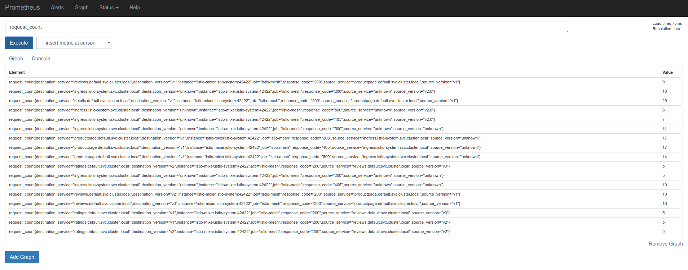
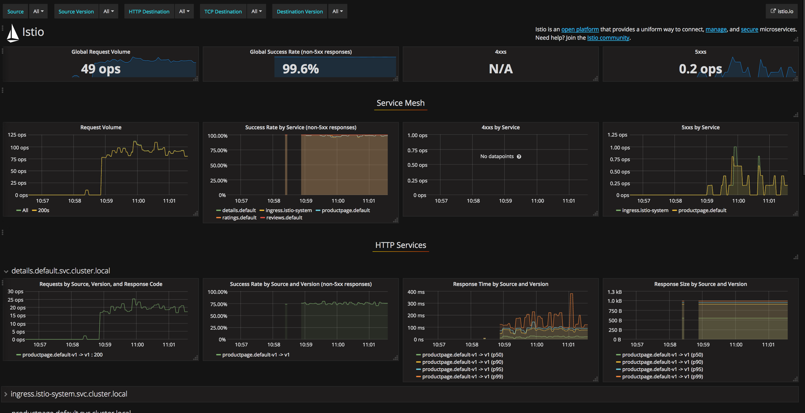



This task shows how to install and use the set of Istio add-ons. The add-ons
include a Prometheus server with config to pull metrics from Istio endpoints, a
Grafana server preconfigured with a default dashboard for monitoring an Istio
service mesh, and an example ServiceGraph service that can generate a visual
representation of an Istio service mesh.

The [BookInfo]({{home}}/docs/guides/bookinfo.html) sample application is used
as the example application throughout this task.

## Before you begin
* [Install Istio]({{home}}/docs/setup/) in your cluster and deploy an
  application.

## Using the Prometheus add-on

### Installation and Usage

1. To collect, view, and query the metrics provided by Mixer, install the
   Prometheus add-on.

    In Kubernetes environments, execute the following command:

    ```bash
    kubectl apply -f install/kubernetes/addons/prometheus.yaml
    ```

1. Verify that the service is running in your cluster.

    In Kubernetes environments, execute the following command:

    ```bash
    kubectl -n istio-system get svc prometheus
    ```

    The output will be similar to:

    ```
    NAME         CLUSTER-IP     EXTERNAL-IP   PORT(S)    AGE
    prometheus   10.59.241.54   <none>        9090/TCP   2m
    ```

1. Send traffic to the mesh.

    For the BookInfo sample, visit `http://$GATEWAY_URL/productpage` in your web
    browser or issue the following command:

   ```bash
   curl http://$GATEWAY_URL/productpage
   ```

1. Open the Prometheus UI.

    In Kubernetes environments, execute the following command:

    ```bash
    kubectl -n istio-system port-forward $(kubectl -n istio-system get pod -l app=prometheus -o jsonpath='{.items[0].metadata.name}') 9090:9090 &   
    ```

    Visit [http://localhost:9090/graph](http://localhost:9090/graph) in your web browser.

1. Execute a Prometheus query.

    In the "Expression" input box at the top of the web page, enter the text:
    `request_count`. Then, click the **Execute** button.

    The results will be similar to:

    <figure>
    <figcaption>Prometheus Query Result</figcaption></figure>

### About the Prometheus Add-on

Mixer comes with a built-in [Prometheus](https://prometheus.io) adapter that
exposes an endpoint serving generated metric values. The Prometheus add-on is a
Prometheus server that comes pre-configured to scrape Mixer endpoints to collect
the exposed metrics. It provides a mechanism for persistent storage and querying
of Istio metrics. The Grafana add-on, for instance, uses this add-on as the
source for all of the dashboard data.

The configured Prometheus add-on scrapes three endpoints:
1. *istio-mesh* (`istio-mixer.istio-system:42422`): all Mixer-generated mesh
   metrics.
1. *mixer* (`istio-mixer.istio-system:9093`): all Mixer-specific metrics. Used
   to monitor Mixer itself.
1. *envoy* (`istio-mixer.istio-system:9102`): raw stats generated by Envoy (and
   translated from statsd to prometheus).

## Using the Grafana add-on

**NOTE**: Use of the Grafana add-on _requires_ use of the Prometheus add-on.

### Installation and Usage

1. To view Istio metrics in a graphical dashboard install the Grafana add-on. 

    In Kubernetes environments, execute the following command:

    ```bash
    kubectl apply -f install/kubernetes/addons/grafana.yaml
    ```

1. Verify that the service is running in your cluster.

    In Kubernetes environments, execute the following command:

    ```bash
    kubectl -n istio-system get svc grafana
    ```

    The output will be similar to:

    ```
    NAME      CLUSTER-IP      EXTERNAL-IP   PORT(S)    AGE
    grafana   10.59.247.103   <none>        3000/TCP   2m
    ```

1. Open the Istio Dashboard via the Grafana UI.

    In Kubernetes environments, execute the following command:

    ```bash
    kubectl -n istio-system port-forward $(kubectl -n istio-system get pod -l app=grafana -o jsonpath='{.items[0].metadata.name}') 3000:3000 &
    ```

    Visit [http://localhost:3000/dashboard/db/istio-dashboard](http://localhost:3000/dashboard/db/istio-dashboard) in your web browser.

    The Istio Dashboard will look similar to:

    <figure>
    <figcaption>Istio Dashboard</figcaption></figure>

1. Send traffic to the mesh.

    For the BookInfo sample, visit `http://$GATEWAY_URL/productpage` in your web
    browser or issue the following command:

   ```bash
   curl http://$GATEWAY_URL/productpage
   ```

   Refresh the page a few times (or send the command a few times) to generate a
   small amount of traffic.

   Look at the Istio Dashboard again. It should reflect the traffic that was
   generated. It will look similar to:

  <figure>
    <figcaption>Istio Dashboard With Traffic</figcaption></figure>


### About the Grafana add-on

The Grafana add-on is a pre-configured instance of Grafana. The base image
([`grafana/grafana:4.1.2`](https://hub.docker.com/r/grafana/grafana/)) has been
modified to start with both a Prometheus data source and the Istio Dashboard
installed. The base install files for Istio, and Mixer in particular, ship with
a default configuration of global (used for every service) metrics. The Istio
Dashboard is built to be used in conjunction with the default Istio metrics
configuration and a Prometheus backend.

The Istio Dashboard consists of three main sections:
1. A Global Summary View. This section provides high-level summary of HTTP
   requests flowing through the service mesh.
1. A Mesh Summary View. This section provides slightly more detail than the
   Global Summary View, allowing per-service filtering and selection.
1. Individual Services View. This section provides metrics about requests and
   responses for each individual service within the mesh (HTTP and TCP).

For more on how to create, configure, and edit dashboards, please see the
[Grafana documentation](http://docs.grafana.org/).

## Using the Servicegraph add-on

**NOTE**: Use of the Grafana add-on _requires_ use of the Prometheus add-on.

1. To view a graphical representation of your service mesh, install the
   Servicegraph add-on.

    In Kubernetes environments, execute the following command:

    ```bash
    kubectl apply -f install/kubernetes/addons/servicegraph.yaml
    ```

1. Verify that the service is running in your cluster.

    In Kubernetes environments, execute the following command:

    ```bash
    kubectl -n istio-system get svc servicegraph
    ```

    The output will be similar to:

    ```
    NAME           CLUSTER-IP      EXTERNAL-IP   PORT(S)    AGE
    servicegraph   10.59.253.165   <none>        8088/TCP   30s
    ```

1. Send traffic to the mesh.

    For the BookInfo sample, visit `http://$GATEWAY_URL/productpage` in your web
    browser or issue the following command:

   ```bash
   curl http://$GATEWAY_URL/productpage
   ```

   Refresh the page a few times (or send the command a few times) to generate a
   small amount of traffic.

1. Open the Servicegraph UI.

    In Kubernetes environments, execute the following command:

    ```bash
    kubectl -n istio-system port-forward $(kubectl -n istio-system get pod -l app=servicegraph -o jsonpath='{.items[0].metadata.name}') 8088:8088 &   
    ```

    Visit [http://localhost:8088/dotviz](http://localhost:8088/dotviz) in your web browser.

    The results will look similar to:

    <figure>
    <figcaption>Example Servicegraph</figcaption></figure>
    
### About the Servicegraph Add-on

The Servicegraph service is an example service that provides endpoints for
generating and visualizing a graph of services within a mesh. It exposes the
following endpoints:

- `/graph` which provides a JSON serialization of the servicegraph
- `/dotgraph` which provides a dot serialization of the servicegraph
- `/dotviz` which provides a visual representation of the servicegraph

All endpoints take an optional argument of `time_horizon`, which controls the
timespan to consider for graph generation.

All endpoints also take an optional argument of `filter_empty=true`, which will
restrict the nodes and edges shown to only those that reflect non-zero traffic
levels during the specified `time_horizon`.

The Servicegraph example is built on top of Prometheus queries.