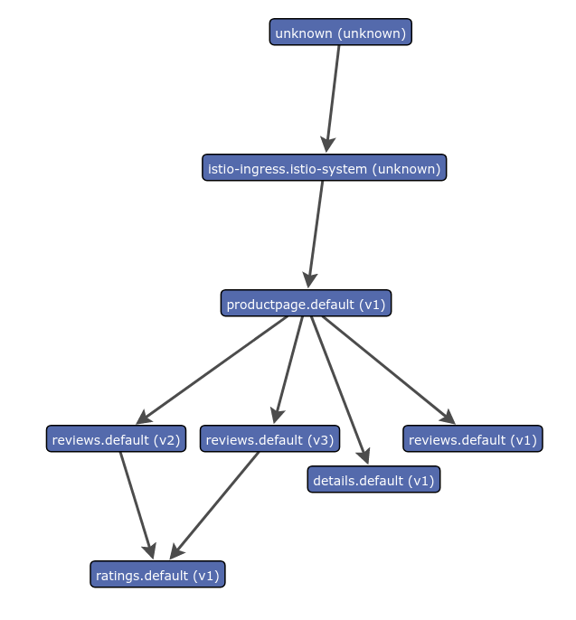



This task shows you how to generate a graph of services within an Istio mesh.
As part of this task, you will install the ServiceGraph addon and use
the web-based interface for viewing service graph of the service mesh.

The [BookInfo]({{home}}/docs/guides/bookinfo.html) sample application is used as
the example application throughout this task.

## Before you begin

* [Install Istio]({{home}}/docs/setup/) in your cluster and deploy an
  application.

* Install the Prometheus add-on. Directions for install of this add-on are
  supplied as part of the [Querying
  Metrics]({{home}}/docs/tasks/telemetry/querying-metrics.html) Task.

  Use of the Prometheus add-on is _required_ for the service graph.

## Generating a Service Graph

1. To view a graphical representation of your service mesh, install the
   Servicegraph add-on.

    In Kubernetes environments, execute the following command:

    ```bash
    kubectl apply -f install/kubernetes/addons/servicegraph.yaml
    ```

1. Verify that the service is running in your cluster.

    In Kubernetes environments, execute the following command:

    ```bash
    kubectl -n istio-system get svc servicegraph
    ```

    The output will be similar to:

    ```
    NAME           CLUSTER-IP      EXTERNAL-IP   PORT(S)    AGE
    servicegraph   10.59.253.165   <none>        8088/TCP   30s
    ```

1. Send traffic to the mesh.

    For the BookInfo sample, visit `http://$GATEWAY_URL/productpage` in your web
    browser or issue the following command:

   ```bash
   curl http://$GATEWAY_URL/productpage
   ```

   Refresh the page a few times (or send the command a few times) to generate a
   small amount of traffic.

   Note: `$GATEWAY_URL` is the value set in the
   [BookInfo]({{home}}/docs/guides/bookinfo.html) guide.

1. Open the Servicegraph UI.

    In Kubernetes environments, execute the following command:

    ```bash
    kubectl -n istio-system port-forward $(kubectl -n istio-system get pod -l app=servicegraph -o jsonpath='{.items[0].metadata.name}') 8088:8088 &   
    ```

    Visit [http://localhost:8088/dotviz](http://localhost:8088/dotviz) in your web browser.

    The results will look similar to:

<figure> <figcaption>Example
Servicegraph</figcaption></figure>

### About the Servicegraph Add-on

The Servicegraph service is an example service that provides endpoints for
generating and visualizing a graph of services within a mesh. It exposes the
following endpoints:

- `/graph` which provides a JSON serialization of the servicegraph
- `/dotgraph` which provides a dot serialization of the servicegraph
- `/dotviz` which provides a visual representation of the servicegraph

All endpoints take an optional argument of `time_horizon`, which controls the
timespan to consider for graph generation.

All endpoints also take an optional argument of `filter_empty=true`, which will
restrict the nodes and edges shown to only those that reflect non-zero traffic
levels during the specified `time_horizon`.

The Servicegraph example is built on top of Prometheus queries.

## Cleanup

* In Kubernetes environments, execute the following command to remove the
  ServiceGraph add-on:

  ```bash
  kubectl delete -f install/kubernetes/addons/servicegraph.yaml
  ```

* If you are not planning to explore any follow-on tasks, refer to the
  [BookInfo cleanup]({{home}}/docs/guides/bookinfo.html#cleanup) instructions
  to shutdown the application.
