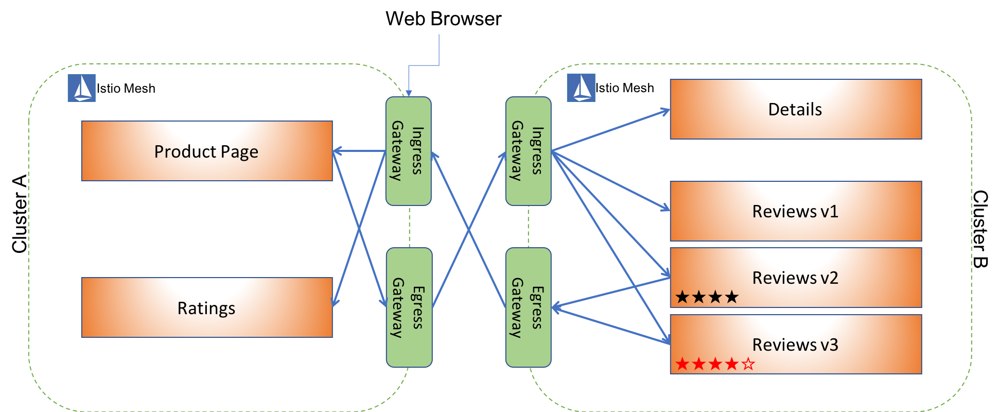

In Istio 0.8 we introduced the Istio Multicluster support that expand the services mesh of a local cluster with services from remote cluster(s). In this approach the user is installing only the critical components necessary to connect remote services to to the local Istio mesh. The advantages of one mesh are clear yet there are some scenarios when this is not feasible to create a Multi-cluster topology. The major one is that it requires that the Pod/Service CIDR addresses will be unique across the connected clusters while some cloud provider can not guarantee to that.

In this blog post we describe another approach for Istio Multi-Cluster that leverages its own capabilities of routing and ingress/egress to support sharing services between clusters. We also share an example of a distributed Bookinfo app that demonstrates the use of this approach.

Let's begin with the design.

## Design principles

Before diving into technical configuration YAMLs let's take a moment to explain the concept introduced here.

Having different clusters with an Istio mesh running on each allows the operators to use Istio components to connect the clusters. T clusters can talk to each other as both have an Ingress and Egress Gateways allowing traffic to enter or exit the clusters. Once we have those we need to use Istio's routing capabilities to selectively route traffic with a remote destination to the remote ingress through the local egress. How can we do it?

The clusters operator (you) explicitly exposes one or more services in a cluster under a common custom DNS suffix (e.g., _*.remote_) via the Ingress gateway. Access to remote clusters can be granted by adding an Istio _ServiceEntry_ object that points to the respective remote cluster's Ingress Gateway for all hosts associated with the remote cluster.

Routing rules (Virtual Services) are setup such that traffic from a cluster to a remote cluster always traverses through the local egress gateway. Funneling all egress traffic through a dedicated egress gateway simplifies policy enforcement, traffic scrubbing, etc.

We can use a [CoreDNS](https://coredns.io/) that has the [Kubernetes plugin](https://coredns.io/plugins/kubernetes/) to resolve host names with the custom DNS suffix. However, even though custom DNS names are used, there is no additional DNS setup required. CoreDNS resolves all hosts in with the _*.remote_ suffix to an invalid IP (e.g., 10.1.1.1), allowing traffic to exit the application and be captured by the sidecar. Once the traffic reaches the sidecar, routing is done through HTTP Authority headers or SNI names.

For example, a client (curl command) in _Cluster A_ calls `http://service_b.remote`, which gets routed from the local proxy to the local Egress Gateway. From the Egress Gateway the request traverses to the remote Ingress Gateway of _Cluster B_, which then forwards the request to the appropriate local service `service_b`.

Notice that while we describe above a Multi-Cluster of two clusters this approach can scale up to more than a pair.

Let's dive into technical details.

## Setting up a cross-cluster

The configuration below shows how to configure _Cluster A_ to be part of the Multi-Cluster. Similar mirrored configuration should be deployed to _Cluster B_ with the relevant changes. It can be done only after Istio and CoreDNS have been installed on each cluster.

We first configure the local Ingress Gateway to accept traffic to `*.svc.a.remote`. I.e. incoming traffic originated from _Cluster B_:

```yaml
apiVersion: networking.istio.io/v1alpha3
kind: Gateway
metadata:
  name: ingress-gateway
spec:
  selector:
    istio: ingressgateway
  servers:
  - hosts:
    - "*.svc.a.remote"
    port:
      number: 80
      protocol: HTTP
      name: http
```

We also configure an Egress `ServiceEntry` to route all traffic with destination host matching `*.svc.b.remote` to the remote Ingress Gateway. `INGRESS_IP_ADDRESS` should be replaced with the public IP address of the Ingress Gateway of _Cluster B_:

```yaml
apiVersion: networking.istio.io/v1alpha3
kind: ServiceEntry
metadata:
  name: b-ingress
spec:
  hosts:
  - ingress.b.remote
  ports:
  - number: 80
    name: http
    protocol: HTTP	
  resolution: STATIC
  endpoints:
  - address: INGRESS_IP_ADDRESS
    ports:
      http: 80
```

The following VirtualService routes all mesh traffic for hosts `*.svc.b.remote` to the ServiceEntry we just defined above. Note that the port values used here can be used to shift the ports traffic is sent on to the ingress (e.g. to allow for egress/ingress proxy pairs that multiplex multiple protocols over the same physical ports). Also note that this route's destination's host exactly matches the host of the ServiceEntry:

```yaml
apiVersion: networking.istio.io/v1alpha3
kind: VirtualService
metadata:
  name: b-virtual-service
spec:
  hosts:
  - "*.svc.b.remote"
  gateways:
  - mesh
  http:
  - route:
    - destination:
        host: ingress.b.remote
        port:
          number: 80
      weight: 100
```

Finally, since we're creating hostnames out of nothing, and our apps resolve hostnames via DNS before making HTTP calls, we need our CoreDNS server to resolve the custom host names. This config sends all requests with a `remote` suffix to the CoreDNS server we have running [configured to return a fake IP](#appendix-configuring-the-coredns) for all `*.remote`. `CORE_DNS_IP` should be replaced with the CoreDNS service IP:

```yaml
apiVersion: v1
kind: ConfigMap
metadata:
  name: kube-dns
  namespace: kube-system
data:
  stubDomains: |
    {"remote": ["CORE_DNS_IP"]}
```

## Security

A separate root CA cluster issues/rotates certs of cluster local CAs. This allows cross cluster communication using mutual TLS, as there is a shared root of trust. Within a cluster, istio mTLS authentication is used to secure traffic between two endpoints.

[Permission to put Shriram's diagram here]

## Example: Distributed Bookinfo

For an easy start and to further explore it, we have an example that has complete configuration for Installing Istio, setting up CoreDNS, configuring a two-clusters Multi-Cluster and deploying a sample app.
Executing a single script will install and setup both clusters and all you need it to provide the Kubeconfig contexts for both clusters. [Link to repo sample]

In this example we took Istio's famous [Bookinfo sample application](https://istio.io/docs/guides/bookinfo/) and configured our Multi-Cluster so that the `Productpage` and `Ratings` microservices are running on one cluster and the `Details` and `Reviews v1/v2/v3` are running on the other. This nicely demonstrates a two way communication between the clusters as `Productpage`, for instance, is calling the `Reviews` service on the remote cluster while `Reviews v2/v3` themselves are calling the `Ratings` service from the first cluster.

The following diagram describes the distribution of the Bookinfo micro-services between the two clusters and the mutual communication between those:



As we described above, the communication between the clusters is going through a set of Ingress and Egress Gateways that both clusters have by deploying Istio to each one of them.

## Appendix: Configuring the CoreDNS

Our applications need to be able to resolve these hostnames to an IP address at runtime, even though Envoy ignores the IP address they supply and instead routes based on Host header. To make this work we configure CoreDNS to return a dummy IP address for all A record queries of the form "*.remote"

```yaml
apiVersion: v1
kind: ServiceAccount
metadata:
  name: coredns
  namespace: istio-system
---
apiVersion: rbac.authorization.k8s.io/v1beta1
kind: ClusterRole
metadata:
  labels:
    kubernetes.io/bootstrapping: rbac-defaults
  name: system:coredns
rules:
- apiGroups:
  - ""
  resources:
  - endpoints
  - services
  - pods
  - namespaces
  verbs:
  - list
  - watch
---
apiVersion: rbac.authorization.k8s.io/v1beta1
kind: ClusterRoleBinding
metadata:
  annotations:
    rbac.authorization.kubernetes.io/autoupdate: "true"
  labels:
    kubernetes.io/bootstrapping: rbac-defaults
  name: system:coredns
roleRef:
  apiGroup: rbac.authorization.k8s.io
  kind: ClusterRole
  name: system:coredns
subjects:
- kind: ServiceAccount
  name: coredns
  namespace: istio-system
---
apiVersion: v1
kind: ConfigMap
metadata:
  name: coredns
  namespace: istio-system
data:
  Corefile: |
    .:53 {
        errors
        health
        kubernetes cluster.local in-addr.arpa ip6.arpa {
          pods insecure
          upstream
          fallthrough in-addr.arpa ip6.arpa
        }
        template IN A remote {
          match (.*?)[.]remote[.]$
          answer "{{ .Name }} 3600 IN A 10.1.1.1"
        }
        prometheus :9153
        proxy . /etc/resolv.conf
        cache 30
        reload
    }
---
apiVersion: extensions/v1beta1
kind: Deployment
metadata:
  name: coredns
  namespace: istio-system
  labels:
    app: core-dns
    kubernetes.io/name: "CoreDNS"
spec:
  replicas: 1
  strategy:
    type: RollingUpdate
    rollingUpdate:
      maxUnavailable: 1
  selector:
    matchLabels:
      app: core-dns
  template:
    metadata:
      labels:
        app: core-dns
    spec:
      serviceAccountName: coredns
      tolerations:
        - key: "CriticalAddonsOnly"
          operator: "Exists"
      containers:
      - name: coredns
        image: coredns/coredns:1.1.2
        imagePullPolicy: IfNotPresent
        args: [ "-conf", "/etc/coredns/Corefile" ]
        volumeMounts:
        - name: config-volume
          mountPath: /etc/coredns
        ports:
        - containerPort: 53
          name: dns
          protocol: UDP
        - containerPort: 53
          name: dns-tcp
          protocol: TCP
        - containerPort: 9153
          name: metrics
          protocol: TCP
        livenessProbe:
          httpGet:
            path: /health
            port: 8080
            scheme: HTTP
          initialDelaySeconds: 60
          timeoutSeconds: 5
          successThreshold: 1
          failureThreshold: 5
      dnsPolicy: Default
      volumes:
        - name: config-volume
          configMap:
            name: coredns
            items:
            - key: Corefile
              path: Corefile
---
apiVersion: v1
kind: Service
metadata:
  name: core-dns
  namespace: istio-system
  annotations:
    prometheus.io/scrape: "true"
  labels:
    app: core-dns
    kubernetes.io/cluster-service: "true"
    kubernetes.io/name: "CoreDNS"
spec:
  selector:
    app: core-dns
  ports:
  - name: dns
    port: 53
    protocol: UDP
  - name: dns-tcp
    port: 53
    protocol: TCP
```