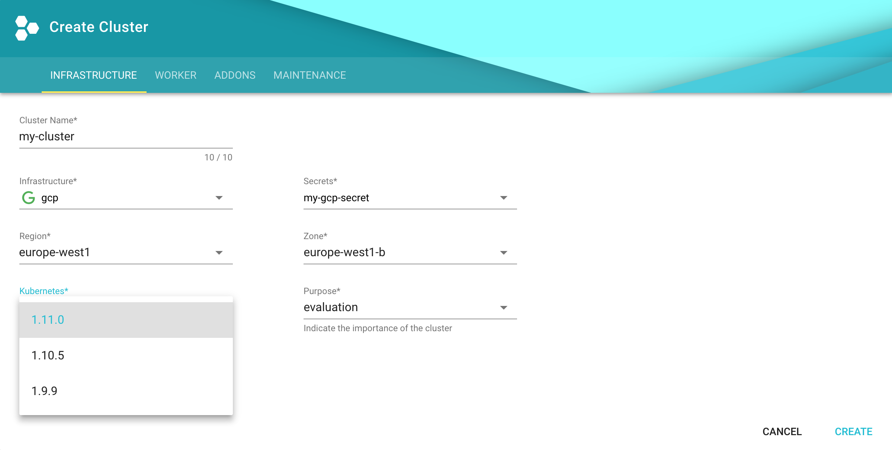

## Bootstrapping Gardener

To set up your own [Gardener](https://gardener.cloud), see the
[documentation](https://github.com/gardener/gardener/blob/master/docs/README.md)
or have a look at the
[landscape-setup-template](https://github.com/gardener/landscape-setup-template)
project. To learn more about this open source project, read the
[blog on `kubernetes.io`](https://kubernetes.io/blog/2018/05/17/gardener/).

### Install and configure `kubectl`

1.  If you already have `kubectl` CLI, run `kubectl version --short` to check
    the version. You need `v1.10` or newer. If your `kubectl` is older, follow the
    next step to install a newer version.

1.  [Install the `kubectl` CLI](https://kubernetes.io/docs/tasks/tools/install-kubectl/).

### Access Gardener

1.  Create a project in the Gardener dashboard. This will essentially create a
    Kubernetes namespace with the name `garden-<my-project>`.

1.  [Configure access to your Gardener project](https://kubernetes.io/docs/tasks/tools/install-kubectl/#verifying-kubectl-configuration)
    using a kubeconfig. If you are not the Gardener Administrator already, you
    can create a technical user in the Gardener dashboard: go to the "Members"
    section and add a service account. You can then download the kubeconfig for
    your project. You can skip this step if you create your cluster using the
    user interface; it is only needed for programmatic access, make sure you set
    `export KUBECONFIG=garden-my-project.yaml` in your shell.
    

### Creating a Kubernetes cluster

You can create your cluster using `kubectl` cli by providing a cluster
specification yaml file. You can find an example for GCP
[here](https://github.com/gardener/gardener/blob/master/example/90-shoot-gcp.yaml).
Make sure the namespace matches that of your project. Then just apply the
prepared so-called "shoot" cluster CRD with `kubectl`:


$ kubectl apply --filename my-cluster.yaml


The easier alternative is to create the cluster following the cluster creation
wizard in the Gardener dashboard:

### Configure `kubectl` for your cluster

You can now download the kubeconfig for your freshly created cluster in the
Gardener dashboard or via cli as follows:


$ kubectl --namespace shoot--my-project--my-cluster get secret kubecfg --output jsonpath={.data.kubeconfig} | base64 --decode > my-cluster.yaml


This kubeconfig file has full administrators access to you cluster. For the rest
of this guide be sure you have `export KUBECONFIG=my-cluster.yaml` set.

## Cleaning up

Use the Gardener dashboard to delete your cluster, or execute the following with
`kubectl` pointing to your `garden-my-project.yaml` kubeconfig:


$ kubectl --kubeconfig garden-my-project.yaml --namespace garden--my-project annotate shoot my-cluster confirmation.garden.sapcloud.io/deletion=true
$ kubectl --kubeconfig garden-my-project.yaml --namespace garden--my-project delete shoot my-cluster

