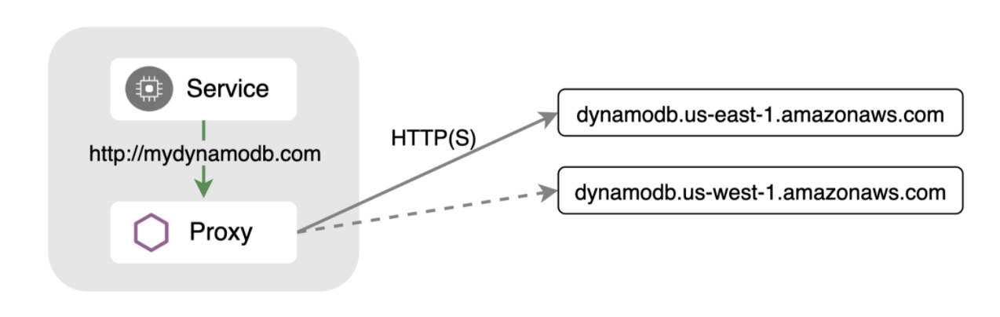

Istio’s powerful APIs can be used to solve a variety of use cases. Many users know about it’s strong ingress and east-west capabilities but it also offers many features for egress (outgoing) traffic. This is especially useful when your application needs to talk to an external service - such as a database endpoint that is provided by a cloud provider. Often, there are [multiple endpoints](https://docs.aws.amazon.com/general/latest/gr/ddb.html) for you to choose from depending on where your workload is running. You want to choose the endpoint that is closest to your workload for latency reasons, but you need to configure automatic failover to another endpoint when things are not working as expected.

Similar to services running inside the mesh, you can use Istio to configure outlier detection and failover to a healthy endpoint while being completely transparent to your application. In this example, we’ll use Amazon’s DynamoDB endpoints to pick a primary region that is the same or close to where your workload is running. We’ll also configure a failover region.

|Routing|Endpoint|
|--- |--- |
|Primary|http://dynamodb.us-east-1.amazonaws.com|
|Failover|http://dynamodb.us-west-1.amazonaws.com|

## Define external endpoints using a ServiceEntry

First, determine the location of your workloads.


$ kubectl describe node | grep failure-domain.beta.kubernetes.io/region
                    failure-domain.beta.kubernetes.io/region=us-east1
                    failure-domain.beta.kubernetes.io/region=us-east1


As you can see, on my GKE cluster, all of my nodes are running in `us-east1`

Next, apply a Istio ServiceEntry to create a `mydb.com` service that’s backed by the two DynamoDB endpoints.


apiVersion: networking.istio.io/v1alpha3
kind: ServiceEntry
metadata:
 name: external-svc-dns
spec:
 hosts:
 - mydb.com
 location: MESH_EXTERNAL
 ports:
 - number: 80
   name: http
   protocol: HTTP
 resolution: DNS
 endpoints:
 - address: dynamodb.us-east-1.amazonaws.com
   locality: us-east1
   ports:
     http: 80
 - address: dynamodb.us-west-1.amazonaws.com
   locality: us-west1
   ports:
     http: 80


Let’s deploy a sleep container to runs some tests:


$ kubectl apply -f https://raw.githubusercontent.com/istio/istio/release-1.10/samples/sleep/sleep.yaml


From the sleep container try going to `http://mydb.com` 5 times:


$ for i in {1..5}; do kubectl exec deploy/sleep -c sleep -- curl -sS http://mydb.com; echo; sleep 2; done
healthy: dynamodb.us-east-1.amazonaws.com
healthy: dynamodb.us-west-1.amazonaws.com
healthy: dynamodb.us-west-1.amazonaws.com
healthy: dynamodb.us-east-1.amazonaws.com
healthy: dynamodb.us-east-1.amazonaws.com


It’s sending requests to both endpoints. We only want it to send to the endpoint marked with the same region as our nodes.

For that, we need to configure a `DestinationRule`.

## Set failover conditions using a `DestinationRule`

Istio’s `DestinationRule` lets you configure load balancing, connection pool, and outlier detection settings. We can use it to specify the conditions to use to mark an endpoint as unhealthy and remove it from the load balancing pool.


apiVersion: networking.istio.io/v1alpha3
kind: DestinationRule
metadata:
 name: mydynamodb
spec:
 host: mydb.com
 trafficPolicy:
   outlierDetection:
     consecutive5xxErrors: 1
     interval: 15s
     baseEjectionTime: 1m


The above `DestinationRule` configures the endpoints to be scanned every 15 seconds, and if any endpoint fails with a 5xx error code even once, it will be marked unhealthy for 1 minute. If this circuit breaker is not triggered, the traffic will route to the same region as the pod.

If we run our curl again, we should see that traffic is always going to the `us-east1` endpoint.


$ for i in {1..5}; do kubectl exec deploy/sleep -c sleep -- curl -sS http://mydb.com; echo; sleep 2; done

healthy: dynamodb.us-east-1.amazonaws.com
healthy: dynamodb.us-east-1.amazonaws.com
healthy: dynamodb.us-east-1.amazonaws.com
healthy: dynamodb.us-east-1.amazonaws.com
healthy: dynamodb.us-east-1.amazonaws.com


## Simulate a failure

Next, let's see what happens if the us-east endpoint goes down. To simulate this, let’s modify the ServiceEntry and set the `us-east` endpoint to an invalid port (change port from 80 to 81).


apiVersion: networking.istio.io/v1alpha3
kind: ServiceEntry
metadata:
 name: external-svc-dns
spec:
 hosts:
 - mydb.com
 location: MESH_EXTERNAL
 ports:
 - number: 80
   name: http
   protocol: HTTP
 resolution: DNS
 endpoints:
 - address: dynamodb.us-east-1.amazonaws.com
   locality: us-central1
   ports:
     http: 81 # INVALID - This is purposefully wrong to trigger failover
 - address: dynamodb.us-west-1.amazonaws.com
   locality: us-west
   ports:
     http: 80


Running our curl again shows that traffic is automatically failed over to our us-west region after failing to connect to the us-east endpoint:


$ for i in {1..5}; do kubectl exec deploy/sleep -c sleep -- curl -sS http://mydb.com; echo; sleep 2; done
upstream connect error or disconnect/reset before headers. reset reason: connection failure
healthy: dynamodb.us-west-1.amazonaws.com
healthy: dynamodb.us-west-1.amazonaws.com
healthy: dynamodb.us-west-1.amazonaws.com
healthy: dynamodb.us-west-1.amazonaws.com


You can check the outlier status of the us-east endpoint by running:


$ istioctl pc endpoints <sleep-pod> | grep mydb
ENDPOINT                         STATUS      OUTLIER CHECK     CLUSTER
52.119.226.80:81                 HEALTHY     FAILED            outbound|80||mydb.com
52.94.12.144:80                  HEALTHY     OK                outbound|80||mydb.com


## Failover for HTTPS

Configuring failover for external HTTPS services is just as easy. Your application can still continue to use plain HTTP and let the Istio proxy perform the TLS origination to the HTTPS endpoint.


apiVersion: networking.istio.io/v1alpha3
kind: ServiceEntry
metadata:
 name: external-svc-dns
spec:
 hosts:
 - mydb.com
 ports:
 - number: 80
   name: http-port
   protocol: HTTP
   targetPort: 443
 resolution: DNS
 endpoints:
 - address: dynamodb.us-east-1.amazonaws.com
   locality: us-east1
 - address: dynamodb.us-west-1.amazonaws.com
   locality: us-west


The above ServiceEntry defines the `mydb.com` service on port 80 and redirects it to the real DynamoDB endpoints on port 443.


apiVersion: networking.istio.io/v1alpha3
kind: DestinationRule
metadata:
 name: mydynamodb
spec:
 host: mydb.com
 trafficPolicy:
   tls:
     mode: SIMPLE
   loadBalancer:
     simple: ROUND_ROBIN
     localityLbSetting:
       enabled: true
       failover:
         - from: us-east1
           to: us-west
   outlierDetection:
     consecutive5xxErrors: 1
     interval: 15s
     baseEjectionTime: 1m


 The `DestinationRule` performs TLS origination and configures the outlier detection. It also has a [failover](/docs/reference/config/networking/destination-rule/#LocalityLoadBalancerSetting) field configured where you can specify exactly what region to failover to. This is useful when you have several regions defined.

## **Wrapping Up**

Istio’s `VirtualService` and `DestinationRule` API’s provide traffic routing, failure recovery and fault injection features so that you can create resilient applications. The ServiceEntry API extends many of these features to external services that are not part of your mesh. As a Field Engineer at [Solo.io](https://www.solo.io/), I help users solve interesting problems such as these using Istio. If you have any questions, feel free to reach out to me on our [Slack](https://slack.solo.io/).