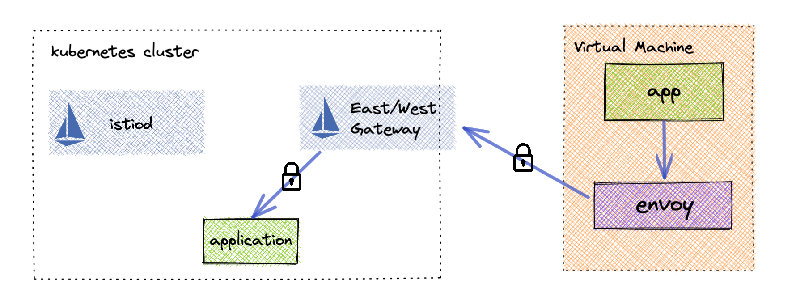
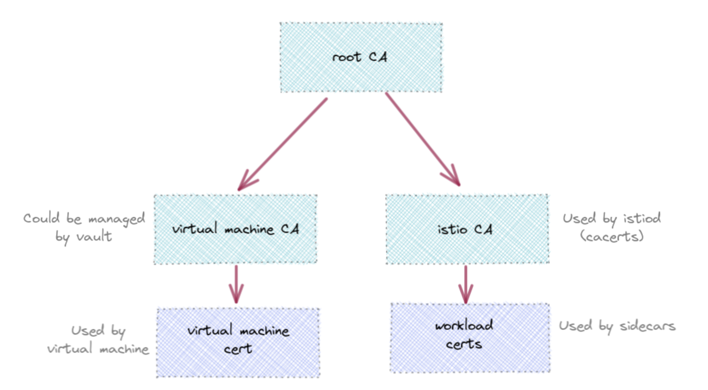
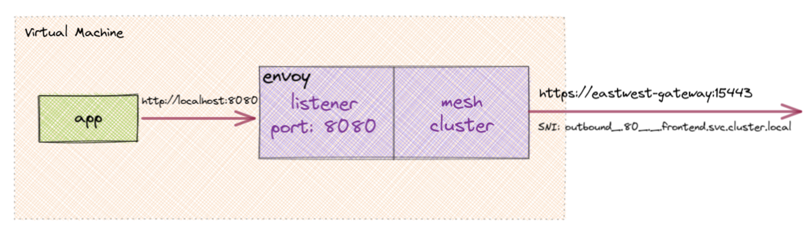
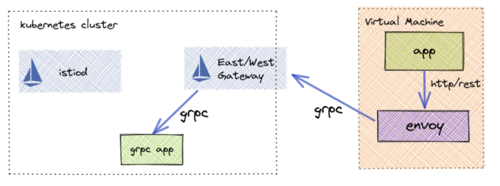

Part 1 - [An easier way to add virtual machines to Istio service mesh](/blog/2021/simple-vms/)

A lot of Istio users would like to connect their virtual machines to their service mesh but the current process is very cumbersome and hard to automate. This series explains a simpler way to connect outside applications securely to your applications running in a service mesh. If you would like to know more about why this might work for you, check out part 1 here.

## Preface

As explained in [part 1](/blog/2021/simple-vms/), to reduce complexity of the virtual machine initialization we will not be registering it with Istio. Instead we will be issuing a certificate directly to the virtual machine and manually configuring the envoy instance to communicate inside the mesh via the east/west gateway. First we will need to organize our certificates so that the service mesh applications will trust these external workloads.

## Certificate Management

Since Istio will not be issuing the certificates for the virtual machines, it will need to be created and managed by some other means. In order for Istio to trust the traffic coming from the virtual machines, the certificates issued must be rooted in the same chain of trust as the service mesh applications.

The simplest way to organize your certificates is to create a shared root CA. Then two intermediate CA certificates can be issued and used for creating Istio workload certificates and one for virtual machine certificates. The virtual machine CA could easily be managed by a third party certificate management system like Hashicorp's Vault.

## Istio Setup and Deployment

The setup for Istio to accept outside secured connections is very trivial. Using the IstioOperator configuration an east/west gateway needs to be created and configured to pass through connections.

### Creating the east/west gateway

Below is an example of an Istio installation of just istiod and the east/west gateway shown above. `PILOT_SKIP_VALIDATE_TRUST_DOMAIN` is enabled so that the virtual machines can have their own SPIFFE ID format.


apiVersion: install.istio.io/v1alpha1
kind: IstioOperator
metadata:
  name: istio-install
  namespace: istio-system
spec:
  profile: minimal
  hub: gcr.io/istio-release
  tag: 1.12.0

  meshConfig:
    # enable access logging to standard output
    accessLogFile: /dev/stdout

  components:
    pilot:
      k8s:
        env:
         # Disable validation so VM can have non conforming identity
          - name: PILOT_SKIP_VALIDATE_TRUST_DOMAIN
            value: "true"
    ingressGateways:
    # enable the default ingress gateway
    - name: istio-eastwestgateway
      namespace: istio-system
      enabled: true
      label:
        istio: eastwestgateway
        app: istio-eastwestgateway
      k8s:
        env:
          # Required for east/west routing
          - name: ISTIO_META_ROUTER_MODE
            value: "sni-dnat"
        service:
          type: LoadBalancer
          ports:
            # health check port (required to be first for aws elbs)
            - name: status-port
              port: 15021
              targetPort: 15021
            # Port for mTLS passthrough
            - port: 15443
              targetPort: 15443
              name: tls


We also need to tell the east/west gateway to forward secure requests to the intended destination. To do this we create a simple Istio Gateway configuration.


apiVersion: networking.istio.io/v1alpha3
kind: Gateway
metadata:
  name: eastwestgateway
  namespace: istio-system
spec:
  selector:
    istio: eastwestgateway
  servers:
  - port:
      number: 15443
      name: tls
      protocol: TLS
    tls:
      mode: AUTO_PASSTHROUGH
    hosts:
    - "*"


The `AUTO_PASSTRHOUGH` config automatically registers the mesh applications with the east/west gateway. You can view the available services by running the following `istioctl` command.


$ istioctl proxy-config listener -n istio-system <east_west_gateway_pod>


Its important to note the SNI values for the mesh applications you wish to communicate with as they will be needed in the envoy configuration.


$ istioctl proxy-config listener -n istio-system istio-eastwestgateway-868fc64fc4-fn6q4 --port 15443
ADDRESS PORT  MATCH
0.0.0.0 15443 SNI: outbound_.9402_._.cert-manager.cert-manager.svc.cluster.local;
0.0.0.0 15443 SNI: outbound_.9153_._.kube-dns.kube-system.svc.cluster.local;
0.0.0.0 15443 SNI: outbound_.80_._.frontend.simple-app.svc.cluster.local;
0.0.0.0 15443 SNI: outbound_.53_._.kube-dns.kube-system.svc.cluster.local;
0.0.0.0 15443 SNI: outbound_.50051_._.fortune-teller.fortune-teller.svc.cluster.local;
0.0.0.0 15443 SNI: outbound_.443_._.metrics-server.kube-system.svc.cluster.local;
0.0.0.0 15443 SNI: outbound_.443_._.kubernetes.default.svc.cluster.local;
0.0.0.0 15443 SNI: outbound_.443_._.istiod.istio-system.svc.cluster.local;
0.0.0.0 15443 SNI: outbound_.443_._.cert-manager-webhook.cert-manager.svc.cluster.local;
0.0.0.0 15443 SNI: outbound_.15443_._.istio-eastwestgateway.istio-system.svc.cluster.local;
0.0.0.0 15443 SNI: outbound_.15021_._.istio-eastwestgateway.istio-system.svc.cluster.local;
0.0.0.0 15443 SNI: outbound_.15014_._.istiod.istio-system.svc.cluster.local;
0.0.0.0 15443 SNI: outbound_.15012_._.istiod.istio-system.svc.cluster.local;
0.0.0.0 15443 SNI: outbound_.15010_._.istiod.istio-system.svc.cluster.local;


## Virtual Machine Configuration

Because we will not be connecting envoy to an external xDS server, we will need to provide the configuration manually. We will need to create an inbound listener for the virtual machine application to communicate through.

### Envoy listener and router


static_resources:
  listeners:
  - address:
      socket_address:
        address: 0.0.0.0
        port_value: 8080
    filter_chains:
    - filters:
      - name: envoy.filters.network.http_connection_manager
        typed_config:
          '@type': type.googleapis.com/envoy.extensions.filters.network.http_connection_manager.v3.HttpConnectionManager
          stat_prefix: vm
          route_config:
            name: local_route
            virtual_hosts:
            - name: routes
              domains:
              - "*"
              routes:
                # Route /frontend http requests to frontend cluster
              - match:
                  prefix: "/frontend"
                route:
                  cluster: frontend
          http_filters:
          - name: envoy.filters.http.router



We then need to configure where the traffic will need to be sent. As shown in the "Istio setup and deployment" section, all traffic will be proxied with mTLS to the mesh application. Below is the cluster resource that we need to create in order to have secure communication with the mesh application. This is also where we use our generated certificates to encrypt the communication.


static_resources:
  clusters:
  - name: frontend
    type: STRICT_DNS
    load_assignment:
      cluster_name: frontend
      endpoints:
      - lb_endpoints:
        - endpoint:
            address:
              socket_address:
                # eastwestgateway LB endpoint (can be hostname or IP)
                address: eastwest-gateway.solo.io
                port_value: 15443
    transport_socket:
      name: envoy.transport_sockets.tls
      typed_config:
        "@type": type.googleapis.com/envoy.extensions.transport_sockets.tls.v3.UpstreamTlsContext
        # sni must match the output from the eastwest gateway listeners
        sni: outbound_.80_._.frontend.simple-app.svc.cluster.local
        common_tls_context:
          alpnProtocols:
          - istio-peer-exchange
          - istio
          tls_certificates:
          - certificate_chain:
              filename: /certs/cert.pem
            private_key:
              filename: /certs/key.pem
          validation_context:
            trusted_ca:
              filename: /certs/ca-cert.pem


#### sni

This field is what the east-west gateway uses to forward traffic to the correct mesh application. It needs to match the listener of the mesh application shown in the `istioctl proxy-config listener` command above.

#### alpnProtocols

Istio uses its own alpn protocol when communicating from sidecar to sidecar. It is required to establish direct mTLS communication with a mesh service.  This also requires that the envoy is built with the necessary Istio extensions to use these protocols.  For example, if running envoy in docker-compose, use the istio-proxy envoy build to have them already installed.


version: "3.7"
services:
  envoy:
    # required to use istio build because you need the builtin istio envoy filters
    image: gcr.io/istio-release/proxyv2:1.12.0
    # override the default entrypoint to start envoy directly
    entrypoint:
      - envoy
      - --config-path
      - /etc/config/envoy.yaml
    volumes:
      - ./config/:/etc/config/
      - ./certs/vm:/certs/:ro
    ports:
      # exposing http port outside local network
      - "8080:8080"


#### tls_certificates

The generated client mTLS certificates should be mounted and referenced in this cluster configuration block.

## gRPC / JSON Transcoding

To enable HTTP REST based applications to communicate with gRPC based ones, update the listener to do transcoding. This requires that the proto definition of the mesh application be present on the virtual machine as well.


static_resources:
  listeners:
  - address:
      socket_address:
        address: 0.0.0.0
        port_value: 8080
    filter_chains:
    - filters:
      - name: envoy.filters.network.http_connection_manager
        typed_config:
          '@type': type.googleapis.com/envoy.extensions.filters.network.http_connection_manager.v3.HttpConnectionManager
          stat_prefix: vm
          route_config:
            name: local_route
            virtual_hosts:
            - name: routes
              domains:
              - "*"
              routes:
                # match on grpc or http requests matched in the proto (/v1/fortune/{user_id})
              - match:
                  prefix: "/build.stack.fortune.FortuneTeller"
                  grpc: {}  #grpc:{} means that requests are only forwarded if they are found in the grpc service definition, returning 404 for others
                route:
                  cluster: fortune-teller
          http_filters:
          # Enable grpc/json transcoding for the build.stack.fortune.FortuneTeller service
          - name: envoy.filters.http.grpc_json_transcoder
            # https://www.envoyproxy.io/docs/envoy/latest/api-v3/extensions/filters/http/grpc_json_transcoder/v3/transcoder.proto#extensions-filters-http-grpc-json-transcoder-v3-grpcjsontranscoder
            typed_config:
              "@type": type.googleapis.com/envoy.extensions.filters.http.grpc_json_transcoder.v3.GrpcJsonTranscoder
              proto_descriptor: "/etc/config/fortune-teller/fortune.pb"
              services: ["build.stack.fortune.FortuneTeller"]
              print_options:
                add_whitespace: true
                always_print_primitive_fields: true
                always_print_enums_as_ints: false
                preserve_proto_field_names: false
              convert_grpc_status: true
          - name: envoy.filters.http.router


## Testing With Docker And k3d

For a full demonstration of this in action take a look at the code [here](https://github.com/solo-io/solo-cop/tree//main/blogs/simple-mesh-vms). Follow the [README](https://github.com/solo-io/solo-cop/tree/main/blogs/simple-mesh-vms/README.md)
