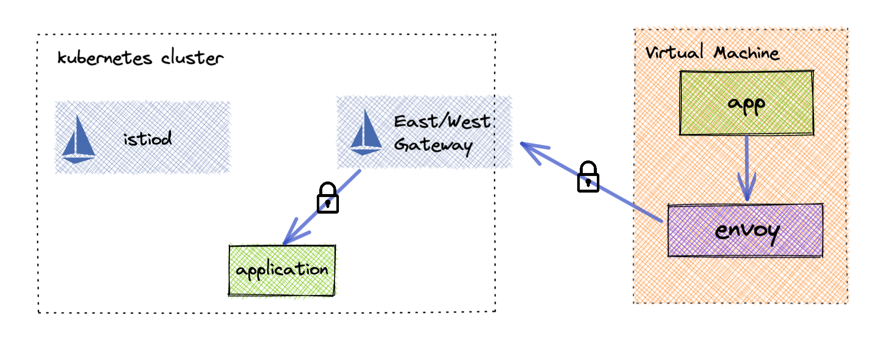
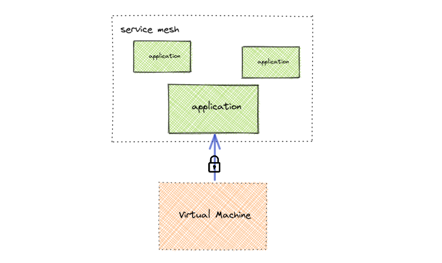
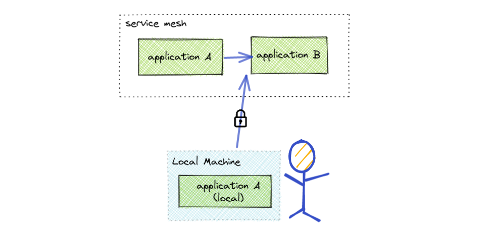
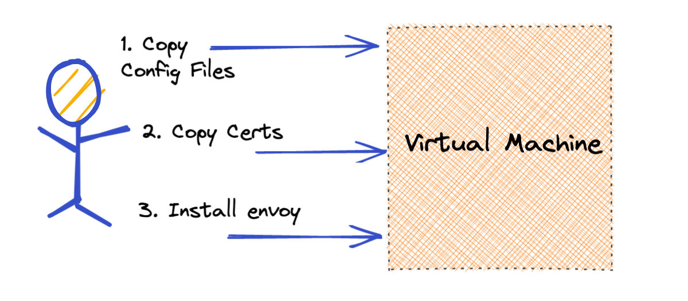
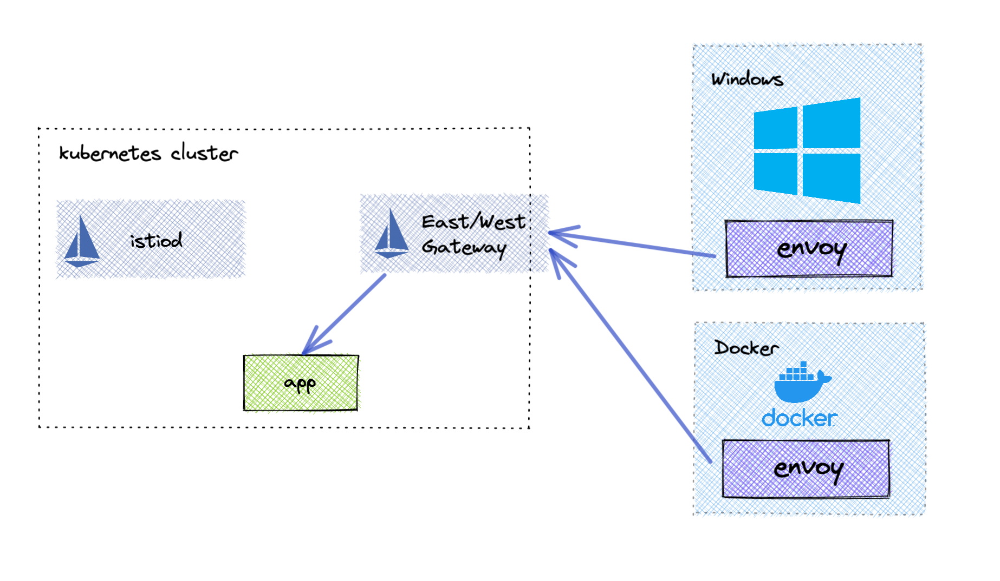
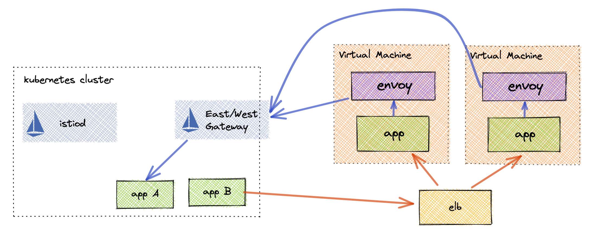
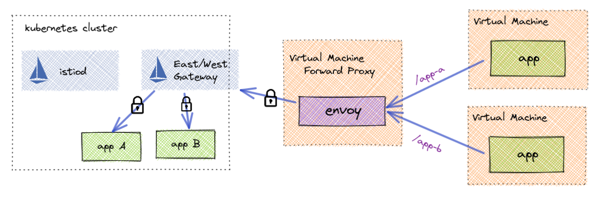

Some of the complexities involved with joining a virtual machine are due to the sheer number of features that a service mesh provides. But, what if you only need a subset of those features? For example, secure communication from your virtual machine to services running inside your service mesh. With only a few tradeoffs, you can give your virtual machine service mesh features without all of the overhead.

What about local development? As more and more micro-services are deployed to Kubernetes and as your dependency graph resembles a spider web, it has become increasingly difficult to do local development. What if a local machine could simply join a service mesh and make calls to mesh applications. This solution could potentially save time and money by not requiring developers to wait for their code to be deployed.

## Reduce Complexity

Today, adding a virtual machine to your Istio service mesh involves a lot of [moving parts](/docs/setup/install/virtual-machine/). You must create a Kubernetes service account, Istio workload entry and then generate configuration all before on-boarding a single virtual machine. There are also complexities to automating this, especially for auto scaling VMs. Finally you are required to expose Istiod externally to your cluster.

The complexity of adding a virtual machine comes from the expectation that the VM should participate 100% within the service mesh. For many this is not a necessity, by looking at the actual requirements of your system you may be able to simplify your virtual machine on-boarding and still get the features you need.

So what are some use cases that could be met but yet still make virtual machines easier to work with service mesh?

### Single Direction Traffic Flow

Sometimes a virtual machine just needs to talk securely to applications within the service mesh. This is often the case when migrating VM based applications to Kubernetes in which other VMs may have depended on those applications. With the described approach below you can still achieve this without all of the operational overhead as shown above.

### Developer Access to Service Mesh

Engineers often do not have the resources to run all of the required micro-services for their environment. The approach below explains how you can achieve this in the same way that virtual machines securely communicate with mesh applications.

## Decouple Envoy and Istio

The largest amount of complexity as it relates to virtual machines is the connecting of envoy to istiod to get its configuration. A simpler approach is to just not connect them anymore. Even though Istio will no longer know about the virtual machines that are communicating in the mesh, that communication can still be secure and authenticated. The trick is issuing virtual machines their own workload certificates that are rooted in the same trust chain as the mesh workloads. This also means that the end user will be responsible for configuring envoy manually on the virtual machine.  For most this shouldn't be an issue because it is not expected that it will change very often.

## A Simpler On-boarding Experience

We can achieve a simpler setup by utilizing some built-in Istio features. First we need to expose a secure tunnel for applications outside the mesh to communicate with applications within.

To do this we simply need to create an Istio east-west gateway and enable `AUTO_PASSTHROUGH`. This automatically configures the east-west gateway to pass traffic through to the correct service over mTLS. This gives your virtual machine end to end authenticated encryption with the application its trying to reach.

Due to the complexity involved in configuring envoy to talk to istiod, it is more practical to directly configure the virtual machine envoy. At first this sounds quite daunting, but due to the reduced complexity we only need to enable a few features to make this work. Envoy will need to be configured to know about each service mesh application that the virtual machine will need to communicate with. We then will configure these as `clusters` within envoy and set them up to use mTLS communication passing through the east-west gateway in the service mesh. Secondly a listener will need to be exposed to handle incoming traffic from the virtual machine application. Finally certificates will need to be issued for each virtual machine that share the same root of trust as the service mesh applications. This allows end to end encryption as well as the ability to authorize which applications the virtual machine can communicate with.

### Easier to Automate

Given that no initialization has to occur on the service mesh cluster when on-boarding a virtual machine, it is much easier to automate. The configuration needed for the virtual machine envoy can be added to your pipeline; the envoy container can either be pulled via docker, or added to your image building infrastructure; the mTLS certificates can also be provisioned and maintained by a third party such as Hashicorp's Vault.

### More Runtime Support

Due to the fact that this installation method does not require access to the underlying OS networking. You can run this approach in more types of environments including Windows and Docker. The only requirement is that your Envoy include the Istio extensions found [here](https://github.com/istio/proxy/tree/master/extensions). Using Docker, you can now run the Envoy proxy on your local machine and communicate with the service mesh directly.

## Advanced Use Cases

### gRPC to JSON

This technique can also be leveraged to enable virtual machine applications to communicate with gRPC applications without having to implement the gRPC endpoints. Using envoys gRPC / JSON transformation, the virtual machine application can communicate with its local envoy over REST and envoy will translate that to gRPC.

### Multi Direction

Even though your service mesh may not know about the virtual machines that are communicating with it, you can still add them as external endpoints using Service Entries. That service entry could be an HTTPS  Load Balancer endpoint that manages traffic to multiple virtual machines. This setup is still often more feasible than fully on-boarding virtual machines into the virtual mesh.

### Forwarding Proxy

Maybe installing envoy on every virtual machine is still too complex. An alternative is to run envoy (or an autoscaling group) to run on its own virtual machine and act as a forwarding proxy into the mesh. This is a much simpler solution to accessing mesh services as the virtual machines that run the applications are left untouched.

## Part 2…

In part 2, I will explain how to configure Istio as well as a virtual machine to communicate within the mesh. If you would like a preview, feel free to reach out to nick.nellis@solo.io

### Special Thanks

A special thanks to Dave Ortiz for this virtual machine idea and congrats to Constant Contact [a new registered Istio user!](https://github.com/istio/istio.io/pull/10571)
