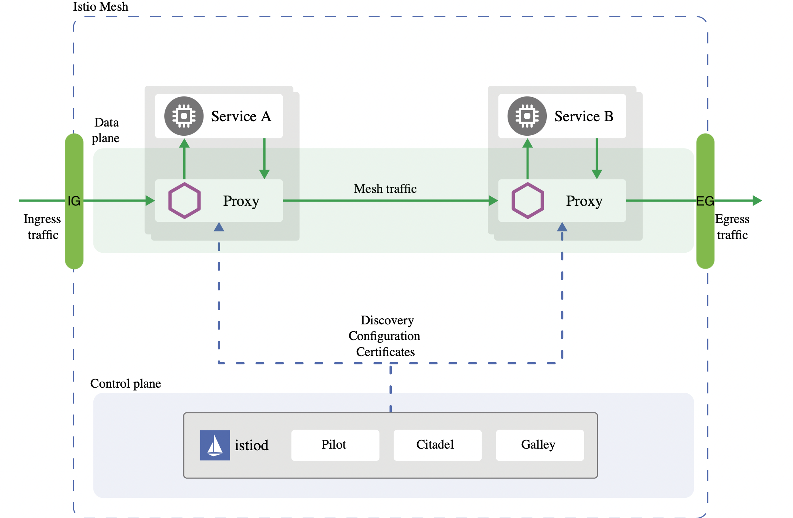
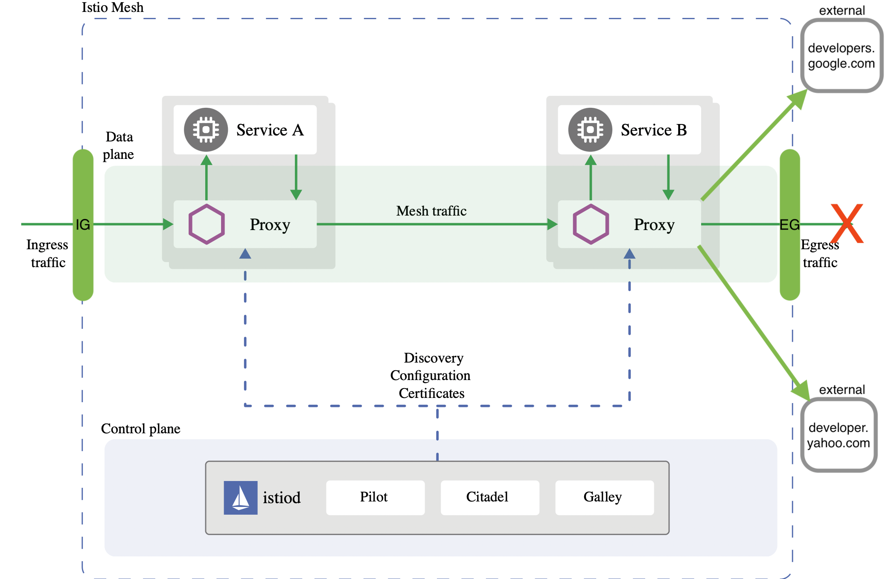
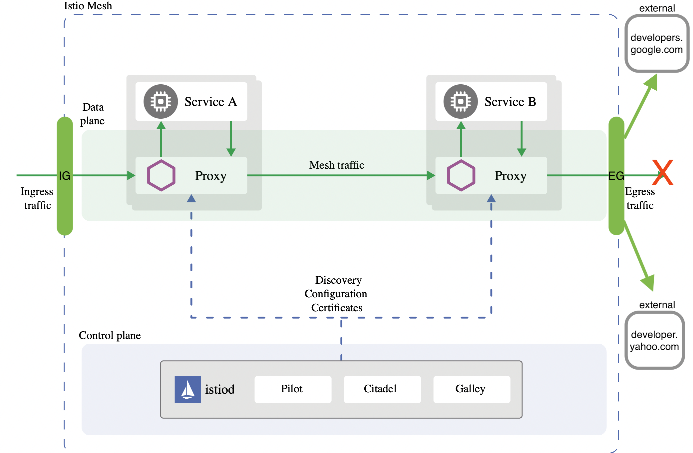

An Istio Egress gateway is just another envoy similar to the Ingress instance but with the purpose to control outbound traffic. Istio uses ingress and egress gateways to configure load balancers executing at the edge of a service mesh. An ingress gateway allows you to define entry points into the mesh that all incoming traffic flows through. Egress gateway is a symmetrical concept; it defines exit points from the mesh. Egress gateways allow you to apply Istio features, for example, monitoring and route rules, to traffic exiting the mesh.

This blog describes how to enforce outbound authorization policies using Istio's Egress gateway in a similar matter when enforcing inbound policies. For this we use the `sleep` service in two separate namespaces within the mesh to access external services at Google and Yahoo.


One important consideration to be aware of is that Istio cannot securely enforce that all egress traffic actually flows through the egress gateways. Istio only enables such flow through its sidecar proxies. If attackers bypass the sidecar proxy, they could directly access external services without traversing the egress gateway. Kubernetes network policies can be used to prevent outbound traffic at the cluster level, for more read [here](/docs/tasks/traffic-management/egress/egress-gateway/#additional-security-considerations).


***

## Before starting

Before starting you'll need:
- A Kubernetes cluster
- kubectl cli tool
- Istio `v1.11` or greater installed
- istioctl cli tool
- sleep service

## Prep-work

Install Istio:


$ istioctl install -y --set profile=demo --set meshConfig.outboundTrafficPolicy.mode=ALLOW_ANY


Notice the demo profile installs an instance of an Egress gateway and the set flag configures the handling of external services by using the `outboundTrafficPolicy` option. `ALLOW_ANY` is the default option enabling access to outbound services and `REGISTRY_ONLY` gets the sidecar proxies to restrict access if the host is not defined in the service registry using the `ServiceEntry` resource.

### Install the sleep service in the default namespace

Label the namespace for sidecar injection:


$ kubectl label ns default istio-injection=enabled



$ kubectl apply -f 


### Install the sleep service in the `otherns` namespace


$ kubectl create ns otherns


Label the namespace for sidecar injection:


$ kubectl label ns otherns istio-injection=enabled


Apply the service resources:


$ kubectl apply -n otherns -f 


### Export `sleep` pods name into variables


$ export SLEEP_POD1=$(kubectl get pod -l app=sleep -ojsonpath='{.items[0].metadata.name}')



$ export SLEEP_POD2=$(kubectl get pod -n otherns -l app=sleep -ojsonpath='{.items[0].metadata.name}')


### Test `sleep` accessing Google and Yahoo


$ kubectl exec $SLEEP_POD1 -it -- curl -I https://developers.google.com


You should expect a similar response like:


HTTP/2 200
last-modified: Mon, 18 Apr 2022 19:50:38 GMT
content-type: text/html; charset=utf-8
set-cookie: _ga_devsite=GA1.3.17352200.1651777078; Expires=Sat, 04-May-2024 18:57:58 GMT; Max-Age=63072000; Path=/
content-security-policy: base-uri 'self'; object-src 'none'; script-src 'strict-dynamic' 'unsafe-inline' https: http: 'nonce-6YT4DgbNb9SFKpYNAAh6BVQ1HrIWUp' 'unsafe-eval'; report-uri https://csp.withgoogle.com/csp/devsite/v2
strict-transport-security: max-age=63072000; includeSubdomains; preload
x-frame-options: SAMEORIGIN
x-xss-protection: 0
x-content-type-options: nosniff
cache-control: no-cache, must-revalidate
expires: 0
pragma: no-cache
x-cloud-trace-context: 3943a8b1bdf28d721eae4f82696ba2c4
content-length: 142275
date: Thu, 05 May 2022 18:57:58 GMT
server: Google Frontend


Now the other service:


$ kubectl exec $SLEEP_POD2 -n otherns -it -- curl -I https://developer.yahoo.com


You should expect a similar response like:


HTTP/2 200
referrer-policy: no-referrer-when-downgrade
strict-transport-security: max-age=15552000
x-frame-options: SAMEORIGIN
x-powered-by: Express
cache-control: private, max-age=0, no-cache
content-security-policy-report-only: default-src 'none'; connect-src 'self' *.yimg.com https://www.google-analytics.com *.yahoo.com *.doubleclick.net; font-src 'self' *.bootstrapcdn.com; frame-src 'self' *.soundcloud.com *.twitter.com; img-src 'self' data: *.yimg.com https://www.google-analytics.com *.yahoo.com https://www.google.com/ads/ga-audiences *.pendo.io *.twitter.com *.twimg.com; script-src 'self' 'nonce-25FqRrNIte3nmHy7Es/O4Q==' *.yimg.com https://www.google-analytics.com https://ssl.google-analytics.com *.github.com/flurrydev/ *.pendo.io *.twitter.com *.twimg.com; style-src 'self' 'unsafe-inline' *.yimg.com *.twitter.com *.twimg.com https://github.githubassets.com/assets/ *.bootstrapcdn.com; report-uri /csp-report
content-type: text/html; charset=utf-8
content-length: 61158
etag: W/"eee6-355CS9JqgK79WnB2sdI2zK9AvBw"
vary: Accept-Encoding
date: Thu, 05 May 2022 19:00:06 GMT
x-envoy-upstream-service-time: 2315
server: ATS
age: 3
expect-ct: max-age=31536000, report-uri="http://csp.yahoo.com/beacon/csp?src=yahoocom-expect-ct-report-only"
x-xss-protection: 1; mode=block
x-content-type-options: nosniff


If you want you can test the other other address on the other `sleep` pod. We can confirm the pods have outbound access to Google and Yahoo.

## Restrict outbound access

Using `istioctl` we modify the Istio installation to change the outbound traffic policy from `ALLOW_ANY` to `REGISTRY_ONLY` which enforces that only hosts defined with `ServiceEntry` resources are part of the mesh service registry; could be accessed to by sidecars of the mesh.


Changing the outbound traffic policy to `REGISTRY_ONLY` should be considered a best-effort security boundary and not as a strong security policy, for more read [here](/docs/ops/best-practices/security/#securing-egress-traffic).


Modify the `outboundTrafficPolicy`:


$ istioctl install -y --set profile=demo --set meshConfig.outboundTrafficPolicy.mode=REGISTRY_ONLY


### Test `sleep` access again


$ kubectl exec $SLEEP_POD1 -it -- curl -I https://developers.google.com


You should expect a similar response like:


curl: (35) OpenSSL SSL_connect: SSL_ERROR_SYSCALL in connection to developers.google.com:443
command terminated with exit code 35


Now the other service:


$ kubectl exec $SLEEP_POD2 -n otherns -it -- curl -I https://developer.yahoo.com


You should expect a similar response like:


curl: (35) OpenSSL SSL_connect: SSL_ERROR_SYSCALL in connection to developer.yahoo.com:443
command terminated with exit code 35


The error is due to the new policy enforcing only services part of the registry are allowed for outbound traffic.


There could be a slight delay on the configuration being propagated to the sidecars where the still allow access to the external services.


***

### Add the Google and Yahoo services to the mesh service registry

Our Google `ServiceEntry` looks like this:


apiVersion: networking.istio.io/v1beta1
kind: ServiceEntry
metadata:
  name: external-developers-google-com
spec:
  hosts:
  - developers.google.com
  exportTo:
  - "."
  location: MESH_EXTERNAL
  resolution: DNS
  ports:
  - number: 443
    name: https
    protocol: HTTPS
  - number: 80
    name: http
    protocol: HTTP


Apply the resource:


$ kubectl apply -f google-serviceentry.yaml


Notice the `exportTo: - "."` section of the service entry resource specifying that is only applicable to the current namespace where applied. You can also change this to `"*"` for all namespaces in the mesh.

Test access to the service:


$ kubectl exec $SLEEP_POD1 -it -- curl -I https://developers.google.com


You should expect a 200 response code now. But what if we test this `sleep` service to Yahoo?


$ kubectl exec $SLEEP_POD1 -it -- curl -I https://developer.yahoo.com


You should expect an error along the lines:


curl: (35) OpenSSL SSL_connect: Connection reset by peer in connection to developer.yahoo.com:443
command terminated with exit code 35


This is because we only allowed outbound traffic to Google from the default namespace where the `SLEEP_POD1` lives. Any outbound traffic from `SLEEP_POD2` should still be restricted, lets enabled traffic to Google:


$ kubectl apply -n otherns -f google-serviceentry.yaml


You should expect a 200 response code from both pods:


$ kubectl exec $SLEEP_POD2 -n otherns -it -- curl -I https://developers.google.com
$ kubectl exec $SLEEP_POD1 -it -- curl -I https://developers.google.com


Notice how Yahoo is still restricted on both services. Take a look at the Yahoo `ServiceEntry`:


apiVersion: networking.istio.io/v1beta1
kind: ServiceEntry
metadata:
  name: external-developer-yahoo-com
spec:
  hosts:
  - developer.yahoo.com
  exportTo:
  - "."
  location: MESH_EXTERNAL
  resolution: DNS
  ports:
  - number: 443
    name: https
    protocol: HTTPS
  - number: 80
    name: http
    protocol: HTTP


Enable traffic on the default namespace and test it:


$ kubectl apply -f yahoo-serviceentry.yaml



$ kubectl exec $SLEEP_POD1 -it -- curl -I https://developer.yahoo.com


Now Yahoo on the `otherns` namespace:


$ kubectl apply -n otherns -f yahoo-serviceentry.yaml



$ kubectl exec $SLEEP_POD2 -n otherns -it -- curl -I https://developer.yahoo.com


You should expect a 200 response code from both pods. Any other request to other external hosts that are not Yahoo or Google should be restricted and only allowed if in the service registry from the `default` and `otherns` namespaces.

Notice how when the `ServiceEntry` resource is created in the target namespace, external communication to the defined host is allowed only from the `sidecar` proxies on that namespace.

### Cleanup


$ kubectl delete -f google-serviceentry.yaml
$ kubectl delete -n otherns -f google-serviceentry.yaml
$ kubectl delete -f yahoo-serviceentry.yaml
$ kubectl delete -n otherns -f yahoo-serviceentry.yaml


***

## Enforcing egress traffic using authorization policies

So far by changing the outbound traffic policy to `REGISTRY_ONLY` we can enforce how our proxy sidecars allow outbound traffic from the mesh to the external hosts only defined with our Service Entry resources, but we don't have a fine-grained control with them.

Using the service entries is more like a opening/closing a "faucet" in the namespace and having to create resources per namespace will create a maintenance burden. You can change the resource to be scoped for all namespaces ("*") and not just the target namespace but just with the `ServiceEntry` resource you can't control which workload within the namespace can or cannot access an external host.

We can accomplish this fine-grained control with an `AuthorizationPolicy` after we flow internally originated outbound traffic to the Egress gateway making act as a proxy with the help of `VirtualService`, `Gateway`, `DestinationRule` resources along with `ServiceEntry`s on how outbound traffic should flow.

In a similar manner when dealing with inbound traffic routing, we can create `DestinationRule`s that flow internal traffic from the sidecars to the egress and then a second `DestinationRule` that flows the traffic to actual external host.

These `DestinationRule`s are bound to a `VirtualService` that matches traffic to the whole `mesh` `Gateway` and the `Gateway` defined for the external host. By doing this setup, we can rely on the `ServiceEntry` and `AuthorizationPolicy` resources to ensure that only allowed/denied outbound traffic defined for namespaces or principals (k8s ServiceAccount) can reach the external hosts.


Is important to note that for this example relies on Istio's automatic mutual TLS, this means services within the mesh send TLS traffic and we are only sending `SIMPLE` TLS traffic at the egress when requests leave the mesh to the actual external host. For `mTLS` origination for egress traffic the `DestinationRule` needs to define the secret name that holds the client credentials certificate and be on `MUTUAL` mode. See more details [here](/docs/tasks/traffic-management/egress/egress-gateway-tls-origination/#configure-mutual-tls-origination-for-egress-traffic).


***

### Route internal outbound traffic to the egress gateway

After deleting the `ServiceEntry`s used on the previous section, make sure your mesh is still restricting outbound access, and that there are no other resources that can conflict with the configuration like other `DestinationRule`s, `VirtualService`s, `Gateway`s and `AuthorizationPolicy`:


$ kubectl exec $SLEEP_POD1 -it -- curl -I https://developers.google.com
$ kubectl exec $SLEEP_POD2 -n otherns -it -- curl -I https://developers.google.com
$ kubectl exec $SLEEP_POD1 -it -- curl -I https://developer.yahoo.com
$ kubectl exec $SLEEP_POD2 -n otherns -it -- curl -I https://developer.yahoo.com


For all requests expect an error along the lines:


curl: (35) OpenSSL SSL_connect: Connection reset by peer in connection to developer.yahoo.com:443
command terminated with exit code 35


Analyze the following resources `external-google.yaml` and `external-yahoo.yaml`:

Google:


apiVersion: networking.istio.io/v1alpha3
kind: ServiceEntry
metadata:
  name: google
spec:
  hosts:
  - developers.google.com
  ports:
  - number: 80
    name: http
    protocol: HTTP
  - number: 443
    name: https
    protocol: HTTPS
  resolution: DNS
---
apiVersion: networking.istio.io/v1alpha3
kind: Gateway
metadata:
  name: istio-google-egressgateway
spec:
  selector:
    istio: egressgateway # use Istio default gateway implementation
  servers:
  - port:
      number: 80
      name: https-port-for-tls-origination
      protocol: HTTPS
    hosts:
    - developers.google.com
    tls:
      mode: ISTIO_MUTUAL
---
apiVersion: networking.istio.io/v1alpha3
kind: DestinationRule
metadata:
  name: egressgateway-for-google
spec:
  host: istio-egressgateway.istio-system.svc.cluster.local
  subsets:
  - name: google
    trafficPolicy:
      portLevelSettings:
      - port:
          number: 80
        tls:
          mode: ISTIO_MUTUAL
          sni: developers.google.com
---
apiVersion: networking.istio.io/v1alpha3
kind: VirtualService
metadata:
  name: direct-google-through-egress-gateway
spec:
  hosts:
  - developers.google.com
  gateways:
  - istio-google-egressgateway
  - mesh
  http:
  - match:
    - gateways:
      - mesh # apply to sidecars in the mesh
      port: 80
    route:
    - destination:
        host: istio-egressgateway.istio-system.svc.cluster.local
        subset: google
        port:
          number: 80
  - match:
    - gateways:
      - istio-google-egressgateway
      port: 80
    route:
    - destination:
        host: developers.google.com
        port:
          number: 443
      weight: 100
---
apiVersion: networking.istio.io/v1alpha3
kind: DestinationRule
metadata:
  name: originate-tls-for-developers-google-com
spec:
  host: developers.google.com
  trafficPolicy:
    loadBalancer:
      simple: ROUND_ROBIN
    portLevelSettings:
    - port:
        number: 443
      tls:
        mode: SIMPLE # initiates HTTPS for connections to developers.google.com


Yahoo:


apiVersion: networking.istio.io/v1alpha3
kind: ServiceEntry
metadata:
  name: yahoo
spec:
  hosts:
  - developer.yahoo.com
  ports:
  - number: 80
    name: http
    protocol: HTTP
  - number: 443
    name: https
    protocol: HTTPS
  resolution: DNS
---
apiVersion: networking.istio.io/v1alpha3
kind: Gateway
metadata:
  name: istio-yahoo-egressgateway
spec:
  selector:
    istio: egressgateway # use Istio default gateway implementation
  servers:
  - port:
      number: 80
      name: https-port-for-tls-origination
      protocol: HTTPS
    hosts:
    - developer.yahoo.com
    tls:
      mode: ISTIO_MUTUAL
---
apiVersion: networking.istio.io/v1alpha3
kind: DestinationRule
metadata:
  name: egressgateway-for-yahoo
spec:
  host: istio-egressgateway.istio-system.svc.cluster.local
  subsets:
  - name: yahoo
    trafficPolicy:
      portLevelSettings:
      - port:
          number: 80
        tls:
          mode: ISTIO_MUTUAL
          sni: developer.yahoo.com
---
apiVersion: networking.istio.io/v1alpha3
kind: VirtualService
metadata:
  name: direct-yahoo-through-egress-gateway
spec:
  hosts:
  - developer.yahoo.com
  gateways:
  - istio-yahoo-egressgateway
  - mesh
  http:
  - match:
    - gateways:
      - mesh # apply to sidecars in the mesh
      port: 80
    route:
    - destination:
        host: istio-egressgateway.istio-system.svc.cluster.local
        subset: yahoo
        port:
          number: 80
  - match:
    - gateways:
      - istio-yahoo-egressgateway
      port: 80
    route:
    - destination:
        host: developer.yahoo.com
        port:
          number: 443
      weight: 100
---
apiVersion: networking.istio.io/v1alpha3
kind: DestinationRule
metadata:
  name: originate-tls-for-developer-yahoo-com
spec:
  host: developer.yahoo.com
  trafficPolicy:
    loadBalancer:
      simple: ROUND_ROBIN
    portLevelSettings:
    - port:
        number: 443
      tls:
        mode: SIMPLE # initiates HTTPS for connections to developer.yahoo.com


In the previous resources you can find:
- `ServiceEntry`s to enable external access to these hosts
- `Gateway`s resources for each host configuring the egress gateway instance for originating traffic to the external host
- `VirtualService`s for each host bound for the entire mesh and the created `Gateway` resource configuration in order to match traffic from within the mesh (sidecars) to the egress and from the egress outbound to the actual external host
- and a couple `DestinationRule`s applied to the traffic after being routed by the `VirtualService` where the first defines internal traffic using the `sni` and relying on Istio's automatic mTLS `ISTIO_MUTUAL`. The second `DestinationRule` defines how to initiate https connections to the actual external host.

Apply these resources and test accessing the services:


$ kubectl apply -f external-google.yaml -n istio-system
$ kubectl apply -f external-yahoo.yaml -n istio-system



This time we are applying all these resources on the `istio-system` namespace where the egress gateway instance resides. This is with the intention to easily manage egress traffic where the egress gateway instance resides, facilitating the management of the `AuthorizationPolicy`s.


***

Access `developers.google.com`:


$ kubectl exec $SLEEP_POD1 -it -- curl -I http://developers.google.com


Expect a 200 response along the lines:


HTTP/1.1 200 OK
last-modified: Mon, 18 Apr 2022 19:50:38 GMT
content-type: text/html; charset=utf-8
set-cookie: _ga_devsite=GA1.3.878699971.1652214977; Expires=Thu, 09-May-2024 20:36:17 GMT; Max-Age=63072000; Path=/
content-security-policy: base-uri 'self'; object-src 'none'; script-src 'strict-dynamic' 'unsafe-inline' https: http: 'nonce-yp4hjMbNOIwavPWy28V4k9lOdtSb6X' 'unsafe-eval'; report-uri https://csp.withgoogle.com/csp/devsite/v2
strict-transport-security: max-age=63072000; includeSubdomains; preload
x-frame-options: SAMEORIGIN
x-xss-protection: 0
x-content-type-options: nosniff
cache-control: no-cache, must-revalidate
expires: 0
pragma: no-cache
x-cloud-trace-context: 61c3fe6ffc0bc6bc209d455b04d9d86e
content-length: 142287
date: Tue, 10 May 2022 20:36:17 GMT
server: envoy
x-envoy-upstream-service-time: 420


Tail the logs of the `istio-proxy` sidecar:


$ kubectl logs $SLEEP_POD1 -f -c istio-proxy


Expect and entry from the sidecar to the egress:


[2022-05-10T20:36:16.973Z] "HEAD / HTTP/1.1" 200 - via_upstream - "-" 0 0 421 420 "-" "curl/7.83.0-DEV" "5ab0ed38-2e77-92a8-bb44-0a07573cd530" "developers.google.com" "10.100.2.6:8080" outbound|80|google|istio-egressgateway.istio-system.svc.cluster.local 10.100.0.5:48236 173.194.217.101:80 10.100.0.5:48764 - -


Tail the logs of the `egressgateway`:


$ kubectl logs istio-egressgateway-66fdd867f4-kbrh4 -f -n istio-system


Expect and entry from the egress to the external host:


[2022-05-10T20:36:16.981Z] "HEAD / HTTP/2" 200 - via_upstream - "-" 0 0 395 394 "10.100.0.5" "curl/7.83.0-DEV" "5ab0ed38-2e77-92a8-bb44-0a07573cd530" "developers.google.com" "173.194.217.101:443" outbound|443||developers.google.com 10.100.2.6:51492 10.100.2.6:8080 10.100.0.5:48236 developers.google.com -



Notice how the internal outbound traffic is intentionally originated using `http` in order to rely on Istio's automatic mTLS within the mesh and then using the `DestinationRule` TLS mode `SIMPLE`, the egress instance does a secure request to the external host.


***

Repeat the same steps using the `sleep` service on the `otherns` for the Yahoo host:


$ kubectl exec $SLEEP_POD2 -n otherns -it -- curl -I http://developer.yahoo.com


Expect an entry like the following on the sidecar logs:


[2022-05-10T20:51:37.091Z] "HEAD / HTTP/1.1" 200 - via_upstream - "-" 0 0 2389 2389 "-" "curl/7.83.0-DEV" "b2e32c17-2db4-925f-bbd7-c201b549f7ef" "developer.yahoo.com" "10.100.2.6:8080" outbound|80|yahoo|istio-egressgateway.istio-system.svc.cluster.local 10.100.1.6:38682 69.147.92.11:80 10.100.1.6:47940 - -


And on the egress:


[2022-05-10T20:51:37.099Z] "HEAD / HTTP/2" 200 - via_upstream - "-" 0 0 2364 2363 "10.100.1.6" "curl/7.83.0-DEV" "b2e32c17-2db4-925f-bbd7-c201b549f7ef" "developer.yahoo.com" "69.147.92.11:443" outbound|443||developer.yahoo.com 10.100.2.6:40486 10.100.2.6:8080 10.100.1.6:38682 developer.yahoo.com -


At this time you can test the other external host on the opposite `sleep` service and notice is still accessible:


$ kubectl exec $SLEEP_POD2 -n otherns -it -- curl -I http://developers.google.com
$ kubectl exec $SLEEP_POD1 -it -- curl -I http://developer.yahoo.com


Expect 200 responses from either `sleep` service.

### Enforce authorization polices

Although we can enforce denying external access by removing `ServiceEntry` resources while the `REGISTRY_ONLY` mode is active, we can also do it with a more fine-grained control using `AuthorizationPolicy`s after the correct configuration is in place.

Take a look at this policy that allows no traffic out:


apiVersion: security.istio.io/v1beta1
kind: AuthorizationPolicy
metadata:
 name: allow-nothing
 namespace: istio-system
spec:
  {}


Apply the `authz-policy-allow-nothing.yaml` file that enforces this purpose:


$ kubectl apply -f authz-policy-allow-nothing.yaml


Try to access the services again:


$ kubectl exec $SLEEP_POD1 -it -- curl -I http://developer.yahoo.com
$ kubectl exec $SLEEP_POD2 -n otherns -it -- curl -I http://developers.google.com
$ kubectl exec $SLEEP_POD1 -it -- curl -I http://developers.google.com
$ kubectl exec $SLEEP_POD2 -n otherns -it -- curl -I http://developer.yahoo.com



Keep in mind some requests could be allowed while the configuration takes place


***

Expect a response along the lines:


HTTP/1.1 403 Forbidden
content-length: 19
content-type: text/plain
date: Tue, 10 May 2022 21:08:13 GMT
server: envoy
x-envoy-upstream-service-time: 13


Notice that even when applying the `authz-policy-allow-google.yaml` allowing the `default` ns to do requests to `developers.google.com` it still gets forbidden. This is because `AuthorizationPolicy`s the `DENY` action is evaluated before the `ALLOW` one.

Delete the resources:


$ kubectl delete authorizationpolicies.security.istio.io -n istio-system allow-nothing external-allow-developers-google-com


### Enforce policies per namespace

For this use case we allow the `sleep` service on the `default` namespace to access `google` but not `yahoo` and the for the `sleep` service on the `otherns` namespace it allows `yahoo` but not `google`.

Analyze the following policies:


apiVersion: security.istio.io/v1beta1
kind: AuthorizationPolicy
metadata:
  name: external-deny-developers-google-com
spec:
  action: DENY
  rules:
  - from:
    - source:
        namespaces: ["otherns"]
    when:
    - key: connection.sni
      values:
      - developers.google.com



apiVersion: security.istio.io/v1beta1
kind: AuthorizationPolicy
metadata:
  name: external-deny-developer-yahoo-com
spec:
  action: DENY
  rules:
  - from:
    - source:
        namespaces: ["default"]
    when:
    - key: connection.sni
      values:
      - developer.yahoo.com


Apply the following policies:


$ kubectl apply -f authz-policy-deny-google.yaml -n istio-system
$ kubectl apply -f authz-policy-deny-yahoo.yaml -n istio-system


Try to access the services again:


$ kubectl exec $SLEEP_POD1 -it -- curl -I http://developer.yahoo.com
$ kubectl exec $SLEEP_POD2 -n otherns -it -- curl -I http://developers.google.com
$ kubectl exec $SLEEP_POD1 -it -- curl -I http://developers.google.com
$ kubectl exec $SLEEP_POD2 -n otherns -it -- curl -I http://developer.yahoo.com


For the first couple requests expect a 403 Forbidden response and for the last couple expect a 200 response.

Tail the logs for the egress gateway and expect an entry describing the policy matched:


[2022-05-10T21:51:49.396Z] "HEAD / HTTP/2" 403 - rbac_access_denied_matched_policy[ns[istio-system]-policy[external-deny-developer-yahoo-com]-rule[0]] - "-" 0 0 0 - "10.100.0.6" "curl/7.83.0-DEV" "a503ba03-f09a-914d-85a4-995a0c1d5b16" "developer.yahoo.com" "-" outbound|443||developer.yahoo.com - 10.100.2.6:8080 10.100.0.6:58370 developer.yahoo.com -


Delete the resources:


$ kubectl delete authorizationpolicies.security.istio.io -n istio-system external-deny-developer-yahoo-com external-deny-developers-google-com


### Enforce policies per workload using service account principals

Using account principals provides the fine-grained control we need per workload within a namespace. For this use case deploy another set of `sleep` services on the `otherns` namespace:


$ kubectl apply -f sleep-custom.yaml -n otherns


The yaml file above is the traditional `sleep` service with custom names, see [here](https://github.com/nauticalmike/egress-security/blob/main/sleep-custom.yaml).

This would create two new `sleep-google` and `sleep-yahoo` services besides the existing one. Save the pods names:


$ export SLEEP_POD_G=$(kubectl get pod -n otherns -l app=sleep-google -ojsonpath='{.items[0].metadata.name}')
$ export SLEEP_POD_Y=$(kubectl get pod -n otherns -l app=sleep-yahoo -ojsonpath='{.items[0].metadata.name}')


Apply the following policies that block the `sleep-google` service to access Yahoo and `sleep-yahoo` service to access Google within the `otherns` namespace, still leaving access to both hosts from the `sleep` service:


apiVersion: security.istio.io/v1beta1
kind: AuthorizationPolicy
metadata:
  name: external-deny-developers-google-com
spec:
  action: DENY
  rules:
  - from:
    - source:
        principals: ["cluster.local/ns/otherns/sa/sleep-yahoo"]
    when:
    - key: connection.sni
      values:
      - developers.google.com



apiVersion: security.istio.io/v1beta1
kind: AuthorizationPolicy
metadata:
  name: external-deny-developer-yahoo-com
spec:
  action: DENY
  rules:
  - from:
    - source:
        principals: ["cluster.local/ns/otherns/sa/sleep-google"]
    when:
    - key: connection.sni
      values:
      - developer.yahoo.com



$ kubectl apply -f authz-policy-deny-google-custom.yaml -n istio-system
$ kubectl apply -f authz-policy-deny-yahoo-custom.yaml -n istio-system


Test the policies:


$ kubectl exec $SLEEP_POD_G -n otherns -it -- curl -I http://developers.google.com
$ kubectl exec $SLEEP_POD_G -n otherns -it -- curl -I http://developer.yahoo.com
$ kubectl exec $SLEEP_POD_Y -n otherns -it -- curl -I http://developers.google.com
$ kubectl exec $SLEEP_POD_Y -n otherns -it -- curl -I http://developer.yahoo.com
$ kubectl exec $SLEEP_POD2 -n otherns -it -- curl -I http://developers.google.com
$ kubectl exec $SLEEP_POD2 -n otherns -it -- curl -I http://developer.yahoo.com


The second and third responses should be 403 forbidden as they are from `sleep-google` to Yahoo and the third from `sleep-yahoo` to Google while the rest should be 200.

You successfully used `AuthorizationPolicy`s to enforce internal outbound traffic through the egress gateway.

***

### Enforce policies per workload using service account principals and TLS originated traffic

This is really similar to the use case described above, the difference is on the way the policies are matched and the configuration of the resources to be able to rely on Istio's mTLS between the sidecar and egress:

For google:


apiVersion: networking.istio.io/v1alpha3
kind: ServiceEntry
metadata:
  name: google
spec:
  hosts:
  - developers.google.com
  location: MESH_EXTERNAL
  ports:
  - number: 443
    name: google-tls
    protocol: TLS
  resolution: DNS
---
apiVersion: networking.istio.io/v1alpha3
kind: Gateway
metadata:
  name: istio-google-egressgateway
spec:
  selector:
    istio: egressgateway # use Istio default gateway implementation
  servers:
  - port:
      number: 443
      name: https-port-for-tls-origination-google
      protocol: TLS
    hosts:
    - developers.google.com
    tls:
      mode: ISTIO_MUTUAL
---
apiVersion: networking.istio.io/v1alpha3
kind: DestinationRule
metadata:
  name: egressgateway-for-google
spec:
  host: istio-egressgateway.istio-system.svc.cluster.local
  subsets:
  - name: google
    trafficPolicy:
      portLevelSettings:
      - port:
          number: 443
        tls:
          mode: ISTIO_MUTUAL
          sni: developers.google.com
---
apiVersion: networking.istio.io/v1alpha3
kind: VirtualService
metadata:
  name: direct-google-through-egress-gateway
spec:
  hosts:
  - developers.google.com
  gateways:
  - istio-google-egressgateway
  - mesh
  tls:
  - match:
    - gateways:
      - mesh # apply to sidecars in the mesh
      port: 443
      sniHosts:
      - developers.google.com
    route:
    - destination:
        host: istio-egressgateway.istio-system.svc.cluster.local
        subset: google
        port:
          number: 443
      weight: 100
  tcp:
  - match:
    - gateways:
      - istio-google-egressgateway
      port: 443
    route:
    - destination:
        host: developers.google.com
        port:
          number: 443
      weight: 100
---


for yahoo:


apiVersion: networking.istio.io/v1alpha3
kind: ServiceEntry
metadata:
  name: yahoo
spec:
  hosts:
  - developer.yahoo.com
  location: MESH_EXTERNAL
  ports:
  - number: 443
    name: yahoo-tls
    protocol: TLS
  resolution: DNS
---
apiVersion: networking.istio.io/v1alpha3
kind: Gateway
metadata:
  name: istio-yahoo-egressgateway
spec:
  selector:
    istio: egressgateway # use Istio default gateway implementation
  servers:
  - port:
      number: 443
      name: https-port-for-tls-origination-yahoo
      protocol: TLS
    hosts:
    - developer.yahoo.com
    tls:
      mode: ISTIO_MUTUAL
---
apiVersion: networking.istio.io/v1alpha3
kind: DestinationRule
metadata:
  name: egressgateway-for-yahoo
spec:
  host: istio-egressgateway.istio-system.svc.cluster.local
  subsets:
  - name: yahoo
    trafficPolicy:
      portLevelSettings:
      - port:
          number: 443
        tls:
          mode: ISTIO_MUTUAL
          sni: developer.yahoo.com
---
apiVersion: networking.istio.io/v1alpha3
kind: VirtualService
metadata:
  name: direct-yahoo-through-egress-gateway
spec:
  hosts:
  - developer.yahoo.com
  gateways:
  - istio-yahoo-egressgateway
  - mesh
  tls:
  - match:
    - gateways:
      - mesh # apply to sidecars in the mesh
      port: 443
      sniHosts:
      - developer.yahoo.com
    route:
    - destination:
        host: istio-egressgateway.istio-system.svc.cluster.local
        subset: yahoo
        port:
          number: 443
      weight: 100
  tcp:
  - match:
    - gateways:
      - istio-yahoo-egressgateway
      port: 443
    route:
    - destination:
        host: developer.yahoo.com
        port:
          number: 443
      weight: 100
---


And the policies:

For the `sleep-yahoo` svc SA principal on the `otherns` ns to block outbound traffic to google matching the SNI host:


apiVersion: security.istio.io/v1beta1
kind: AuthorizationPolicy
metadata:
  name: external-deny-developers-google-com
spec:
  action: DENY
  rules:
  - from:
    - source:
        principals: ["cluster.local/ns/otherns/sa/sleep-yahoo"]
    when:
    - key: connection.sni
      values:
      - developers.google.com


For the `sleep-google` svc SA principal on the `otherns` namespace to block outbound traffic to yahoo matching the SNI host:


apiVersion: security.istio.io/v1beta1
kind: AuthorizationPolicy
metadata:
  name: external-deny-developer-yahoo-com
spec:
  action: DENY
  rules:
  - from:
    - source:
        principals: ["cluster.local/ns/otherns/sa/sleep-google"]
    when:
    - key: connection.sni
      values:
      - developer.yahoo.com


The `connection.sni` key is the main takeaway when doing TLS origination as the SNI key prevents SSL errors mismatching the SAN.

Now testing you should get the following results (make sure only the two previous policies are in place):


$ kubectl exec $SLEEP_POD1 -it -- curl -I https://developer.yahoo.com
$ kubectl exec $SLEEP_POD1 -it -- curl -I https://developers.google.com


For both should be 200.


$ kubectl exec $SLEEP_POD2 -n otherns -it -- curl -I https://developers.google.com
$ kubectl exec $SLEEP_POD2 -n otherns -it -- curl -I https://developer.yahoo.com


For both should be 200.


$ kubectl exec $SLEEP_POD_G -n otherns -it -- curl -I https://developers.google.com
$ kubectl exec $SLEEP_POD_G -n otherns -it -- curl -I https://developer.yahoo.com


The first one being the google pod should be able to access and get a 200, the second one should be blocked.


$ kubectl exec $SLEEP_POD_Y -n otherns -it -- curl -I https://developers.google.com
$ kubectl exec $SLEEP_POD_Y -n otherns -it -- curl -I https://developer.yahoo.com


The first one being the yahoo pod should be blocked because is trying to access google, the second one should be 200.

***
# Summary

Using the right combination of `ServiceEntry`s, `DestinationRule`s, `VirtualService`s, `Gateway`s and `AuthorizationPolicy` allows to flow internal outbound traffic to our egress gateway instance with the purpose to fine-grained control the workloads outbound traffic.
