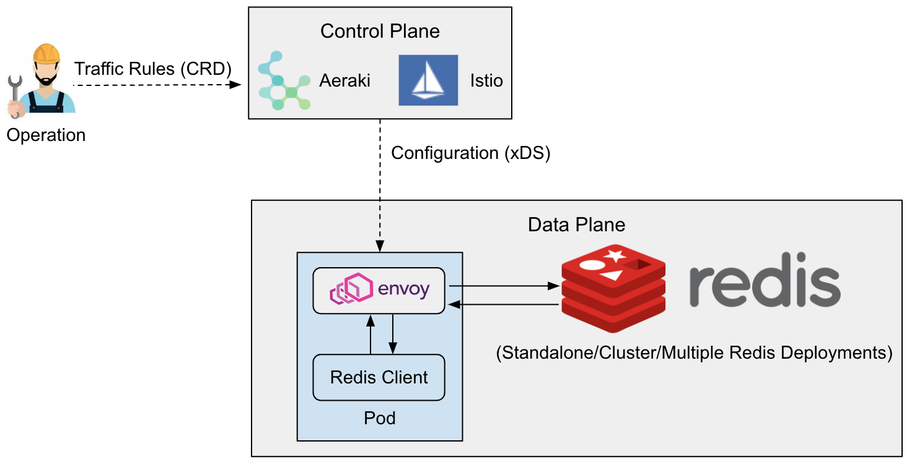
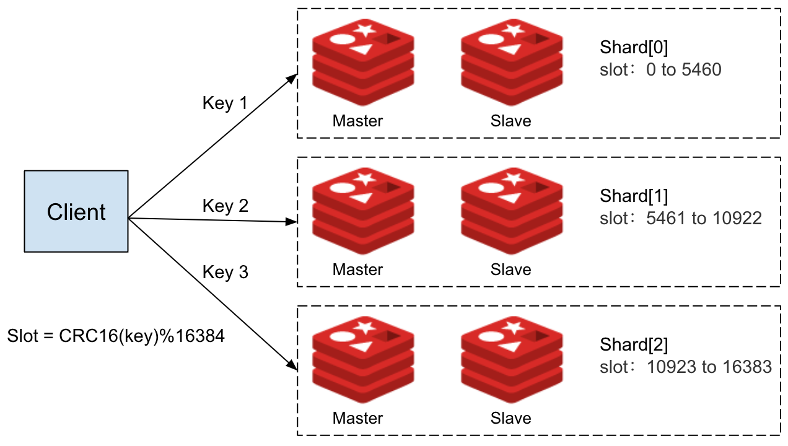

Redis is a high-performing key-value database known for its versatility in supporting a diverse range of data structures and operations, including strings, hashes, lists, sets, and sorted sets. Its robust capabilities make it an ideal choice for caching, session storage, message brokers, and other similar applications.

Istio is one of the most popular service mesh platforms that provides a unified way to connect, secure, and manage microservices. [Aeraki Mesh](https://www.aeraki.net/) is a CNCF open-source project that works with Istio and enhances Istio’s capabilities by providing advanced traffic management for non-HTTP protocols including Thrift, Dubbo, Redis, and proprietary protocols.

Managing a Redis Cluster can be complicated. Istio and Aeraki can help with that. This post uses a demo to demonstrate how to use Istio and Aeraki to manage Redis traffic for your applications, providing client-transparent advanced features such as data sharding, prefix routing, read/write separation, traffic mirroring, fault injection, etc.

## System architecture

Aeraki and Istio operate on the control plane, while the data plane is composed of Envoy sidecars. In the control plane, Aeraki provides two user-friendly Kubernetes Custom Resource Definitions (CRDs), [RedisService](https://aeraki.net/zh/docs/v1.x/reference/redis/#RedisService) and [RedisDestination](https://aeraki.net/zh/docs/v1.x/reference/redis/#RedisDestination), as the rules for users to manage Redis traffic. Aeraki converts these traffic rules into data plane configurations and deploys them to Envoy sidecars through xDS. Envoy sidecars work on the data plane, intercepting Redis client requests and providing relevant traffic management capabilities based on the configuration deployed from the control plane.

## Install the demo

First, download Aeraki Mesh from GitHub.


$ git clone https://github.com/aeraki-mesh/aeraki.git


Before installing Aeraki, it is necessary to first install Istio since Aeraki is built on top of Istio. However, the Aeraki installation script takes care of Istio installation automatically, so executing the Aeraki installation script is all that is required.


$ make demo


Execute the following script. This script creates a namespace called redis and deploy the Redis demo application within it.


$ ./demo/redis/install.sh


The demo application includes a 6-node Redis cluster (a Kubernetes StatefulSet), a single-mode Redis instance, and a Redis client. Later on, this demo will be used to demonstrate Aeraki Mesh’s traffic management capabilities for Redis.


$ kubectl -n redis get pod
NAME                            READY   STATUS    RESTARTS   AGE
redis-client-644c965f48-dvjc7   2/2     Running   0          2m17s
redis-cluster-0                 1/1     Running   0          2m17s
redis-cluster-1                 1/1     Running   0          2m15s
redis-cluster-2                 1/1     Running   0          2m13s
redis-cluster-3                 1/1     Running   0          2m12s
redis-cluster-4                 1/1     Running   0          2m11s
redis-cluster-5                 1/1     Running   0          2m10s
redis-single-ccbb984dc-qz22v    1/1     Running   0          2m17s


## Redis server authentication

In the demo environment, the redis-single service has been configured with an access password. Attempting to access this service via a client will result in Redis prompting the user for authentication and denying the request.


$ kubectl exec -it `kubectl get pod -l app=redis-client -n redis -o jsonpath="{.items[0].metadata.name}"` -c redis-client -n redis -- redis-cli -h redis-single
redis-single:6379> set a a
(error) NOAUTH Authentication required.


Without Aeraki Mesh, the client needs to know whether authentication is required, as well as any necessary usernames and passwords for authentication. This adds complexity to client code.

By using Aeraki Mesh’s [RedisDestination](https://aeraki.net/zh/docs/v1.x/reference/redis/#RedisDestination), the password for accessing Redis can be set at the runtime, and authentication between the client and Redis server can be handled by the Sidecar Proxy. This eliminates the need for the Client to manage password information for the Redis service.


$ kubectl apply -f- <<EOF
apiVersion: v1
kind: Secret
metadata:
  name: redis-service-secret
  namespace: redis
type: Opaque
data:
  password: dGVzdHJlZGlzCg==
---
apiVersion: redis.aeraki.io/v1alpha1
kind: RedisDestination
metadata:
  name: redis-single
  namespace: redis
spec:
  host: redis-single.redis.svc.cluster.local
  trafficPolicy:
    connectionPool:
      redis:
        auth:
          secret:
            name: redis-service-secret
EOF


With this Aeraki Redis traffic rule, you should be able to access the redis-single service without any issues.


$ kubectl exec -it `kubectl get pod -l app=redis-client -n redis -o jsonpath="{.items[0].metadata.name}"` -c redis-client -n redis -- redis-cli -h redis-single

redis-single:6379> set foo bar
OK


## Client-side authentication

In some cases, you may want the access password used by the client to differ from the actual password for the Redis service. Doing so provides a number of advantages, including the ability to change the Redis service password without impacting the client and reducing the likelihood of exposing sensitive credentials. Through [RedisService](https://aeraki.net/zh/docs/v1.x/reference/redis/#RedisService), clients can be assigned separate access passwords to meet these needs.


$ kubectl apply -f- <<EOF
apiVersion: redis.aeraki.io/v1alpha1
kind: RedisService
metadata:
  name: redis-single
  namespace: redis
spec:
  host:
    - redis-single.redis.svc.cluster.local
  settings:
    auth:
      plain:
        password: testredis123!
EOF


To access the redis-single service at this time, the new password set within the above RedisService must be used.


$ kubectl exec -it `kubectl get pod -l app=redis-client -n redis -o jsonpath="{.items[0].metadata.name}"` -c redis-client -n redis -- redis-cli -h redis-single

redis-single:6379> AUTH testredis
(error) ERR invalid password
redis-single:6379> AUTH testredis123!
OK
redis-single:6379> get foo
"bar"


Note in both the RedisDestination and RedisService, the `auth` field supports two different methods for obtaining keys: `secret` and `plain`. `Secret` indicates that any necessary username and password information can be found inside a Kubernetes secret resource. In such cases, the default username value for `auth` will be the `username` defined within the specified secret, with either the `password` or `token` serving as the associated password for `auth`. However, if alternative fields within the secret are used for authentication purposes, the configuration of `passwordField` and `usernameField` can be used to specify which password and username fields should be utilized for authentication.

## Making Redis deployment mode transparent to clients

Redis can be deployed in either single-node or cluster mode. Cluster mode offers several advantages over single-node mode, including:

* Supports horizontal scaling by increasing the number of nodes to improve performance and capacity.
* Supports automatic partitioning to distribute data across different nodes, enhancing load balancing and availability.
* Provides a certain degree of fault tolerance, enabling automatic failover and recovery even if a node fails or network issues arise.

Redis requires different client APIs for accessing single-node and cluster modes. However, by leveraging Aeraki Mesh’s Redis traffic management features, you can easily switch between these two modes without needing to modify client code, thus simplifying application development.

As an example, you might use a small, single-instance Redis service for testing purposes, while deploying a Redis cluster consisting of multiple instances for production workloads. Through the use of Aeraki Mesh, you can seamlessly connect our application to these different Redis services without needing to adjust application code or configurations, [ensuring that development, staging, and production environments remain consistent throughout the software deployment cycle](https://12factor.net/dev-prod-parity).

The Redis cluster deployed in the demo consists of six instances divided into three shards, each with one master node and one slave node. You can view the topology of this Redis cluster using the following command:


$ kubectl exec -it redis-cluster-0 -c redis -n redis -- redis-cli cluster shards


The Redis cluster’s topology is depicted in the above diagram, which shows that the cluster consists of three shards, with each shard responsible for a specific range of slots. Shard 0 handles slots 0 through 5460, Shard 1 handles slots 5461 through 10922, and Shard 2 handles slots 10923 through 16383. Importantly, each key is associated with a specific slot number, which is calculated using the formula CRC16(key) mod 16384.

Therefore, when writing or reading data to the Redis cluster, clients must first calculate the slot number based on the CRC16(key) mod 16384 algorithm, and then send the request to the corresponding node in the appropriate shard.

If you attempt to access the Redis cluster in the demo, you may encounter the following access error:


$ kubectl exec -it `kubectl get pod -l app=redis-client -n redis -o jsonpath="{.items[0].metadata.name}"` -c redis-client -n redis -- redis-cli -h redis-cluster

redis-cluster:6379> set foo bar
(error) MOVED 15495 10.244.0.23:6379


The reason for this error is that the Redis client is using a regular API, which means that requests are sent to the redis-cluster service and then forwarded to a random Redis node in the cluster. If that node is not responsible for handling the corresponding slot of the key in the request, the node will return a MOVED error indicating which node the client should connect to instead.

Unfortunately, since the client is using a regular API, it is unable to interpret this error and automatically resend the request to the appropriate node. As a result, the client continues to return an error.

By setting the mode parameter in [RedisDestination](https://aeraki.net/zh/docs/v1.x/reference/redis/#RedisDestination) to CLUSTER, Aeraki Mesh is able to abstract away the differences between Redis’ Cluster mode and standalone mode.


$ kubectl apply -f- <<EOF
apiVersion: redis.aeraki.io/v1alpha1
kind: RedisDestination
metadata:
  name: external-redis
  namespace: redis
spec:
  host: external-redis.redis.svc.cluster.local
  trafficPolicy:
    connectionPool:
      redis:
        mode: CLUSTER
EOF


Now, you can interact with the redis-cluster service just as you would with a standalone Redis node.


$ kubectl exec -it `kubectl get pod -l app=redis-client -n redis -o jsonpath="{.items[0].metadata.name}"` -c redis-client -n redis -- redis-cli -h redis-cluster

redis-cluster:6379> set foo bar
OK


With this approach, you can seamlessly switch between development and production environments without modifying application code. Additionally, as our business grows and the demands on our Redis infrastructure become too burdensome, you can effortlessly migrate from a single-node Redis deployment to a Cluster.

In a Redis cluster, different keys are stored across different shards, allowing us to scale up by either increasing the number of replica nodes within each shard or adding additional shards to the cluster itself. This ensures that you can effectively manage any increases in data pressure that may result from ongoing business expansion. By integrating with Envoy proxy and leveraging its powerful traffic management functionality, Aeraki Mesh makes the entire migration and scaling process fully transparent, ensuring that online business operations remain uninterrupted throughout.

## Prefix routing

You can route traffic to different Redis services based on the prefix of the requested key with the help of RedisService.

As an example, consider the following [RedisService](https://aeraki.net/zh/docs/v1.x/reference/redis/#RedisService), which routes any key beginning with `cluster` to the redis-cluster service, while all other keys are directed to the redis-single service.


$ kubectl apply -f- <<EOF
apiVersion: redis.aeraki.io/v1alpha1
kind: RedisService
metadata:
  name: redis-cluster
  namespace: redis
spec:
  host:
    - redis-cluster.redis.svc.cluster.local
  redis:
    - match:
        key:
          prefix: cluster
      route:
        host: redis-cluster.redis.svc.cluster.local
    - route:
        host: redis-single.redis.svc.cluster.local
EOF


With this configuration in place, first, you use a Redis client to access the redis-cluster service and set values for two distinct keys, `test-route` and `cluster-test-route`. You can then retrieve the values of these keys using the get command.


$ kubectl exec -it `kubectl get pod -l app=redis-client -n redis -o jsonpath="{.items[0].metadata.name}"` -c redis-client -n redis -- redis-cli -h redis-cluster

redis-cluster:6379> set test-route "this key goes to redis-single"
OK
redis-cluster:6379> set cluster-test-route "this key goes to redis-cluster"
OK
redis-cluster:6379> get test-route
"this key goes to redis-single"
redis-cluster:6379> get cluster-test-route
"this key goes to redis-cluster


If you connect to the redis-single service, you can see that it only contains the `test-route` key, while the value of the `cluster-test-route` key is nil. This behavior confirms our RedisService configuration, as it shows that `test-route` has been correctly routed to the redis-single service, while `cluster-test-route` is being handled by the redis-cluster service.


$ kubectl exec -it `kubectl get pod -l app=redis-client -n redis -o jsonpath="{.items[0].metadata.name}"` -c redis-client -n redis -- redis-cli -h redis-single

redis-single:6379> AUTH testredis123!
OK
redis-single:6379> get test-route
"this key goes to redis-single"
redis-single:6379> get cluster-test-route
(nil)


## Read/write separation

In Redis Cluster, there are multiple shards, each consisting of a master node and one or more replica(slave) nodes. The master nodes are responsible for handling write operations and synchronizing updates with their associated replicas. Replicas, in turn, serve as backup nodes and can respond to client read requests since they maintain an identical dataset to that of their master.

Aeraki Mesh supports setting different read policies for Redis through [RedisService](https://aeraki.net/zh/docs/v1.x/reference/redis/#RedisService):

* MASTER: the default read mode. It only reads data from the master node and should be used when strong consistency is required. This mode places significant pressure on the master node and cannot distribute read workload among replicas within the same shard.
* PREFER_MASTER: prioritizes reading data from the master node, but will fall back to replica nodes if it becomes unavailable.
* REPLICA: only read data from the replica nodes. Since the replication process between master and replica is asynchronous, this mode may return outdated data and is therefore suitable for scenarios where clients do not require strict data consistency. Multiple replicas can effectively distribute read load in this mode.
* PREFER_REPLICA: prioritize reading data from the replica nodes, but will revert to the master node if they become unavailable.
* ANY: read data from any available node.

By setting the read mode to REPLICA, you can reduce the workload on the master node by having it only handle write operations while the replica nodes handle read operations. As our business grows, you can also increase the number of replica nodes within a shard to distribute read operations across multiple nodes.


$ kubectl apply -f- <<EOF
apiVersion: redis.aeraki.io/v1alpha1
kind: RedisService
metadata:
  name: redis-cluster
  namespace: redis
spec:
  host:
    - redis-cluster.redis.svc.cluster.local
  settings:
    readPolicy: REPLICA
  redis:
    - route:
        host: redis-cluster.redis.svc.cluster.local
EOF


## Traffic mirroring

Using [RedisService](https://aeraki.net/zh/docs/v1.x/reference/redis/#RedisService), you have the ability to duplicate any requests sent to a Redis service and route them to another Redis service concurrently. The client will only receive the response from the primary Redis service, while the response from the mirrored Redis service is discarded. You can also set the percentage of traffic that is mirrored, for example, mirroring 50% of the traffic to another Redis service.

For example, consider the following RedisService configuration, which mirrors any requests sent to the redis-cluster service to the redis-single service:


$ kubectl apply -f- <<EOF
apiVersion: redis.aeraki.io/v1alpha1
kind: RedisService
metadata:
  name: redis-cluster
  namespace: redis
spec:
  host:
    - redis-cluster.redis.svc.cluster.local
  redis:
    - route:
        host: redis-cluster.redis.svc.cluster.local
      mirror:
        - route:
            host: redis-single.redis.svc.cluster.local
          percentage:
            value: 100
EOF


Apply the above configuration, then let’s connect to redis-cluster and set the value of `test-traffic-mirroring`.


$ kubectl exec -it `kubectl get pod -l app=redis-client -n redis -o jsonpath="{.items[0].metadata.name}"` -c redis-client -n redis -- redis-cli -h redis-cluster

redis-cluster:6379> set test-traffic-mirroring "this key goes to both redis-cluster and redis-single"
OK
redis-cluster:6379> get test-traffic-mirroring
"this key goes to both redis-cluster and redis-single"


Now if you connect to redis-single, you can see that the key `test-traffic-mirroring` also exists in the redis-single service. This implies that the requests sent to the redis-cluster were mirrored to the redis-single.


$ kubectl exec -it `kubectl get pod -l app=redis-client -n redis -o jsonpath="{.items[0].metadata.name}"` -c redis-client -n redis -- redis-cli -h redis-single

redis-single:6379> AUTH testredis123!
OK
redis-single:6379> get test-traffic-mirroring
"this key goes to both redis-cluster and redis-single"


## Fault injection

Using [RedisService](https://aeraki.net/zh/docs/v1.x/reference/redis/#RedisService), you can inject faults into Redis services, which can be useful for conducting chaos testing and other scenarios to ensure that the system properly handles Redis failures.

RedisService supports two types of fault configurations:

* Delay (DELAY): Adds delay to responses.
* Error (ERROR): Returns errors on requests.

For instance, the following configuration will result in 50% of GET commands directly returning errors.


$ kubectl apply -f- <<EOF
apiVersion: redis.aeraki.io/v1alpha1
kind: RedisService
metadata:
  name: redis-cluster
  namespace: redis
spec:
  host:
    - redis-cluster.redis.svc.cluster.local
  redis:
    - route:
        host: redis-cluster.redis.svc.cluster.local
  faults:
    - type: ERROR
      percentage:
        value: 50
      commands:
        - GET
EOF


Apply the above configuration, then connect to redis-cluster through the client, half of the GET commands will return the error message `Fault Injected: Error`.


$ kubectl exec -it `kubectl get pod -l app=redis-client -n redis -o jsonpath="{.items[0].metadata.name}"` -c redis-client -n redis -- redis-cli -h redis-cluster

redis-cluster:6379> get a
(error) Fault Injected: Error
redis-cluster:6379> get a
"a"


## Connect to external redis

While the Redis service in the demo is deployed within a Kubernetes cluster, it’s possible to use Aeraki Mesh to connect to a Redis service that’s outside of the cluster. This can be done by creating a [service without selectors](https://kubernetes.io/docs/concepts/services-networking/service/#services-without-selectors), followed by creating an EndpointSlice for the service to specify the address of the external Redis. Once that’s done, RedisService and Redis Destination can be used to manage traffic for the service, just as they would for Redis within the cluster.


$ kubectl apply -f- <<EOF
apiVersion: v1
kind: Service
metadata:
  name: external-redis
  namespace: redis
spec:
  ports:
    - name: tcp-redis
      protocol: TCP
      port: 6379
      targetPort: 6379
---
apiVersion: discovery.k8s.io/v1
kind: EndpointSlice
metadata:
  name: external-redis
  namespace: redis
  labels:
    kubernetes.io/service-name: external-redis
addressType: IPv4
ports:
  - name: tcp-redis
    port: 6379
    protocol: TCP
endpoints:
  - addresses:
      - 10.244.0.26   # The address of the external Redis, for example, one provided by a cloud service provider.
EOF


## Wrapping up

This article has demonstrated how to use Aeraki Mesh for traffic management on Redis, covering features such as authentication, redis cluster, prefix routing, traffic mirroring, and fault injection. These functions are now available in the latest version of Aeraki Mesh, and we encourage everyone to try them out and provide feedback and suggestions. For more information about Aeraki Mesh, please refer to its [official website](https://www.aeraki.net) and [GitHub repository](http://github.com/aeraki-mesh).

## References

* [Aeraki Mesh website](https://aeraki.net/)
* [Aeraki Mesh GitHub](https://github.com/aeraki-mesh)
