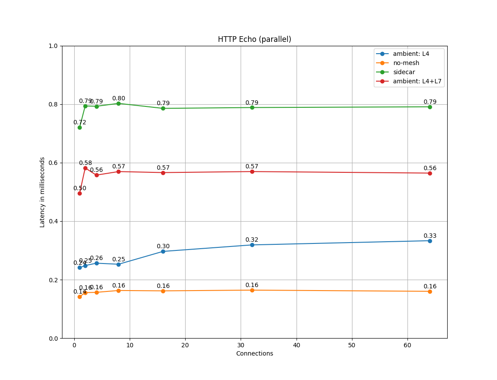
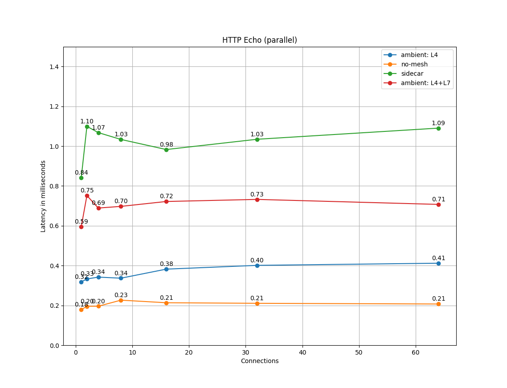

Istio makes it easy to create a network of deployed services with rich routing,
load balancing, service-to-service authentication, monitoring, and more - all
without any changes to the application code. Istio strives to provide
these benefits with minimal resource overhead and aims to support very
large meshes with high request rates while adding minimal latency.

The Istio data plane components, the Envoy proxies, handle data flowing through
the system. The Istio control plane component, Istiod, configures
the data plane. The data plane and control plane have distinct performance concerns.

## Performance summary for Istio 1.22

The [Istio load tests](https://github.com/istio/tools/tree//perf/load) mesh consists
of **1000** services and **2000** pods in an Istio mesh with 70,000 mesh-wide requests per second.

## Control plane performance

Istiod configures sidecar proxies based on user authored configuration files and the current
state of the system. In a Kubernetes environment, Custom Resource Definitions (CRDs) and deployments
constitute the configuration and state of the system. The Istio configuration objects like gateways and virtual
services, provide the user-authored configuration.
To produce the configuration for the proxies, Istiod processes the combined configuration and system state
from the Kubernetes environment and the user-authored configuration.

The control plane supports thousands of services, spread across thousands of pods with a
similar number of user authored virtual services and other configuration objects.
Istiod's CPU and memory requirements scale with the amount of configurations and possible system states.
The CPU consumption scales with the following factors:

- The rate of deployment changes.
- The rate of configuration changes.
- The number of proxies connecting to Istiod.

However, this part is inherently horizontally scalable.

You can increase the number of Istiod instances to reduce the amount of time it takes for the configuration
to reach all proxies.

At large scale, [configuration scoping](/docs/ops/configuration/mesh/configuration-scoping) is highly recommended.

## Data plane performance

Data plane performance depends on many factors, for example:

- Number of client connections
- Target request rate
- Request size and Response size
- Number of proxy worker threads
- Protocol
- CPU cores
- Various proxy features. In particular, telemetry filters (logging, tracing, and metrics) are known to have a moderate impact.

The latency, throughput, and the proxies' CPU and memory consumption are measured as a function of said factors.

### Sidecar CPU and memory usage

Since the sidecar proxy performs additional work on the data path, it consumes CPU
and memory. In Istio 1.22, a sidecar proxy consumes about 0.5 vCPU per 1000
requests per second.

The memory consumption of the proxy depends on the total configuration state the proxy holds.
A large number of listeners, clusters, and routes can increase memory usage.
In a large namespace with [namespace isolation](/docs/reference/config/networking/sidecar/) enabled, the proxy consumes approximately 50 MB of memory.

Since the proxy normally doesn't buffer the data passing through,
request rate doesn't affect the memory consumption.

### Latency

Since Istio injects a sidecar proxy on the data path, latency is an important
consideration.
Every feature Istio adds also adds to the path length inside the proxy and potentially affects latency.

The Envoy proxy collects raw telemetry data after a response is sent to the
client. The time spent collecting raw telemetry for a request does not contribute
to the total time taken to complete that request. However, since the worker
is busy handling the request, the worker won't start handling the next request
immediately. This process adds to the queue wait time of the next request and affects
average and tail latencies. The actual tail latency depends on the traffic pattern.

### Latency for Istio 1.22

Inside the mesh, a request traverses the client-side proxy and then the server-side
proxy. In the default ambient mode (with L4) configuration of Istio 1.22,
the two ztunnel proxies add about 0.17 ms and 0.20 ms to the 90th and 99th percentile latency, respectively, over the baseline data plane latency.
We obtained these results using the [Istio benchmarks](https://github.com/istio/tools/tree//perf/benchmark)
for the `http/1.1` protocol, with a 1 kB payload at 1000 requests per second using 1,2,4,8,16,32,64 client connections, 2 proxy workers and mutual TLS enabled.

Note: This testing was performed on the [CNCF Community Infrastructure Lab](https://github.com/cncf/cluster). Different hardware will give different values.

<h6 style="text-align: center;"> P90 latency vs client connections </h6>

  

<h6 style="text-align: center;"> P99 latency vs client connections </h6>

 

- `no_mesh`: Client pod directly calls the server pod, no pods in Istio service mesh.
- `ambient: L4`: Default ambient mode with the secure L4 overlay
- `ambient: L4+L7` Default ambient mode with the secure L4 overlay and waypoints enabled for the namespace.
- `sidecar` Client and server sidecars.

### Benchmarking tools

Istio uses the following tools for benchmarking

- [`fortio.org`](https://fortio.org/) - a constant throughput load testing tool.
- [`nighthawk`](https://github.com/envoyproxy/nighthawk) - a load testing tool based on Envoy.
- [`isotope`](https://github.com/istio/tools/tree//isotope) - a synthetic application with configurable topology.
