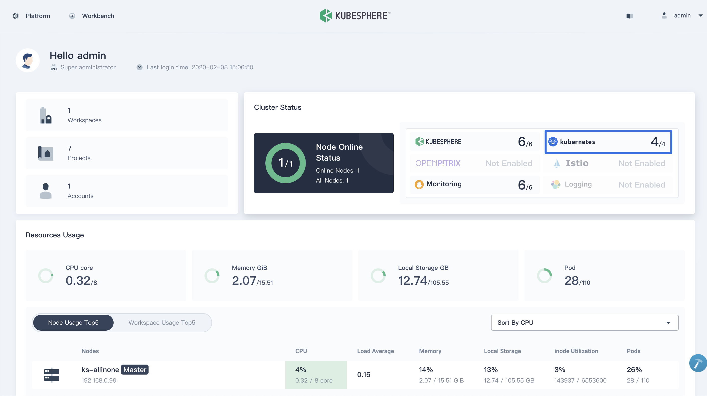

Follow these instructions to prepare the [KubeSphere Container Platform](https://github.com/kubesphere/kubesphere) for Istio. You can download KubeSphere to easily install a Kubernetes cluster on your Linux machines.


KubeSphere provides [All-in-One](https://kubesphere.io/docs/v2.1/en/installation/all-in-one/) and [Multi-Node](https://kubesphere.io/docs/v2.1/en/installation/multi-node/) installations. This enables quick setup and manages Kubernetes and Istio in a unified web console. This tutorial will walk you through the All-in-One installation. Reference [Multi-node Installation](https://kubesphere.io/docs/v2.1/en/installation/multi-node/) for further information.


## Prerequisites

A Linux machine that is either a virtual machine or bare metal. This machine requires at a minimum:

- Hardware:

    - CPU: at least 2 Cores
    - Memory: at least 4 `GB`

- Operating Systems:

    - CentOS 7.4 ~ 7.7 (`64-bit`)
    - Ubuntu 16.04/18.04 LTS (`64-bit`)
    - RHEL 7.4 (`64-bit`)
    - Debian Stretch 9.5 (`64-bit`)


Ensure your firewall meets the [port requirements](https://kubesphere.io/docs/v2.1/en/installation/port-firewall/). If this is not immediately feasible, you may evaluate Istio and KubeSphere by disabling the firewall as documented in your distribution.


## Provisioning a Kubernetes cluster

1. Download KubeSphere to your Linux machine, it will create a standard Kubernetes cluster (1.15 by default, KubeSphere also supports 1.13 and 1.14):

    
    $ curl -L https://kubesphere.io/download/stable/v2.1.0 > installer.tar.gz
    $ tar -xzf installer.tar.gz
    $ cd kubesphere-all-v2.1.0/scripts
    

1. Execute the installation script. Select the **"1) All-in-one"** option when prompted:

    
    $ ./install.sh
    

1. Installation may take 15 ~ 20 minutes. Wait until all pods are running. Access the console using the account information obtained from the installation logs:

    
    #####################################################
    ###              Welcome to KubeSphere!           ###
    #####################################################
    Console: http://192.168.0.8:30880
    Account: admin
    Password: It will be generated by KubeSphere Installer
    

    
    At the same time, Kubernetes 1.15 has been installed into your environment.
    

    

## Enable installing Istio on Kubernetes

KubeSphere will install Istio within Kubernetes. Reference [Enable Service Mesh](https://kubesphere.io/docs/v2.1/en/installation/install-servicemesh/) for further information.
