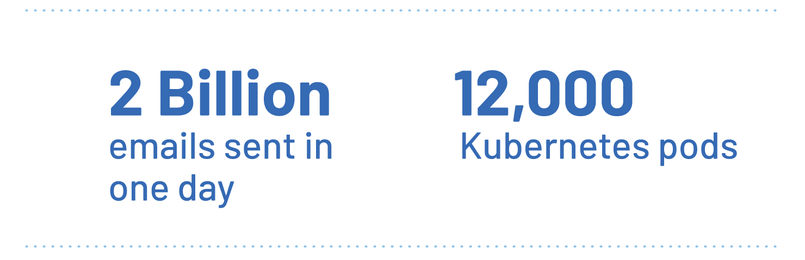
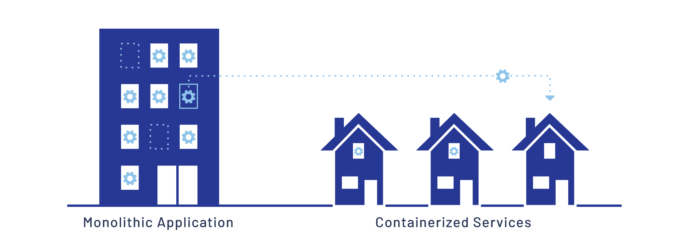

Bluecore es una plataforma de personalización multicanal que se especializa en correos electrónicos, mensajes en el sitio y anuncios de medios pagados altamente personalizados entregados a escala. Dado que la oferta única de Bluecore requiere procesar datos de recomendación de clientes, así como enviar una gran cantidad de comunicaciones digitales personalizadas, se ocupan de ingerir, procesar y enviar toneladas de datos. Es una workload enorme; durante un Black Friday reciente, enviaron más de 2 mil millones de correos electrónicos.

Además del volumen, Bluecore necesita ser rápido. Tienen acuerdos de servicio con la mayoría de sus socios que garantizan que cualquier cliente recibirá un correo electrónico, un mensaje en el sitio o un anuncio a las pocas horas de que se envíe un trabajo, lo que significa que la velocidad de procesamiento es de vital importancia. Logran esta hazaña utilizando tanto una aplicación monolítica que se ejecuta en Google App Engine como un cluster de Google Kubernetes Engine (GKE) que ejecuta alrededor de 12,000 pods.

## El desafío: arquitectura monolítica y aumento del tráfico de datos

Bluecore es una operación grande con serios requisitos en torno a la transferencia y el procesamiento de datos. Se enfrentaban a un desafío abrumador; la cantidad de datos que necesitan procesar aumenta continuamente. Sabían que sus canalizaciones se sobrecargarían si su arquitectura no se pudiera actualizar para manejar las crecientes demandas.

Un examen de su arquitectura reveló que la aplicación monolítica iba a ser el mayor desafío. El equipo de desarrollo de Bluecore se dio cuenta de que para permitir el crecimiento futuro, era hora de comenzar a migrar a una infraestructura más flexible y escalable.

Kubernetes ofrecía un camino para escalar, y dado que Bluecore ya se estaba ejecutando en App Engine, parecía que migrar partes de su flujo de trabajo a GKE sería una obviedad. Sin embargo, la mayoría de los ingenieros de Bluecore no tenían suficiente experiencia con aplicaciones en contenedores. Esto podría hacer que la migración a GKE sea una transición dolorosa.

Afortunadamente, encontraron una solución.

## La solución: Habilitar a los desarrolladores con la service mesh de Istio

"Istio permite un enfoque que te permite comenzar a construir desde el primer momento", explica Shray Kumar, ingeniero de software del equipo de infraestructura de Bluecore. "Y puedes asegurarte de que estás construyendo las cosas de la manera correcta".

Sin una service mesh, dividir una aplicación monolítica en servicios en contenedores presenta una serie de desafíos sin soluciones obvias. Uno de ellos, por ejemplo, es la implementación de la autenticación y la autorización. Si cada servicio en contenedores necesita su propia solución, las posibilidades son demasiado grandes de que los desarrolladores individuales encuentren su propia manera de hacerlo. Esto puede conducir a un código fragmentado y muchos dolores de cabeza en el futuro.

Afortunadamente, Kumar y el equipo de infraestructura estaban familiarizados con Istio. Trabajaron en estrecha colaboración con Al Delucca, ingeniero principal del equipo de la plataforma de datos de Bluecore, en un plan para comenzar a implementarlo.

"Teníamos el problema", explica Delucca. "Pero si Istio era o no la herramienta para resolverlo, eso es lo que teníamos que averiguar".

Descubrieron que el conjunto de características de Istio proporcionaba muchas soluciones a los desafíos existentes. La autorización fue una de las más importantes. Los mensajes entrantes de las aplicaciones de los socios debían autenticarse. Istio podía realizar esa autenticación en el borde, lo que significaba que cada servicio individual no necesitaba implementar sus propios métodos.

"Podemos llevar la autenticación y la autorización al borde, lo que elimina la carga de comprender esos sistemas de nuestros ingenieros", dice Delucca. "No se trata tanto de lo que hacen con Istio directamente, sino de lo que Istio hace por ellos sin que ellos lo sepan. Esa es la clave, la gran victoria para nosotros".

A medida que sus ingenieros comenzaron a dividir la aplicación monolítica en servicios, encontraron otro desafío que Istio pudo resolver. El seguimiento de las llamadas a los servicios parecía que sería problemático. Muchas de las funciones heredadas no tenían una documentación clara sobre sus dependencias y requisitos. Esto significaba que los problemas de rendimiento y las llamadas a servicios remotos podían dejar a los desarrolladores rascándose la cabeza. Afortunadamente, el [seguimiento distribuido de Istio](/es/docs/tasks/observability/distributed-tracing/) vino al rescate. Con él, los desarrolladores pudieron identificar cuellos de botella y servicios que necesitaban correcciones de errores y trabajo adicional.

La service mesh de Istio permitió a los desarrolladores centrarse en dividir la aplicación monolítica en servicios individuales sin tener que desarrollar un conocimiento profundo de toda la infraestructura. Esto permitió a los ingenieros de Bluecore ser más productivos más rápidamente.

## Conclusión: El futuro

Si bien el equipo de Bluecore ya ha encontrado un valor increíble en las características de Istio que han utilizado, todavía buscan utilizar más. Entre estas características se encuentra la capacidad de administrar [implementaciones canarias](/blog/2017/0.1-canary/) autoescaladas. Una implementación canaria permite a un equipo introducir una nueva versión de un servicio probándola con solo una pequeña parte del tráfico de la aplicación. Si la prueba sale bien, la actualización se puede implementar automáticamente mientras se elimina gradualmente la versión anterior. Por otro lado, si se detecta un problema con la nueva versión, la versión anterior se puede revertir rápidamente.

El equipo de Bluecore continuará dividiendo su aplicación monolítica en servicios en contenedores, utilizando Istio para llevar cada vez más servicios al borde y dar a sus desarrolladores más tiempo para hacer lo que mejor saben hacer. Se sienten seguros de que están listos para la siguiente etapa de crecimiento a medida que necesitan ingerir y procesar cada vez más datos.
