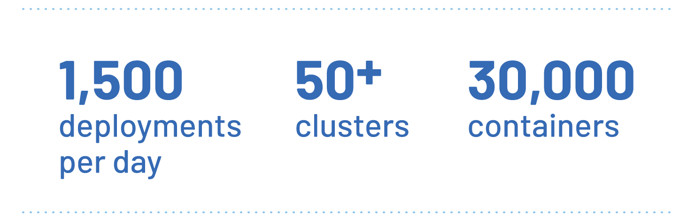

Rappi conecta empresas, consumidores y repartidores con la misión de dar a sus usuarios más tiempo libre. Su aplicación les da a los usuarios el poder de pedir una amplia variedad de bienes y servicios. Es la primera superaplicación de América Latina, con presencia en nueve países y más de 250 ciudades. La aplicación ha tenido más de 100 millones de descargas desde que se fundó la empresa en 2015.

Con un gran éxito viene el desafío del rápido crecimiento, y Rappi ha estado creciendo constantemente. En los últimos años, el valor de la empresa ha crecido de 100 millones de dólares a 8 _mil millones_ de dólares. Su tecnología ha tenido que seguir el ritmo del negocio, por lo que eligieron implementar y administrar su aplicación en Kubernetes. Kubernetes continúa siendo una herramienta que permite el increíble crecimiento de su infraestructura.

Sin embargo, incluso con Kubernetes implementado, la infraestructura de Rappi enfrentó grandes desafíos. ¿Cómo gestionaron su crecimiento a más de 50 clusteres de Kubernetes, con el más grande ejecutando más de 20 000 contenedores?

## El desafío: El agobio del éxito

Aunque el equipo de Rappi había logrado trasladar su infraestructura a Kubernetes, todavía estaban luchando con los dolores del crecimiento. Tendrían que evolucionar como empresa de tecnología para poder seguir el ritmo de su negocio. Para ayudar a administrar su infraestructura en expansión, desarrollaron una service mesh interna. Desafortunadamente, esto requería demasiado mantenimiento y luchaba por mantenerse al día con el crecimiento que estaban viendo.

"Recordé la historia de Lyft usando Envoy, y decidí que deberíamos probarlo en nuestro entorno", dice Ezequiel Arielli, ingeniero sénior de DevOps en Rappi.

## La solución: Istio al rescate

El equipo de Rappi decidió implementar Istio, que utiliza sidecars de Envoy. Fue una excelente opción. A medida que asumieron el nuevo proyecto, encontraron que la documentación ofrecía un excelente soporte y que las API de Istio eran limpias y eficientes. Istio fue la solución para gestionar sus dolores de crecimiento.

A medida que la noticia del éxito de la implementación inicial de Istio se extendió por toda la organización, cada vez más equipos de DevOps de Rappi comenzaron a migrar a Istio. Inicialmente, solo un equipo de 30 personas usaba Istio, pero hoy ese número ha crecido a más de 1500 desarrolladores.

Istio les dio a los equipos de DevOps de Rappi la flexibilidad de establecer diferentes especificaciones para diferentes servicios. Pudieron personalizar los límites de velocidad, los interruptores de circuito, los grupos de conexiones, los tiempos de espera y otros parámetros críticos.

Descubrieron que Istio también ofrecía características extremadamente útiles para la seguridad y el cumplimiento. Por ejemplo, la service mesh podía segmentar el tráfico vertical y restringir la comunicación entre diferentes endpoints.

"Istio nos da la flexibilidad de establecer diferentes especificaciones para diferentes servicios", dice Juan Franco Cusa, líder técnico de DevOps para Rappi. "También proporciona características extremadamente útiles para la seguridad y el cumplimiento, lo cual es muy útil para entornos de alta seguridad".

"Cuando nuestra solución anterior alcanzó su límite, pudimos usar Istio para refactorizar nuestra pila de monitoreo", explica Arielli. "Istio le dio a nuestro equipo la capacidad de monitorear los servicios a cualquier escala sin problemas".

Esto se volvió esencial a medida que su infraestructura superó los 30 000 contenedores.

## Resultado: La infraestructura continúa creciendo

El equipo de desarrollo creó una implementación de cluster de Kubernetes e Istio automatizada y lista para producción. Su API interna superpuesta a los clusteres de Kubernetes, les dio la capacidad de administrar microservicios en cada cluster. Además, cada microservicio tiene recursos de tráfico creados y asignados automáticamente durante la implementación. Gracias a este sistema, pueden gestionar más de 1500 implementaciones por día.

"Nuestra configuración ha permitido que nuestro uso e infraestructura de Kubernetes continúen creciendo", dice Arielli. "Ahora administramos más de 50 clusteres de Kubernetes, el más grande contiene más de 20 000 contenedores. Nuestro entorno cambia constantemente, e Istio ayuda a garantizar una comunicación eficiente, escalable y segura en todo él".

Istio gestiona el tráfico entre más de 1500 aplicaciones en los clusteres más críticos y, gracias a su potente conjunto de características, pueden elegir diferentes estrategias de implementación cuando sea necesario. El control plane de Istio reequilibra las conexiones fácilmente, incluso a medida que el tráfico continúa aumentando.

## ¿Qué sigue para Rappi?

El equipo de DevOps detrás de la adopción de Istio todavía está avanzando con mejoras en la infraestructura.

"En el futuro, esperamos poder implementar el soporte multicluster a nivel de malla", dice Arielli. "Con esta característica, no importará dónde se esté ejecutando una aplicación. Todas las aplicaciones podrán acceder entre sí a través de los clusteres".

## Conclusión: Escalado exitoso con Istio

Con la service mesh de Istio, Rappi ha logrado crecer según lo requiere el mercado. Pueden manejar fácilmente la implementación de nuevos clusteres y la activación de servicios en más mercados y ciudades.

"Gracias a Istio, estamos seguros de que Rappi podrá implementar más servicios y más aplicaciones para satisfacer la creciente demanda", dice Arielli.
