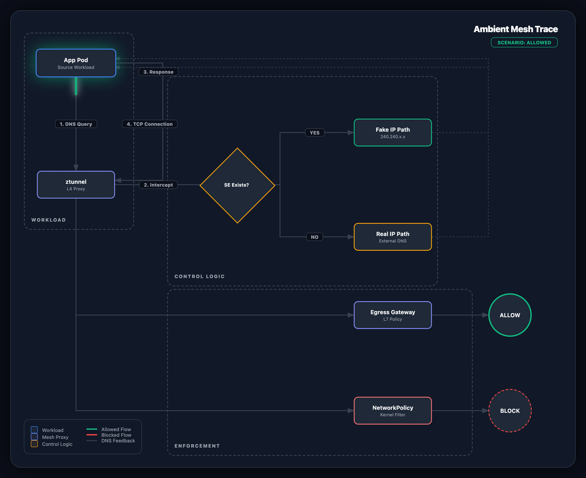

Якщо ви перенесли робоче навантаження з AWS на локальну інфраструктуру, ви, ймовірно, стикалися з цим: **ізоляції мережі, яку ви отримували безкоштовно в хмарі, на bare metal немає.**

В AWS Security Groups та межі VPC мовчки забезпечують межі сервісів. Більшість команд ніколи не замислюються про це. На локальній інфраструктурі мережа зазвичай є пласкою. Ваш платіжний сервіс, внутрішня панель адміністратора, агент логування та API для клієнтів всі знаходяться в одному кластері без нічого між ними на мережевому рівні.

Ви можете відновити цю ізоляцію за допомогою правил брандмауера та сегментації мережі, але в більшості локальних налаштувань це означає роботу з інфраструктурними командами, які мають власні цикли управління змінами. Коли ви перебуваєте в процесі міграції та намагаєтеся рухатися швидко, це є значним обмеженням.

Отже, у розгортанні EKS Hybrid, яке ми проводили, ми вирішили розвʼязати це на рівні mesh. У нас уже був Istio в стеку, і він дав нам спосіб забезпечити ізоляцію на рівні робочого навантаження без очікування змін на мережевому рівні. Команда з безпеки переглянула модель і схвалила її, оскільки контрольні механізми, які ми побудували, безпосередньо відповідали тому, що вони вимагали б від брандмауера. Ця [доповідь](https://one2n.io/talks/kubernetes-for-hybrid-cloud-environments---harshwardhan-mehrotra---60-kubernetes-pune-meetup) охоплює ширші налаштування EKS Hybrid, якщо вам потрібен цей контекст.


У цьому дописі йдеться про те, як ми побудували цей рівень ізоляції, шар за шаром, і що ми дізналися в процесі.


## Чому Istio (навіть для невеликих кластерів) {#why-istio-even-for-small-clusters}

Вам не потрібна масштабна архітектура мікросервісів, щоб отримати користь від Istio. Навіть у невеликому кластері mesh дає вам три речі, які важко отримати будь-яким іншим способом:

* **Ідентифікація за принципом «нульової довіри»**: Замість того, щоб довіряти сервісу через його IP-адресу, ви довіряєте йому, оскільки він має криптографічно перевірений сертифікат, привʼязаний до його ідентичності. Зловмисник, який потрапив у мережу, не зможе це підробити.
* **Прозоре шифрування**: Весь трафік між сервісами автоматично шифрується за допомогою mTLS (взаємного TLS, тобто обидві сторони перевіряють одна одну), без необхідності змінювати код вашого додатка.
* **Поглиблена спостережуваність**: Ви отримуєте живу мапу того, які сервіси спілкуються між собою, без необхідності інструментування.

## Sidecar чи Ambient: чому було обрано Ambient {#sidecar-vs-ambient-why-we-chose-ambient-mode}

Існує два способи запуску Istio. Традиційна модель робить інʼєкцію невеликого проксі (який називається sidecar) у кожен pod. Кожен сервіс отримує власний проксі, який обробляє шифрування та застосування політик для цього сервісу.

Ми обрали новіший підхід: **Istio Ambient Mode**. Замість проксі для кожного podʼа, Ambient запускає один спільний компонент під назвою ztunnel на кожному вузлі. Він виконує ту саму роботу (шифрування трафіку, забезпечення ідентичності), але працює строго на транспортному рівні (Layer 4, L4), на рівні вузла, а не всередині кожного окремого podʼа.

| Функція | Режим Sidecar | Режим Ambient |
| --- | --- | --- |
| **Розгортання** | Один проксі всередині кожного podʼа | Один спільний компонент на вузол |
| **Операційне навантаження** | Високе (рестарти, додаткова памʼять на pod) | Низьке (прозоро для podʼа) |
| **Шифрування (mTLS)** | Виконується власним проксі кожного podʼа | Виконується ztunnel на вузлі |
| **Розширені HTTP-функції (L7)** | Завжди доступні | Потребує додаткового компонента (Waypoint Proxy) |
| **Продуктивність** | Середня | Менше накладних витрат для базової безпеки |

### Чого ви позбавляєтеся в режимі Ambient {#what-you-give-up-with-ambient-mode}

Режим Ambient ще не є повноцінною заміною sidecar. Варто знати про обмеження, перш ніж ви вирішите його використовувати:

* **Розширені HTTP-функції (L7) потребують додаткового компонента**: Такі речі, як маршрутизація на основі заголовків, повторні спроби та метрики на запит, не обробляються ztunnel. Для цього потрібно розгорнути Waypoint Proxy.
* **Власні фільтри не працюють на ztunnel**: якщо ви хочете запускати власні втулки WebAssembly або скрипти Lua через сучасний API TrafficExtension, вони потребують Waypoint Proxy. Оскільки ztunnel працює строго на рівні Layer 4, він не може обробляти логіку Layer 7, на яку покладаються більшість фільтрів та втулків користувачів.
* **Віртуальні машини не підтримуються**: Ambient працює лише для робочих навантажень Kubernetes. Якщо вам потрібно включити ВМ у mesh, все одно потрібна модель sidecar.
* **Налаштування мультикластерів потребує додаткової уваги**: Підтримка крос-кластерів між кластерами в режимі sidecar і Ambient знаходиться в бета-версії та має специфічні вимоги до конфігурації.

### Ментальна модель, перш ніж читати далі {#a-mental-model-before-you-read-further}

З інструментами визначено, ось як варто мислити про те, що ми насправді будуємо, перш ніж переходити до кроків.

Уявіть свій кластер як офісну будівлю, де всі двері стандартно відкриті. Будь-хто, хто потрапляє всередину, може пройти в будь-яку кімнату. Те, що ми робимо тут, це:

1. **Закриймо всі двері** — стандартно жодна служба не може отримувати трафік, якщо ми явно не дозволимо це.
1. **Заміна ключ-карт на бейджі співробітників** — замість "цей IP-адрес дозволений", стає "ця конкретна служба, підтверджена сертифікатом, дозволена". Зловмисник не може підробити сертифікат, просто підробивши IP.
1. **Контроль того, що залишає будівлю** — нічого в кластері не може спілкуватися з зовнішнім інтернетом, якщо це не проходить через єдину контрольовану точку виходу.
1. **Додамо фізичний засув зверху** — другий рівень мережевих правил на рівні операційної системи, щоб навіть якщо щось обійшло Istio повністю, воно все одно не могло вийти.

Кожен розділ нижче охоплює один із цих чотирьох кроків, по порядку.

## Шлях до зміцнення безпеки {#the-hardening-journey}

Ми не впроваджували це за один раз. Кожен рівень усував прогалину, яку залишив попередній. Принцип залишався незмінним: спочатку все блокувати, а потім відкривати лише те, що можна обґрунтувати.

### Рівень 1: глобальна заборона {#layer-1-the-global-deny}

Перший крок — заблокувати весь вхідний трафік до кожної служби в mesh. Ми зробили це за допомогою однієї політики Istio, застосованої на верхньому рівні:



# Приклад 1: Глобальна політика заборони вхідного трафіку

apiVersion: security.istio.io/v1beta1
kind: AuthorizationPolicy
metadata:
  name: deny-all-ingress
  namespace: istio-system
spec:
{}


Порожній `spec` без правил означає, що нічого не дозволено. Далі ми додаємо явні правила для кожного зʼєднання, яке має бути дозволене.


**Примітка:** Традиційна конфігурація sidecar має корисний режим "сухого запуску", який називається Audit Mode. Він реєструє трафік, який був би заблокований, без фактичного блокування, щоб ви могли перевірити правильність своїх правил перед їх застосуванням. Ambient mode в Istio 1.24 цього не підтримує. Тому нам довелося бути обережнішими, вручну перевіряючи кожне правило дозволу та уважно стежачи за журналами доступу перед переходом до суворого застосування.


### Рівень 2: ідентичність SPIFFE як периметр {#layer-2-spiffe-identity-as-the-perimeter}

Як тільки все стандартно заблоковано, нам потрібен спосіб відкрити конкретні зʼєднання. Замість використання IP-адрес (які можуть змінюватися при перезапуску podʼів) ми використовуємо ідентичність сервісів.

Кожен сервіс в mesh отримує **SPIFFE ID**, стандартний спосіб іменування ідентичностей робочих навантажень. SPIFFE розшифровується як Secure Production Identity Framework for Everyone. Це виглядає так:

`spiffe://cluster.local/ns/production/sa/frontend-sa`

Ця ідентичність вбудована в TLS-сертифікат, який використовує сервіс. Оскільки Istio контролює ці сертифікати, сервіс не може претендувати на іншу ідентичність, просто змінивши мітку або конфігураційний файл.


Безпека привʼязана до облікового запису сервісу, а не до його IP-адреси чи розташування в мережі.


Дозвіл сервісу frontend викликати backend виглядає так:



# Приклад 2: Дозвіл frontend викликати backend на основі ідентичності SPIFFE

apiVersion: security.istio.io/v1beta1
kind: AuthorizationPolicy
metadata:
  name: allow-frontend-to-backend
  namespace: production
spec:
  selector:
    matchLabels:
      app: backend-api
  action: ALLOW
  rules:
    - from:
        - source:
            principals: ["cluster.local/ns/production/sa/frontend-sa"]


### Рівень 3: блокування egress та перехоплення DNS {#layer-3-egress-blocking-and-dns-interception}

Блокування вхідного трафіку — це лише половина проблеми. У пласкій мережі скомпрометований сервіс все ще може вільно виходити в інтернет. Саме так відбувається витік даних, як зловмисники встановлюють зворотне зʼєднання зі своєю інфраструктурою, і як сервіси в кінцевому підсумку викликають те, до чого вони не повинні мати доступ.

Ми вирішили цю проблему, маршрутизуючи весь вихідний трафік через спеціальну точку виходу (Egress Gateway) для кожного namespace і блокуючи все інше на рівні мережі.

### Як працює перехоплення DNS {#how-the-dns-side-of-this-works}

Коли сервіс намагається підключитися до зовнішньої адреси, наприклад `api.external.com`, відбувається наступне:

1. ztunnel перехоплює DNS-запит до того, як він буде надісланий.
1. Якщо ми оголосили `api.external.com` як дозволений зовнішній сервіс (через `ServiceEntry`), ztunnel повертає заповнювач IP-адреси. Сервіс підключається до нього, а ztunnel маршрутизує реальне підключення через Egress Gateway для перевірки.
1. Якщо ми не оголосили цю адресу, ztunnel пропускає DNS-запит, але фактичне підключення блокується мережевими правилами на рівні ядра (розглянуто на наступному рівні).

<em>Рис. 1: Потік вихідного трафіку з перехопленням DNS</em>

Для реєстрації дозволеного зовнішнього сервісу та маршрутизації його через шлюз:



# Приклад 3: Реєстрація зовнішнього сервісу та привʼязка до Egress Gateway

apiVersion: networking.istio.io/v1
kind: ServiceEntry
metadata:
  name: external-api
  namespace: production
  labels:
    istio.io/use-waypoint: production-egress-gateway # Explicitly binds SE to our gateway
spec:
  hosts:
    - api.external.com
  ports:
    - number: 443
      name: https
      protocol: HTTPS
  location: MESH_EXTERNAL
  resolution: DNS


Мітка `istio.io/use-waypoint` повідомляє ztunnel, що цей вихідний трафік слід маршрутизувати через наш Egress Waypoint, який є стандартним Waypoint Proxy, що діє як egress-шлюз, замість того щоб дозволяти йому виходити безпосередньо в інтернет.

### Layer 4: контроль на рівні ядра {#layer-4-the-kernel-level-backstop}

Istio потужний, але ми хотіли мати страховку під ним. Якщо щось обійде mesh повністю, мережа сама повинна це перехопити.

Kubernetes має власні мережеві правила (`NetworkPolicies`), які працюють на нижчому рівні, ніж Istio, і застосовуються ядром Linux на кожному вузлі. Ми встановили два правила для кожного namespace:

1. **Блокувати весь вихідний трафік**, крім DNS-запитів та внутрішнього порту для комунікації Istio (15008). Звичайні сервіси не можуть виходити в інтернет.
1. **Дозволити Egress Gateway виходити в інтернет**. Це єдиний компонент, який може це робити.



# Приклад 4: Обмеження вихідного трафіку подів лише mesh та DNS

kind: NetworkPolicy
apiVersion: networking.k8s.io/v1
kind: NetworkPolicy
metadata:
  name: deny-all-egress-except-mesh
  namespace: production
spec:
  podSelector: {} # Applies to all pods in the namespace
  policyTypes:
    - Egress
  egress:
    - to: # Allow DNS
        - namespaceSelector: {} # any namespace
      ports:
        - protocol: UDP
          port: 53
    - to: # Allow traffic to istio-system (for control plane/discovery)
        - namespaceSelector:
            matchLabels:
              kubernetes.io/metadata.name: istio-system
      ports: # Allow HBONE tunnel to Egress Gateway/Waypoint
        - protocol: TCP
          port: 15008
---

# Приклад 5: Дозвіл Egress Gateway виходити в інтернет

apiVersion: networking.k8s.io/v1
kind: NetworkPolicy
metadata:
  name: allow-egress-gateway-to-internet
  namespace: production
spec:
  podSelector:
    matchLabels:
      gateway.networking.k8s.io/gateway-name: production-egress-gateway
  policyTypes: ["Egress"]
  egress:
    - {} # Unrestricted egress for the gateway itself


## Що ми дізналися {#what-we-learned}

1. **Потрібно зосередитися на бізнес-проблемі, а не на технології**: Ми впровадили Istio не тому, що це цікава технологія, а тому, що інфраструктура не могла забезпечити нам необхідну ізоляцію без місяців узгоджень. Це важливо, коли ви пояснюєте своє рішення команді з безпеки.
1. **Ambient mode вартий уваги, але йдіть з відкритими очима**: Він знімає багато операційного навантаження, але вам знадобиться Waypoint Proxy для всього, що виходить за межі базового шифрування трафіку, а віртуальні машини поки що не підтримуються.
1. **Istio та мережеві правила Kubernetes — це не одне й те саме**: Istio захищає трафік на основі ідентичності робочого навантаження на транспортному та прикладному рівнях. Мережеві правила Kubernetes (`NetworkPolicies`) працюють на мережевому рівні. Потрібні обидва. Кожен ловить те, що інший не може.

Жорстке зміцнення мережі на пласкій інфраструктурі рідко буває чистим процесом. Все починається з хаотичної реальності, коли сервіси вільно спілкуються один з одним, і включає багато ретельного тестування зі стандартними правилами "deny" перед тим, як ви зможете довіряти тому, що побудували. Але, перейшовши від "довіряй цьому IP" до "довіряй цій перевіреній ідентичності", ми перетворили високоризикове on-premises середовище на те, що ми могли реально захистити, не подаючи жодного інфраструктурного запиту.


В кінцевому підсумку, mesh — це не лише про управління трафіком. Йдеться про взяття під контроль вашої безпекової позиції в середовищах, де базове обладнання не підтримує вас.


Більшість команд розглядають mesh як інструмент для управління трафіком, а брандмауер як інструмент безпеки. На пласкій мережі такий поділ може обернутися проти вас. Якщо ваші робочі навантаження зараз вільно спілкуються один з одним, подивіться, як ми підходимо до цього, або давайте виправимо ситуацію.
