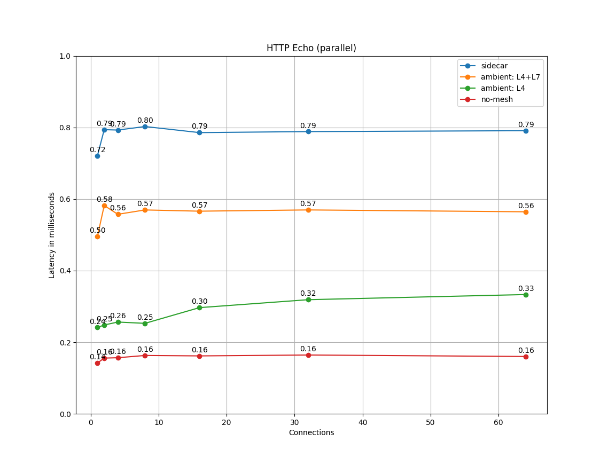

Istio полегшує створення мережі розгорнутих сервісів із багатими можливостями маршрутизації, балансування навантаження, автентифікації між сервісами, моніторингу та іншого — без жодних змін у коді застосунку. Istio прагне надавати ці переваги з мінімальним навантаженням на ресурси та підтримує дуже великі сервісні мережі з високою частотою запитів, додаючи мінімальні затримки.

Компоненти панелі даних Istio, проксі Envoy, обробляють дані, що проходять через систему. Компонент панелі управління Istio, Istiod, налаштовує панель даних. Панель даних і панель управління мають окремі питання продуктивності.

## Огляд продуктивності для Istio 1.22 {#performance-summary-for-istio-122}

[Тести навантаження Istio](https://github.com/istio/tools/tree//perf/load) охоплюють **1000** сервісів і **2000** podʼів у mesh Istio з 70 000 запитами в секунду по всій мережі.

## Продуктивність панелі управління {#control-plane-performance}

Istiod налаштовує sidecar проксі на основі конфігурацій, створених користувачем, і поточного стану системи. У середовищі Kubernetes конфігурацію і стан системи представляють визначення власних ресурсів (CRD) та розгортання. Обʼєкти конфігурації Istio, такі як шлюзи та віртуальні сервіси, є конфігурацією, створеною користувачем. Щоб створити конфігурацію для проксі, Istiod обробляє комбінацію конфігурацій і стану системи з середовища Kubernetes і створеної користувачем конфігурації.

Панель управління підтримує тисячі сервісів, розподілених між тисячами podʼів із подібною кількістю віртуальних сервісів і інших обʼєктів конфігурації, створених користувачем. Вимоги до процесора та памʼяті Istiod збільшуються зі зростанням кількості конфігурацій та можливих станів системи. Споживання процесора збільшується з такими факторами:

- Швидкість змін розгортання.
- Швидкість змін конфігурації.
- Кількість проксі, що підключаються до Istiod.

Однак, ця частина може масштабуватися горизонтально.

Ви можете збільшити кількість екземплярів Istiod, щоб зменшити час, необхідний для доставки конфігурації до всіх проксі.

На великих масштабах наполегливо рекомендується [визначення масштабів конфігурації](/docs/ops/configuration/mesh/configuration-scoping).

## Продуктивність панелі даних {#data-plane-performance}

Продуктивність панелі даних залежить від багатьох факторів, наприклад:

- Кількість клієнтських підключень
- Потрібна швидкість запитів
- Розмір запиту та розмір відповіді
- Кількість робочих потоків проксі
- Протокол
- Процесорні ядра
- Різні функції проксі. Зокрема, фільтри телеметрії (логування, трасування та метрики) мають помірний вплив.

Затримки, пропускна здатність та споживання процесора і памʼяті проксі вимірюються як функція зазначених факторів.

### Використання процесора та пам'яті sidecarʼом {#sidecar-cpu-and-memory-usage}

Оскільки sidecar проксі виконує додаткову роботу на шляху даних, він споживає ресурси процесора та памʼять. У Istio 1.22 sidecar проксі споживає приблизно 0.5 vCPU на 1000 запитів за секунду.

Споживання памʼяті проксі залежить від загального стану конфігурації, яку він зберігає. Велика кількість прослуховувачів, кластерів і маршрутів може збільшити споживання памʼяті. У великому просторі імен із ввімкненою [ізоляцією простору імен](/docs/reference/config/networking/sidecar/) проксі споживає приблизно 50 МБ памʼяті.

Оскільки проксі зазвичай не буферизує дані, що проходять через нього, швидкість запитів не впливає на споживання памʼяті.

### Затримка {#latency}

Оскільки Istio вставляє sidecar проксі на шляху даних, затримка є важливим фактором. Кожна функція, яку додає Istio, також додає до довжини шляху всередині проксі та потенційно впливає на затримку.

Проксі Envoy збирає необроблені дані телеметрії після надсилання відповіді клієнту. Час, витрачений на збір необробленої телеметрії для запиту, не додається до загального часу виконання цього запиту. Однак, оскільки обробник зайнятий обробкою запиту, він не може негайно почати обробляти наступний запит. Цей процес додає час очікування в черзі для наступного запиту та впливає на середні та крайні затримки. Фактична крайня затримка залежить від шаблону трафіку.

### Затримка для Istio 1.22 {#latency-for-istio-122}

Всередині сервісної мережі запит проходить через проксі з боку клієнта, а потім через проксі з боку сервера. У стандартній конфігурації в режимі оточення (ambient) (з L4) для Istio 1.22 два проксі ztunnel додають приблизно 0.17 мс і 0.20 мс до 90-го та 99-го процентилю затримки відповідно до базової затримки панелі даних. Ці результати ми отримали, використовуючи [бенчмарки Istio](https://github.com/istio/tools/tree//perf/benchmark) для протоколу `http/1.1`, з розміром повідомлення 1 кБ при 1000 запитах за секунду з використанням 1,2,4,8,16,32,64 клієнтських підключень, 2 робочих процесах проксі та ввімкнутим mutual TLS.

Примітка: Це тестування було виконано у [CNCF Community Infrastructure Lab](https://github.com/cncf/cluster). Різне апаратне забезпечення може давати різні значення.

<h6 style="text-align: center;"> Затримка P90 для клієнтських підключень </h6>

  

<h6 style="text-align: center;"> Затримка P99 для клієнтських підключень </h6>

 

- `no_mesh`: Клієнтський pod напряму викликає серверний pod, жодних podʼів у сервісній мережі Istio.
- `ambient: L4`: Стандартний режим оточення з захищеним L4 Overlay
- `ambient: L4+L7`: Стандартний режим оточення із захищеним  L4 Overlay та ввімкненими waypoints для простору імен.
- `sidecar`: Клієнтські та серверні sidecarʼи.

### Інструменти для тестування {#benchmarking-tools}

Istio використовує такі інструменти для тестування:

- [`fortio.org`](https://fortio.org/) — інструмент для тестування навантаження з постійною пропускною здатністю.
- [`nighthawk`](https://github.com/envoyproxy/nighthawk) — інструмент для тестування навантаження, заснований на Envoy.
- [`isotope`](https://github.com/istio/tools/tree//isotope) — синтетичний застосунок із налаштовуваною топологією.
