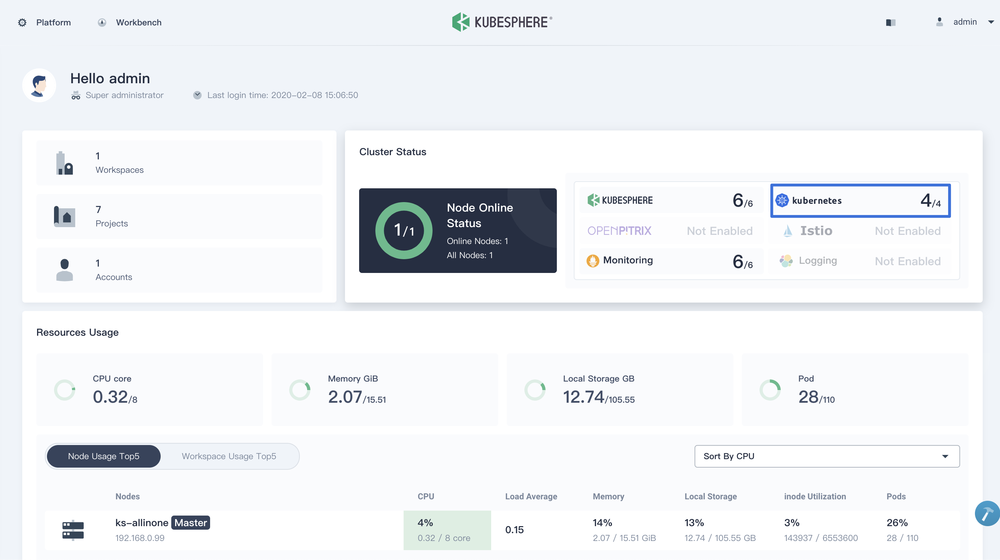

Ця сторінка була останній раз оновлена 9 березня 2021 року.



Виконайте ці інструкції, щоб підготувати [KubeSphere Container Platform](https://github.com/kubesphere/kubesphere) для Istio. Ви можете завантажити KubeSphere для легкого встановлення кластера Kubernetes на ваших Linux машинах.


KubeSphere пропонує [All-in-One](https://kubesphere.io/docs/installation/all-in-one/) та [Multi-Node](https://kubesphere.io/docs/installation/multi-node/) установки. Це забезпечує швидке налаштування та управління Kubernetes і Istio в єдиній вебконсолі. Цей посібник покаже вам кроки для встановлення All-in-One. Для додаткової інформації зверніться до [Multi-node Installation](https://kubesphere.io/docs/installation/multi-node/).


## Передумови {#prerequisites}

Linux машина, яка є або віртуальною машиною, або сервером (bare metal). Для цієї машини необхідний мінімум:

- Апаратура:

  - CPU: щонайменше 2 ядра
  - Оперативна пам'ять: щонайменше 4 `GB`

- Операційні системи:

  - CentOS 7.4 ~ 7.7 (`64-bit`)
  - Ubuntu 16.04/18.04 LTS (`64-bit`)
  - RHEL 7.4 (`64-bit`)
  - Debian Stretch 9.5 (`64-bit`)


Переконайтеся, що ваш фаєрволл відповідає [вимогам до портів](https://kubesphere.io/docs/installation/port-firewall/). Якщо це не можливо виконати одразу, ви можете оцінити Istio і KubeSphere, тимчасово відключивши фаєрволл, як це вказано у документації  вашого дистрибутиву.


## Підготовка кластера Kubernetes {#provisioning-a-kubernetes-cluster}

1. Завантажте KubeSphere на вашу Linux машину і перейдіть до теки KubeSphere. Наприклад, якщо створена тека називається `kubesphere-all-v2.1.1`:

    
    $ curl -L https://kubesphere.io/download/stable/latest > installer.tar.gz
    $ tar -xzf installer.tar.gz
    $ cd kubesphere-all-v2.1.1/scripts
    

1. Запустіть скрипт встановлення, який створить стандартний кластер Kubernetes. Виберіть опцію **"1) All-in-one"**, коли буде запропоновано:

    
    $ ./install.sh
    

1. Встановлення може тривати 15 ~ 20 хвилин. Дочекайтеся, поки всі podʼи запустяться. Отримайте доступ до консолі за допомогою інформації про обліковий запис, отриманої з журналів встановлення:

    
    #####################################################
    ###              Ласкаво просимо до KubeSphere!   ###
    #####################################################
    Консоль: http://192.168.0.8:30880
    Обліковий запис: admin
    Пароль: буде згенерований KubeSphere Installer
    

    
    Водночас Kubernetes було встановлено у вашому середовищі.
    

    

## Увімкнення встановлення Istio на Kubernetes {#enable-installing-istio-on-kubernetes}

KubeSphere встановить Istio всередині Kubernetes. Тепер зверніться до [Увімкнення Service Mesh](https://kubesphere.io/docs/pluggable-components/service-mesh/), щоб увімкнути Istio.
