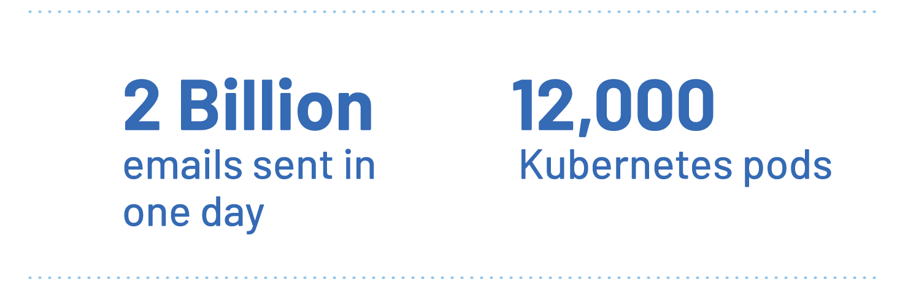
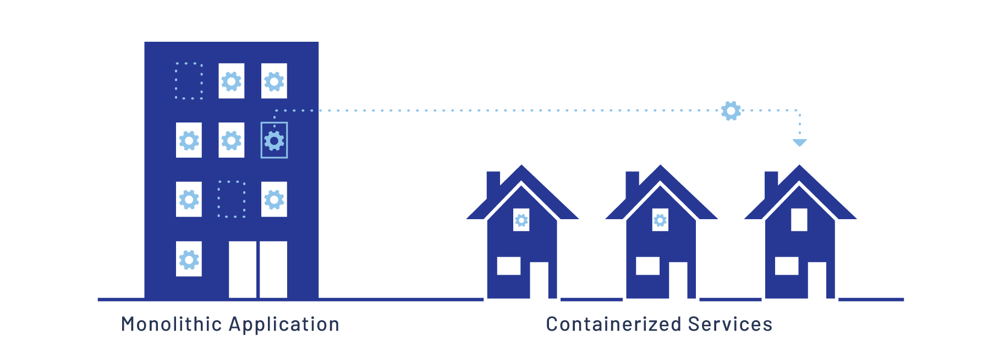

Bluecore 是一家多渠道个性化平台，专注于提供大规模的高度个性化的电子邮件、
网站消息服务和付费媒体广告。由于 Bluecore 独特的产品需要处理客户推荐数据以及发送大量个性化的数字通信，
他们需要处理大量数据的摄取、处理和发送工作。这个工作量巨大；
在最近的黑色星期五促销活动期间，他们发送了超过 20 亿封电子邮件。

除了数量之外，Bluecore 还需要速度。他们与大多数合作伙伴签订了服务协议，
保证任何客户在提交工作后几个小时内收到电子邮件、网站消息或广告，
这意味着处理速度至关重要。他们使用 Google App Engine
上运行的单体应用程序和运行约 12,000 个 Pod 的 Google Kubernetes Engine (GKE)
集群来实现这一目标。

## 挑战：单体架构和不断增长的数据流量 {#the-challenge-monlithic-architecture-and-increasing-data-traffic}

Bluecore 是一个庞大的运营机构，对数据传输和处理有严格的要求。
他们面临着一个艰巨的挑战：他们需要处理的数据量不断增加。
他们知道如果自己的架构不能及时更新就无法应对不断增长的需求，整个流程管道将会过载。

对他们的架构进行审查后发现，单体应用将是最大的挑战。
Bluecore 的开发团队意识到，为了实现未来的增长，
是时候开始迁移到更灵活、可扩展的基础架构了。

Kubernetes 提供了一种扩展的路径，而且由于 Bluecore 已经在
App Engine 上运行，将他们的工作流程的一部分迁移到 GKE
似乎是一个明智的选择。然而，大多数 Bluecore
的工程师没有足够的容器化应用经验。这可能使迁移到 GKE 变得困难。

幸运的是，他们找到了解决方案。

## 解决方案：使用 Istio 服务网格赋能开发人员 {#the-solution-enabling-developers-with-the-istio-service-mesh}

“Istio 使你能够立即开始构建”，Bluecore 基础设施团队的软件工程师
Shray Kumar 解释说，“而且你可以确保你正在以正确的方式构建。”

没有服务网格，将单体应用拆分为容器化服务就会带来许多没有明显解决方案的挑战。
例如挑战之一是如何实现身份认证和授权。如果每个容器化服务都需要自己的解决方案，
那么每个开发人员都很可能会采用自己的方式来解决问题。
这可能导致代码碎片化和未来很多麻烦的问题。

幸运的是，Kumar 和基础设施团队熟悉 Istio。
他们与 Bluecore 数据平台团队的首席工程师
Al Delucca 密切合作，制定了一个开始应用 Istio 的计划。

“我们遇到了这个问题”，Delucca 称，
“但 Istio 是否是解决这个问题的合适工具，这是我们必须弄清楚的。”

他们发现 Istio 的特性集提供了许多现有挑战的解决方案。
授权是其中一大特性。来自合伙应用的传入消息需要进行身份认证。
Istio 可以在边缘执行这种身份认证，
这意味着每个单独的服务不需要实现自己的方法。

“我们能够将身份认证和授权推到边缘，这样我们的工程师就不需要理解这些系统的细节了”。
Delucca 说，“重要的不是他们直接使用 Istio 做了什么，
而是 Istio 在他们不知情的情况下为他们做了什么。
这就是关键所在，对我们来说是一个巨大的胜利。”

当他们的工程师开始将单体应用拆分为服务时，他们遇到了 Istio
能够解决的另一个挑战。即追踪对服务的调用似乎是个问题。
许多旧特性没有关于其依赖关系和要求的清晰文档。
这意味着性能问题和远程服务调用可能会让开发人员困惑不解。幸运的是，
[Istio 的分布式追踪](/zh/docs/tasks/observability/distributed-tracing/)能够解决这个问题。
借助这个特性，开发人员能够找出瓶颈和需要修复错误和进行额外工作的服务。

Istio 的服务网格使开发人员能够专注于将单体应用拆分为独立的服务，
而无需深入了解整个基础架构。这使得 Bluecore 的工程师能够更快地提高生产力。

## 结论：未来 {#conclusion-the-future}

尽管 Bluecore 团队已经发现了他们所使用的 Istio 特性的巨大价值，
但他们仍希望利用更多特性。其中之一是能够管理自动扩缩的
[金丝雀部署](/zh/blog/2017/0.1-canary/)。
金丝雀部署允许团队仅使用应用的一小部分流量进行测试新版本的服务。
如果测试顺利，可以自动部署升级版本，并逐步淘汰之前的版本。
另一方面，如果检测到新版本存在问题，可以快速回滚到之前的版本。

Bluecore 团队将继续将他们的单体应用拆分为容器化服务，利用 Istio
将越来越多的服务推到边缘，并为开发人员提供更多时间专注于自己擅长的工作。
他们已经准备好迎接下一个增长阶段，他们也为抓取和处理越来越多的数据充满自信。
