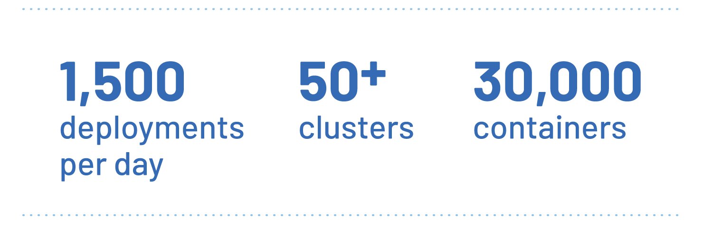

Rappi 连接企业、消费者和配送人员，力图让用户节省更多时间。
他们的应用赋能用户订购各种商品和服务。这是拉丁美洲的第一个超级应用，
覆盖范围遍布 9 个国家和 250 多个城市。自 2015 年公司成立以来，
该应用已经实现了超过 1 亿次下载。

随着巨大的成功，快速增长也带来了挑战，Rappi 一直在不断增长。
在过去的几年中，该公司的估值已从 1 亿美元增长至 80 亿美元。
Rappi 的技术团队急需跟上业务的发展步伐，这就是为什么 Rappi 选择在
Kubernetes 上部署和管理应用的原因。Kubernetes 逐渐成为赋能其基础设施不断增长的工具。

然而，即使有了 Kubernetes，Rappi 的基础设施仍面临巨大的挑战。
譬如怎样才能高效管理 50 多个 Kubernetes 集群，其中最大的集群运行了 20,000 多个容器。

## 挑战：成功带来的困扰 {#challenge-crush-of-success}

尽管 Rappi 团队已经设法将其基础设施迁移到 Kubernetes，但快速的成长仍然带来了很多问题。
他们不得不演变为一家技术型公司才能跟上业务的发展。为了帮助管理日益扩大的基础设施，
他们开发了一个内部的服务网格。然而，这需要太多的维护工作，并且难以跟上业务的增长速度。

“我记得 Lyft 使用 Envoy 的故事，所以我决定我们应该在自己的环境中测试它 Envoy，”
Rappi 高级 DevOps 工程师 Ezequiel Arielli 说道。

## 解决方案：Istio 力挽狂澜 {#istio-to-rescue}

Rappi 团队决定部署使用 Envoy Sidecar 的 Istio。结果一拍即合。
当 Rappi 团队为新项目搭建网格时，他们发现 Istio 文档提供了出色的支持，
而 Istio API 既干净又高效。Istio 是管理他们日益扩大的基础设施的有效解决方案。

随着最初的 Istio 部署成功的消息遍布整个企业，越来越多的
Rappi DevOps 团队开始使用 Istio。起初，只有 30 人的团队在使用 Istio，
但今天这个数字已经增长到超过 1,500 名开发人员。

Istio 为 Rappi 的 DevOps 团队提供了灵活性，可以为不同的服务设置不同的规约。
他们能够自定义速率限制、断路器、连接池、超时和其他关键参数。

他们发现，Istio 还为安全和合规提供了极其有用的功能。
例如，服务网格可以分隔垂直流量并限制不同端点之间的通信。

“Istio 可以为不同服务设置不同的规约，非常灵活。”
Rappi 的 DevOps 技术主管 Juan Franco Cusa 如是说。
“它还提供了极其有用的安全和合规功能，这对于注重安全的环境非常方便。”

“当我们以前的解决方案达到极限时，我们能够使用 Istio 重新构建自己的监控堆栈。”
Arielli 解释道，“Istio 可以无缝地使我们的团队在任何规模下监测正在运行的服务。”

随着 Rappi 的基础设施超过 30,000 个容器，这一决策变得至关重要。

## 结果：基础设施继续增长 {#outcome-infrastructure-continues-to-grow}

开发团队构建了一个自动化的、生产就绪的 Kubernetes 和 Istio 集群部署机制。
内部的 API 层位于 Kubernetes 集群之上，能够轻松管理每个集群中的微服务。
此外，在部署期间自动创建并分配每个微服务的流量资源。
凭借这个系统，开发团队能够每天管理 1,500 多次部署。

“我们的配置允许 Kubernetes 使用量和基础设施继续增长。”Arielli 说，
“我们现在管理了 50 多个 Kubernetes 集群，其中最大的集群包含 20,000 多个容器。
我们的环境持续变化，Istio 有助于确保所有容器之间的高效、可扩展和安全的通信。”

Istio 管理着关键集群上的 1,500 多个应用之间的流量，由于其强大的功能集，
这些集群能够在需要时选择不同的部署策略。即使流量持续增加，
Istio 控制平面也可以轻松重新平衡各个连接。

## Rappi 的下一步计划 {#what-is-next}

选择采用 Istio 的 DevOps 团队仍在推进基础设施的优化工作。

“未来，我们希望能够在网格级别实现多集群支持。”Arielli 说，
“有了这个功能，应用运行的位置将不再重要。
所有应用都将能够在整个集群之间相互访问。”

## 结论：使用 Istio 成功扩展 {#conclustion-success-scaling-with-istio}

通过 Istio 服务网格，Rappi 已经成功地根据市场需求进行了扩展。
Rappi 团队可以轻松处理部署新集群并在更多市场和城市开启更多服务。

“由于 Istio 的帮助，我们有信心 Rappi 将能够部署更多的服务和应用来满足不断增长的需求。”
Arielli 说道。
