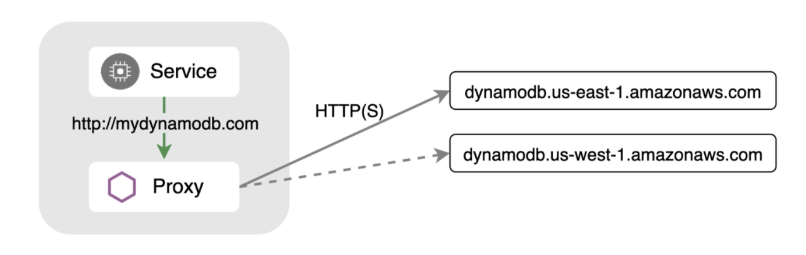

Istio 强大的 API 可用于解决各种使用服务网格时遇到的问题。
许多用户对其强大的入口和东西向流量能力都比较了解，但是除此之外它也为出口（向外）流量提供了诸多功能。
当您的应用程序需要与外部服务（例如云服务商提供的数据库端点）通信时，
该功能就可以派上用场。根据工作负载运行的位置，通常可以有多个端点供用户选择。
例如，Amazon 的 DynamoDB 就可以提供跨区域的[多个端点](https://docs.aws.amazon.com/general/latest/gr/ddb.html)。
由于延迟原因，常常希望选择使用离您工作负载最近的端点，
但是为了防止未按照预期正常工作的情况发生，您可能需要配置自动故障转移使流量可以指向另一个端点。

与在服务网格内运行的服务类似，您可以对 Istio
进行离群检测配置来实现将流量指向健康端点的故障转移操作，
并且该配置仍然对您的应用程序完全透明。在此示例中，我们将使用
Amazon DynamoDB 端点选择与 Google Kubernetes Engine（GKE）
集群中运行的工作负载处于相同或接近的主要区域。
另外我们还会为其配置一个故障转移区域。

|路由|端点|
|--- |--- |
|主路由|http://dynamodb.us-east-1.amazonaws.com|
|故障路由|http://dynamodb.us-west-1.amazonaws.com|

## 使用 ServiceEntry 定义外部端点 {#define-external-endpoints-using-a-serviceentry}

[本地负载均衡](/zh/docs/tasks/traffic-management/locality-load-balancing/)基于 `region`
或 `zone` 工作，这通常是从 Kubernetes 节点上设置的标签推断出来的。
首先，确定您工作负载所处的位置：


$ kubectl describe node | grep failure-domain.beta.kubernetes.io/region
                    failure-domain.beta.kubernetes.io/region=us-east1
                    failure-domain.beta.kubernetes.io/region=us-east1


在此示例中，GKE 集群节点在 `us-east1` 区域中运行。

接下来，创建一个 `ServiceEntry` 来聚合您要使用的端点。在此示例中，
我们选择了 `mydb.com` 作为 host。这也是您应用程序需要配置的连接地址。
然后将主要端点的 `locality` 设置为与您工作负载相同的区域：


apiVersion: networking.istio.io/v1beta1
kind: ServiceEntry
metadata:
  name: external-svc-dns
spec:
  hosts:
  - mydb.com
  location: MESH_EXTERNAL
  ports:
  - number: 80
    name: http
    protocol: HTTP
  resolution: DNS
  endpoints:
  - address: dynamodb.us-east-1.amazonaws.com
    locality: us-east1
    ports:
      http: 80
  - address: dynamodb.us-west-1.amazonaws.com
    locality: us-west
    ports:
      http: 80


让我们部署一个 sleep 容器作为发送请求的测试源。


$ kubectl apply -f @samples/sleep/sleep.yaml@


从这个 sleep 容器中尝试发起对 `http://mydb.com` 的 5 次访问：


$ for i in {1..5}; do kubectl exec deploy/sleep -c sleep -- curl -sS http://mydb.com; echo; sleep 2; done
healthy: dynamodb.us-east-1.amazonaws.com
healthy: dynamodb.us-west-1.amazonaws.com
healthy: dynamodb.us-west-1.amazonaws.com
healthy: dynamodb.us-east-1.amazonaws.com
healthy: dynamodb.us-east-1.amazonaws.com


您将看到 Istio 会分别向两个端点都发送请求。
但是我们只希望请求被发送到与我们节点标记为相同区域的端点中。

为此，我们需要配置一个 `DestinationRule`。

## 使用 `DestinationRule` 设置故障转移条件 {#set-failover-conditions-using-a-destinationrule}

Istio 的 `DestinationRule` 允许您配置负载均衡、连接池和离群检测设置。
我们可以指定用于将端点标识为不健康并将其从负载均衡池中删除的条件。


apiVersion: networking.istio.io/v1beta1
kind: DestinationRule
metadata:
  name: mydynamodb
spec:
  host: mydb.com
  trafficPolicy:
    outlierDetection:
      consecutive5xxErrors: 1
      interval: 15s
      baseEjectionTime: 1m


上面的 `DestinationRule` 将端点配置为每 15 秒扫描一次，如果任何端点出现
5xx 错误代码形式的失败请求，即使只出现一次，在接下来的一分钟内它也会被标记为不健康状态。
在此熔断机制未被触发时，流量将被路由到与 Pod 相同的区域。

如果我们再次运行 curl 命令，应该看到流量总是流向 `us-east1` 端点。


$ for i in {1..5}; do kubectl exec deploy/sleep -c sleep -- curl -sS http://mydb.com; echo; sleep 2; done

healthy: dynamodb.us-east-1.amazonaws.com
healthy: dynamodb.us-east-1.amazonaws.com
healthy: dynamodb.us-east-1.amazonaws.com
healthy: dynamodb.us-east-1.amazonaws.com
healthy: dynamodb.us-east-1.amazonaws.com


## 模拟失败 {#simulate-a-failure}

接下来，让我们看看如果 us-east 端点出现故障会发生什么情况。
为了模拟这种情况，让我们对 ServiceEntry 进行修改并为 `us-east` 端点设置一个无效端口：


apiVersion: networking.istio.io/v1beta1
kind: ServiceEntry
metadata:
  name: external-svc-dns
spec:
  hosts:
  - mydb.com
  location: MESH_EXTERNAL
  ports:
  - number: 80
    name: http
    protocol: HTTP
  resolution: DNS
  endpoints:
  - address: dynamodb.us-east-1.amazonaws.com
    locality: us-east1
    ports:
      http: 81 # INVALID - This is purposefully wrong to trigger failover
  - address: dynamodb.us-west-1.amazonaws.com
    locality: us-west
    ports:
      http: 80


再次运行 curl 命令，结果展示流量在无法连接到 us-east
端点后自动故障转移到 us-west 区域：


$ for i in {1..5}; do kubectl exec deploy/sleep -c sleep -- curl -sS http://mydb.com; echo; sleep 2; done
upstream connect error or disconnect/reset before headers. reset reason: connection failure
healthy: dynamodb.us-west-1.amazonaws.com
healthy: dynamodb.us-west-1.amazonaws.com
healthy: dynamodb.us-west-1.amazonaws.com
healthy: dynamodb.us-west-1.amazonaws.com


您可以通过运行以下命令检查 us-east 端点的离群检测状态：


$ istioctl pc endpoints <sleep-pod> | grep mydb
ENDPOINT                         STATUS      OUTLIER CHECK     CLUSTER
52.119.226.80:81                 HEALTHY     FAILED            outbound|80||mydb.com
52.94.12.144:80                  HEALTHY     OK                outbound|80||mydb.com


## HTTPS 的故障转移 {#failover-for-https}

为外部 HTTPS 服务配置故障转移同样简单。您的应用程序仍然可以继续使用纯
HTTP 协议，并且您可以让 Istio 代理将 TLS 源指向 HTTPS。


apiVersion: networking.istio.io/v1beta1
kind: ServiceEntry
metadata:
  name: external-svc-dns
spec:
  hosts:
  - mydb.com
  ports:
  - number: 80
    name: http-port
    protocol: HTTP
    targetPort: 443
  resolution: DNS
  endpoints:
  - address: dynamodb.us-east-1.amazonaws.com
    locality: us-east1
  - address: dynamodb.us-west-1.amazonaws.com
    locality: us-west


上面的 ServiceEntry 在 80 端口上定义了 `mydb.com` 服务，
并将流量重定向到 443 端口上的真实 DynamoDB 端点。


apiVersion: networking.istio.io/v1beta1
kind: DestinationRule
metadata:
  name: mydynamodb
spec:
  host: mydb.com
  trafficPolicy:
    tls:
      mode: SIMPLE
    loadBalancer:
      simple: ROUND_ROBIN
      localityLbSetting:
        enabled: true
        failover:
          - from: us-east1
            to: us-west
    outlierDetection:
      consecutive5xxErrors: 1
      interval: 15s
      baseEjectionTime: 1m


`DestinationRule` 现在执行 TLS 源并配置离群检测。
该规则还配置了一个[故障转移](/zh/docs/reference/config/networking/destination-rule/#LocalityLoadBalancerSetting)字段，
您可以在其中准确指定哪些区域是故障转移目标。当您定义了多个区域时，这非常有用。

## 总结 {#wrapping-up}

Istio 的 `VirtualService` 和 `DestinationRule` API 提供流量路由、
故障恢复和故障注入功能，因此您可以创建具有弹性的应用程序。
ServiceEntry API 也将其中许多功能扩展到服务网格之外的服务中。
