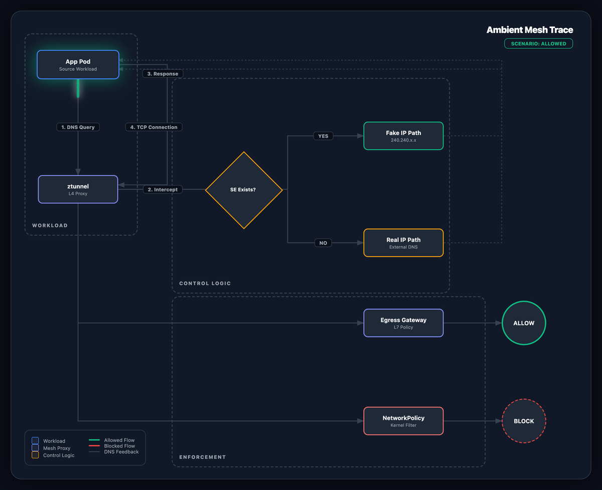

如果您已将工作负载从 AWS 移至本地基础设施上，您可能会遇到这种情况：**您在云上免费获得的网络隔离并不存在于裸金属机器上。**

在 AWS 上，安全组和 VPC 边界在后台悄悄地强制实施服务边界。大多数团队从来不需要考虑这个问题。
在本地，网络默认是扁平的。您的支付服务、内部管理面板、日志记录代理和面向客户的 API 都位于同一个集群中，
在网络层上它们之间没有任何关系。

您可以通过防火墙规则和网络分段恢复这种隔离，但在大多数本地设置中，
这意味着通过具有自己的变更管理周期的基础设施团队进行工作。当您处于迁移中期并试图快速移动时，这是一个有意义的限制。

因此，在我们运行的 EKS 混合部署中，我们决定在网格层解决这个问题。
我们的技术栈中已经有了 Istio，它为我们提供了一种无需等待网络级别更改即可强制执行工作负载级别隔离的方法。
安全团队审查了模型并签署了协议，因为我们构建的控件直接映射到他们对防火墙的要求。
如果您需要该上下文，此[演讲](https://one2n.io/talks/kubernetes-for-hybrid-cloud-environments---harshwardhan-mehrotra---60-kubernetes-pune-meetup)涵盖了更广泛的 EKS 混合设置。


这篇文章介绍了我们如何逐层构建隔离层，以及我们从中学到了什么。


## 为什么选择 Istio（即使对于小型集群） {#why-istio-even-for-small-clusters}

您不需要大规模的微服务架构即可从 Istio 中受益。
即使在一个小集群中，网格也可以为您提供三种其他方式很难获得的东西：

* **零信任身份**：您不是因为服务具有特定的 IP 地址而信任它，
  而是因为它拥有与其身份相关的经过加密验证的证书。进入网络的攻击者无法伪造这一点。
* **透明加密**：服务之间的所有流量都会使用 mTLS（双向 TLS，意味着双方相互验证）自动加密，无需更改您的应用程序代码。
* **深度可观测性**：您可以获得哪些服务正在与哪些服务进行通信的实时地图，无需任何仪器。

## Sidecar 与 Ambient：为什么我们选择 Ambient 模式 {#sidecar-vs-ambient-why-we-chose-ambient-mode}

有两种方式运行 Istio。传统模型将一个小型代理（称为 Sidecar）注入到每个 Pod 中。
每个服务都有自己的代理，该代理处理该服务的加密和策略实施。

我们选择了更新的方法：**Istio Ambient 模式**。Ambient 不是每个 Pod 都有一个代理，
而是在每个节点上运行一个名为 ztunnel 的共享组件。它处理相同的工作（加密流量、强制身份），
但严格在四层 (L4) 传输层运行，在节点级别运行，而不是在每个单独的 Pod 内部运行。

| 特性 | Sidecar 模式 | Ambient 模式 |
|---|---|---|
| **部署** | 每个 Pod 内一个代理 | 每个节点一个共享组件 |
| **运营开销** | 高（涉及重启，每个 Pod 占用额外内存） | 低（对 Pod 透明） |
| **加密（mTLS）** | 由每个 Pod 自身的代理处理 | 由节点级的 ztunnel 处理 |
| **高级 HTTP 功能（L7）** | 始终可用 | 需要一个额外的组件（waypoint 代理） |
| **性能** | 中等 | 更低的基础安全方面开销 |

### 使用 Ambient 时需要舍弃的功能 {#what-you-give-up-with-ambient-mode}

Ambient 模式还不能直接替代 Sidecar。在承诺之前值得了解的差距：

* **高级 HTTP 功能 (L7) 需要额外的组件**：ztunnel 不处理基于标头的路由、
  重试和每个请求指标等内容。您需要为这些部署一个 waypoint 代理。
* **自定义过滤器不适用于 ztunnel**：如果您想通过现代 TrafficExtension API
  运行自定义 WebAssembly 插件或 Lua 脚本，则需要 waypoint 代理。
  由于 ztunnel 严格在四层运行，因此它无法处理大多数自定义过滤器和插件所依赖的七层应用程序逻辑。
* **不支持虚拟机**：Ambient 仅适用于 Kubernetes 工作负载。
  如果您需要在网格中包含虚拟机，您仍然需要 Sidecar 模型。
* **多集群设置需要格外小心**：Sidecar 模式和 Ambient 模式集群之间的跨集群支持处于测试阶段，并且有特定的配置要求。

### 在继续阅读之前，先建立一个思维模型 {#a-mental-model-before-you-read-further}

确定了工具后，在进入步骤之前，以下是如何思考我们实际构建的内容。

将您的集群想象成一座办公楼，默认情况下所有门都未上锁。
任何进入里面的人都可以走进任何房间。我们在这里所做的是：

1. **锁上所有的门** - 默认情况下，除非我们明确说明可以，否则任何服务都无法接收流量。
1. **用员工工牌代替钥匙卡** - 不再是“允许该 IP 地址进入”，而是“允许通过证书验证的该特定服务进入”。攻击者无法仅通过欺骗 IP 来伪造证书。
1. **对离开大楼进行控制** - 集群中的任何内容都无法与外部互联网通信，除非它通过单个受监控的出口点。
1. **在顶部添加物理门锁** - 操作系统级别的第二层网络规则，这样即使有东西完全绕过 Istio，它仍然无法离开。

下面的每个部分按顺序涵盖这四个步骤之一。

## 强化历程 [#the-hardening-journey}

我们并不是一次性推出这个产品的。每一层都解决了前一层留下的空白。
整个原则都是一样的：从所有被阻止的东西开始，然后只打开你能证明合理的东西。

### 第一层：全局拒绝 {#layer-1-the-global-deny}

第一步是默认阻止网格中每个服务的所有传入流量。我们通过在顶层应用单个 Istio 策略来做到这一点：


# 示例 1：全局入站拒绝策略
apiVersion: security.istio.io/v1beta1
kind: AuthorizationPolicy
metadata:
  name: deny-all-ingress
  namespace: istio-system
spec:
{}


一个不包含任何规则的空 `spec` 意味着不允许任何连接。在此基础上，我们需要为每一个应当允许的连接添加明确的规则。


**注意：** 传统的 Sidecar 设置有一个有用的“试运行”模式，称为审核模式。
它会记录本来会被阻止的流量，但不会实际阻止它，因此您可以在执行规则之前检查规则是否正确。
Istio 1.24 中的 Ambient 模式不支持此功能。因此，我们必须更加小心，
在转向严格执行之前手动检查每个允许规则并密切监视访问日志。


### 第二层：以 SPIFFE 身份作为边界 {#layer-2-spiffe-identity-as-the-perimeter}

一旦默认情况下一切都被阻止，我们就需要一种方法来打开特定的连接。
我们不使用 IP 地址（在 Pod 重新启动时可能会更改），而是使用服务身份。

网格中的每个服务都会获得一个 **SPIFFE ID**，这是命名工作负载身份的标准方式。
SPIFFE 代表“面向所有人的安全生产身份框架”。它看起来像这样：

`spiffe://cluster.local/ns/production/sa/frontend-sa`

此身份已融入服务使用的 TLS 证书中。由于 Istio 控制这些证书，
因此服务不能仅通过更改标签或配置文件来声明不同的身份。


安全性与服务的帐户相关，而不是与其 IP 地址或网络中的位置相关。


允许前端服务调用后端，如下所示：


# 示例 2：允许前端基于 SPIFFE 身份调用后端
apiVersion: security.istio.io/v1beta1
kind: AuthorizationPolicy
metadata:
  name: allow-frontend-to-backend
  namespace: production
spec:
  selector:
    matchLabels:
      app: backend-api
  action: ALLOW
  rules:
    - from:
        - source:
            principals: ["cluster.local/ns/production/sa/frontend-sa"]


### 第三层：出口阻断与 DNS 拦截 {#layer-3-egress-blocking-and-dns-interception}

锁定传入流量只是问题的一半。在扁平的网络上，受损的服务仍然可以自由地访问互联网。
这就是数据被泄露的方式，攻击者如何建立返回其基础设施的连接，
以及服务最终如何调用与它们没有业务调用的东西的方式。

我们通过每个命名空间通过专用出口点（出口网关）路由所有出站流量并阻止网络级别的所有其他流量来解决此问题。

### 这其中的 DNS 运作机制是怎样的 {#how-the-dns-side-of-this-works}

当服务尝试连接到 `api.external.com` 等外部地址时，会发生以下情况：

1. ztunnel 在 DNS 查找出去之前拦截它。
1. 如果我们已将 `api.external.com` 声明为允许的外部服务（通过 `ServiceEntry`），
   ztunnel 将返回一个占位符 IP 地址。服务连接到该端口，
   ztunnel 通过 Egress Gateway 路由真实连接以进行检查。
1. 如果我们没有声明该地址，ztunnel 会让 DNS 请求通过，但实际连接会被内核级网络规则（在下一层中介绍）丢弃。

<em>图 1：包含 DNS 拦截的出站流量</em>

要注册允许的外部服务并通过网关路由它：


# 实例 3：注册外部服务并链接到出口网关
apiVersion: networking.istio.io/v1
kind: ServiceEntry
metadata:
  name: external-api
  namespace: production
  labels:
    istio.io/use-waypoint: production-egress-gateway # Explicitly binds SE to our gateway
spec:
  hosts:
    - api.external.com
  ports:
    - number: 443
      name: https
      protocol: HTTPS
  location: MESH_EXTERNAL
  resolution: DNS


`istio.io/use-waypoint` 标签告诉 ztunnel 通过我们的 Egress waypoint 路由此出站流量，
Egress waypoint 只是一个标准 waypoint 代理，充当出口网关，而不是让它直接传递到互联网。

### 第四层：内核级兜底机制 {#layer-4-the-kernel-level-backstop}

Istio 很强大，但我们需要在它下面有一个安全网。如果某些东西完全绕过了网格，我们需要网络本身来捕获它。

Kubernetes 有自己的网络规则（`NetworkPolicies`），其工作级别低于 Istio，
由每个节点上的 Linux 内核强制执行。我们为每个命名空间设置两条规则：

1. **阻止所有出站流量**，DNS 查找和内部 Istio 通信端口 (15008) 除外。常规服务无法访问互联网。
1. **允许出口网关访问互联网**。这是唯一可以的组件。


# 示例 4：将 Pod 的出站流量仅限于网格和 DNS
kind: NetworkPolicy
apiVersion: networking.k8s.io/v1
kind: NetworkPolicy
metadata:
  name: deny-all-egress-except-mesh
  namespace: production
spec:
  podSelector: {} # Applies to all pods in the namespace
  policyTypes:
    - Egress
  egress:
    - to: # Allow DNS
        - namespaceSelector: {} # any namespace
      ports:
        - protocol: UDP
          port: 53
    - to: # Allow traffic to istio-system (for control plane/discovery)
        - namespaceSelector:
            matchLabels:
              kubernetes.io/metadata.name: istio-system
      ports: # Allow HBONE tunnel to Egress Gateway/Waypoint
        - protocol: TCP
          port: 15008
---
# 示例 5：允许出口网关访问互联网
apiVersion: networking.k8s.io/v1
kind: NetworkPolicy
metadata:
  name: allow-egress-gateway-to-internet
  namespace: production
spec:
  podSelector:
    matchLabels:
      gateway.networking.k8s.io/gateway-name: production-egress-gateway
  policyTypes: ["Egress"]
  egress:
    - {} # Unrestricted egress for the gateway itself


## 我们的收获 {#what-we-learned}

1. **关注业务问题，而不是技术**：我们在这里采用 Istio 并不是因为它是有趣的技术，
   而是因为如果不经过数月的反复，基础设施无法为我们提供所需的隔离。当您向安全团队解释决定时，这个框架很重要。
1. **Ambient 模式是值得的，但要睁大眼睛进入**：它消除了大量的操作开销，
   但您将需要 waypoint 代理来完成基本流量加密之外的任何操作，并且尚不支持虚拟机。
1. **Istio 和 Kubernetes 网络规则不是一回事**：Istio 根据传输层和应用层的工作负载身份来保护流量。
   Kubernetes `NetworkPolicies` 在网络层工作。你两者都需要。每个人都能抓住对方抓不到的东西。

在扁平基础设施上强化网络很少是一个干净的过程。它始于服务之间自由对话的混乱现实，
并涉及使用默认拒绝规则进行大量仔细测试，然后您才能信任您所构建的内容。
但是，通过从“信任此 IP”转变为“信任此经过验证的身份”，我们将高风险的本地环境转变为我们可以实际防御的环境，
而无需提交单一基础设施票据即可到达那里。


最后，网格不仅仅是流量管理。这是关于在底层硬件不支持您的环境中控制您的安全状况。


大多数团队将网格视为流量工具，将防火墙视为安全工具。在平坦的网络上，
这种分裂会烧毁你。如果您的工作负载现在可以自由地相互通信，请看看我们如何解决这个问题，或者让我们解决这个问题。
