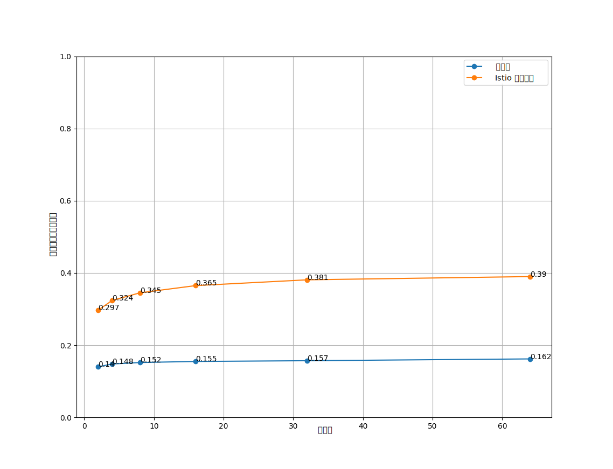
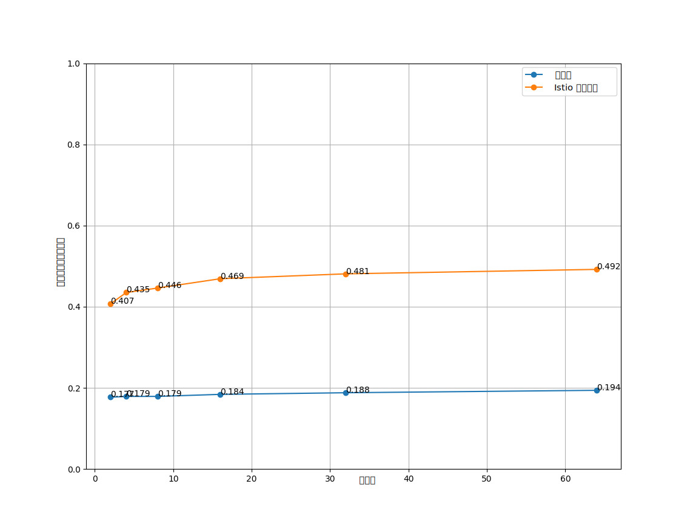

Istio 以十分便捷且对应用程序透明的方式，为已部署的服务创建网络，
提供完善的网络功能，包括：路由规则、负载均衡、服务到服务的验证以及监控等。
Istio 致力于用最小的资源开销实现最大的便易性，旨在支持高请求密度的大规模网格，
同时让延迟最小化。

Istio 的数据平面组件 Envoy 代理用来处理通过系统的数据流。控制平面组件如
Pilot、Galley 和 Citadel 负责配置数据平面。数据平面和控制平面有不同的性能关注点。

## Istio 1.20 性能总结 {#performance-summary-for-Istio}

[Istio 负载测试](https://github.com/istio/tools/tree//perf/load)网格包含了
**1000** 个服务和 **2000** 个 Sidecar，全网格范围内，QPS 为 70,000。
在使用 Istio 1.20 运行测试后，我们得到了如下结果：

## 控制平面性能 {#control-plane-performance}

Pilot 根据用户编写的配置文件和系统当前状态来配置 Sidecar 代理。在
Kubernetes 环境中，自定义资源定义（CRDs）和部署构成了系统的配置和状态。
像网关和虚拟服务这样的 Istio 配置对象提供了用户编写配置的能力。Pilot
综合处理配置和系统状态，生成代理的配置信息。这些配置和系统状态源自
Kubernetes 环境和用户编写的配置文件。

控制平面支持数千个服务，分布在数千个 Pod 上，
所需的用户自有虚拟服务和其它配置对象的数量级与之类似。Pilot
的 CPU 和内存资源需求量与系统配置和可能状态的量级成正比。CPU
消耗的变化取决于以下因素：

- 部署改变的频率。
- 配置改变的频率。
- 连接到 Pilot 的代理数量。

这部分本身是水平可伸缩的。当[命名空间隔离](/zh/docs/reference/config/networking/sidecar/)选项被打开，
一个单一的 Pilot 实例仅用 1 vCPU 和 1.5 GB 的内存就可以支持 1000
个服务和 2000 个 Sidecar。您可以增加 Pilot 实例的数量来降低它花在推送配置到所有代理的耗时。

## 数据平面性能 {#data-plane-performance}

数据平面的性能受很多因素影响，例如：

- 客户端连接数量
- 目标服务接收请求的密度
- 请求和响应的体量
- 代理工作线程的数量
- 协议
- CPU 核数
- 代理过滤器的数量和类型，特别是 Mixer 过滤器

根据上述因素来度量延迟、吞吐量以及代理的 CPU 和内存消耗。

### CPU 和内存 {#CPU-and-memory}

由于 sidecar 代理在数据路径上执行额外的工作，它需要消耗 CPU 和内存。
以 Istio 1.19 举例，1000 QPS 会使用大约 0.5 vCPU。

代理的内存消耗取决于它的总体配置状态。大量的监听器、集群和路由会增加内存使用量。
在启用了[命名空间隔离](/zh/docs/reference/config/networking/sidecar/)的大型命名空间中，
代理消耗大约 50 MB 的内存。

由于代理通常不缓存通过的数据，请求速率不会影响内存消耗。

### 延迟 {#latency}

由于 Istio 在数据路径上注入了一个 Sidecar 代理，因此延迟是一个重要的考虑因素。
Istio 添加的每个功能也会增加代理内部的路径长度，并可能影响延迟。

Envoy 代理在向客户端发送响应后收集原始遥测数据。
为请求收集原始遥测数据所花费的时间不计入完成该请求所花费的总时间。
但由于 worker 正忙于处理请求，它不会立即开始下一个请求的处理。
此过程会增加下一个请求的队列等待时间，并影响平均延迟和尾延迟。
实际的尾部延迟取决于流量模式。

### Istio 1.20 的延迟 {#latency-for-Istio}

在网格内部，请求会依次遍历客户端和服务器端代理。在 Istio 1.19
的默认配置中（即带有遥测 v2 的 Istio），两个代理分别在基线数据平面延迟的 90 和 99
分位延迟上增加约 0.228 和 0.298 毫秒。我们使用 `http/1.1` 协议的
[Istio 基准测试](https://github.com/istio/tools/tree//perf/benchmark)获得了这些结果，
测试标准是每秒 1000 请求，负载为 1KB，使用了 2、4、8、16、32、64 个客户端连接和 2 个代理 worker 并启用双向 TLS。

注意：不同的硬件会给出不同的值。

 

<h2 style="text-align: center;"> P90 延迟 vs 客户端连接 </h2>
 

<h2 style="text-align: center;"> P99 延迟 vs 客户端连接 </h2>

- `no_mesh` 客户端 Pod 直接调用服务器 Pod，不存在 Sidecar。
- `istio_with_stats` 默认情况下，客户端和服务器的 Sidecar 都带有遥测配置。这是默认的 Istio 配置。

### 基准测试工具 {#benchmarking-tools}

Istio 使用下面的工具进行基准测试：

- [`fortio.org`](https://fortio.org/) - 一个恒定的吞吐量负载测试工具。
- [`nighthawk`](https://github.com/envoyproxy/nighthawk) - 基于 Envoy 的负载测试工具。
- [`isotope`](https://github.com/istio/tools/tree/master/isotope) - 一个具有可配置拓扑结构的综合应用程序。
