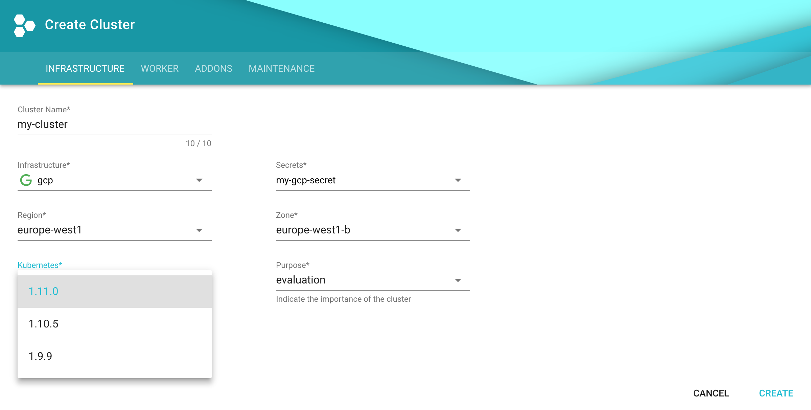

## Gardener 引导 {#bootstrapping-gardener}

使用 [Gardener](https://gardener.cloud) 建立自己的集群, 可以查看
[文档](https://github.com/gardener/gardener/blob/master/docs/README.md)，
也可以查看 [landscape-setup-template](https://github.com/gardener/landscape-setup-template) 项目。
要了解有关此开源项目的更多信息，请阅读 [`kubernetes.io` 博客](https://kubernetes.io/blog/2018/05/17/gardener/).

### 安装并且配置 `kubectl`{#install-and-configure-Kubernetes}

1. 如果您已经有 `kubectl` CLI，请运行 `kubectl version --short` 来检查版本。您需要 `v1.10` 或更高版本。
    如果您的 `kubectl` 较旧，请按照下一步安装新版本。

1. [安装 `kubectl` CLI](https://kubernetes.io/docs/tasks/tools/install-kubectl/).

### 访问 Gardener{#access-gardener}

1. 在 Gardener 仪表板中创建一个项目。这实际上将创建一个名为 `garden-<my-project>` 的 Kubernetes 命名空间。

1. [配置对您的 Gardener 项目的访问权限](https://kubernetes.io/docs/tasks/tools/install-kubectl/#verifying-kubectl-configuration)
    使用 kubeconfig，如果您还不是 Gardener 管理员，则可以在 Gardener 仪表板中创建一个用户：转到 "Members" 部分并添加服务帐户。
    然后，您可以为您的项目下载 kubeconfig。如果使用用户界面创建集群，则可以跳过此步骤。
    只有通过程序访问才需要它，请确保在您的 shell 中设置`export KUBECONFIG=garden-my-project.yaml`。
    

### 创建 Kubernetes 集群{#creating-a-Kubernetes-cluster}

您可以通过提供集群规范 yaml 文件，使用 `kubectl` cli 创建集群。您可以在[这博客里](https://github.com/gardener/gardener/blob/master/example/90-shoot.yaml)找到关于 GCP 的示例。
确保名称空间与您的项目名称空间匹配。然后只需将准备好的 "shoot" 群集 CRD 与 `kubectl` 配合使用：


$ kubectl apply --filename my-cluster.yaml


更简单的替代方法是按照 Gardener 仪表板中的集群创建向导来创建集群：

### 为集群配置 `kubectl`{#configure-Kubernetes-for-your-cluster}

现在，您可以在 Gardener 仪表板中或通过 cli 为新创建的集群下载 kubeconfig，如下所示：


$ kubectl --namespace shoot--my-project--my-cluster get secret kubecfg --output jsonpath={.data.kubeconfig} | base64 --decode > my-cluster.yaml


此 kubeconfig 文件具有管理员对您群集的完全访问权限。对于本指南的其余部分，请确保已设置 `export KUBECONFIG=my-cluster.yaml`。

## 删除{#cleaning-up}

使用 Gardener 仪表板删除集群，或者使用指向您的 `garden-my-project.yaml` kubeconfig 的 `kubectl` 执行以下操作：


$ kubectl --kubeconfig garden-my-project.yaml --namespace garden--my-project annotate shoot my-cluster confirmation.garden.sapcloud.io/deletion=true
$ kubectl --kubeconfig garden-my-project.yaml --namespace garden--my-project delete shoot my-cluster

