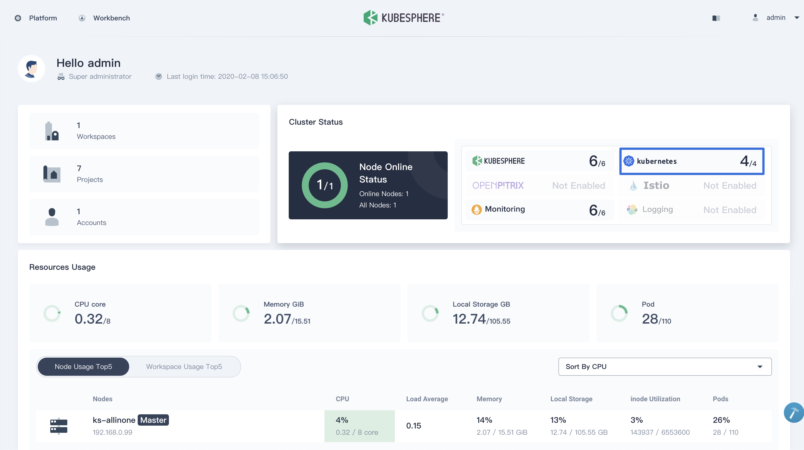

该文档最近更新于2021年3月9日。



根据如下指示准备 [KubeSphere Container Platform](https://github.com/kubesphere/kubesphere) 环境。您可以通过 KubeSphere 在 Linux 机器上快速安装一个 Kubernetes 集群。


KubeSphere 提供了[All-in-One](https://kubesphere.io/docs/installation/all-in-one/) 和 [Multi-Node](https://kubesphere.io/docs/installation/multi-node/) 两种模式的安装。这使得 Kubernetes 和 Istio 可以在一个统一的 web 控制台中进行快速设置和管理。详细信息请参考 [Multi-node Installation](https://kubesphere.io/docs/installation/multi-node/)


## 先决条件 {#prerequisites}

满足以下要求的虚拟机或裸金属机器：
- 硬件:

    - CPU: 至少 2 Cores
    - Memory: 至少 4 `GB`

- 操作系统:

    - CentOS 7.4 ~ 7.7 (`64-bit`)
    - Ubuntu 16.04/18.04 LTS (`64-bit`)
    - RHEL 7.4 (`64-bit`)
    - Debian Stretch 9.5 (`64-bit`)


确保防火墙策略满足指定[端口需求](https://kubesphere.io/docs/installation/port-firewall/)。如果不能立即实现，您可以参考相应文档先关闭防火墙然后再进一步评估 Istio 和 KubeSphere。


## 准备 Kubernetes 集群 {#provisioning-a-Kubernetes-cluster}

1. 下载 KubeSphere 文件到您的机器上，然后移动到 KubeSphere 目录下。例如：如果您创建的目录是`kubesphere-all-v2.1.1`:

    
    $ curl -L https://kubesphere.io/download/stable/latest > installer.tar.gz
    $ tar -xzf installer.tar.gz
    $ cd kubesphere-all-v2.1.1/scripts
    

1. 执行安装脚本，创建一个标准的 Kubernetes 集群环境。等待提示根据需求选择 **"1) All-in-one"** 模式。

    
    $ ./install.sh
    

1. 安装过程可能要持续 15 ~ 20 分钟。待所有 Pod 变成运行中状态。使用安装日志中提示的账号信息访问控制台,日志信息格式如下:

    
    #####################################################
    ###              Welcome to KubeSphere!           ###
    #####################################################
    Console: http://192.168.0.8:30880
    Account: admin
    Password: It will be generated by KubeSphere Installer
    

    
    这个时候，Kubernetes 已经在您的环境中安装完毕。
    

    

## 在 Kubernetes 中启用 Istio 安装

KubeSphere 会在 Kubernetes 环境中安装 Istio。现在可以参考 [Enable Service Mesh](https://kubesphere.io/docs/pluggable-components/service-mesh/) 来启用 Istio。
