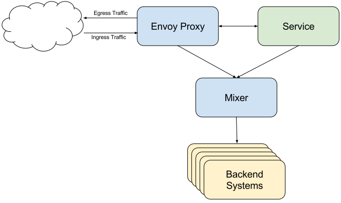
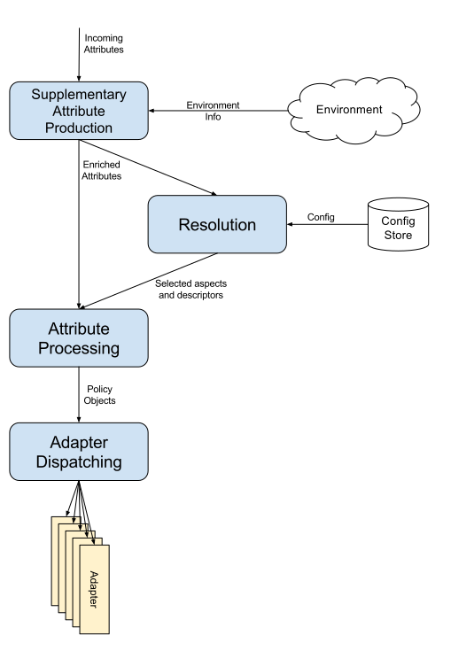


The page explains Istio's Mixer's role and general architecture.



## Background

Mixer provides the control-plane abstractions necessary to support most real-world multi-tenant services,
such as precondition checks, telemetry reporting, and quota management. Envoy delegates precondition
checking (permissions, whitelist, etc) to Mixer and dispatches its telemetry data 
to Mixer, which proceeds to repackage and redirect the data towards configured backends.

Services within the Istio mesh can also directly integrate with Mixer. For example, services may wish to provide rich telemetry
for particular operations beyond what Envoy automatically collects. Or services may use Mixer for resource-oriented quota
management. Services that leverage Mixer in this way are abstracted from environment-specific control plane details, greatly
easing the process of hosting the code in different environments (different clouds and on-prem)


<p style="text-align:center;">Mixer Traffic Flow</p>

Mixer provides three core features:

- **Precondition Checking**. Enables callers to verify a number of preconditions before responding to an incoming request from a service consumer. 
Preconditions can include whether the service consumer is properly authenticated, is on the service's whitelist, passes ACL checks, and more.

- **Telemetry Reporting**. Enables services to produce logging and monitoring. In the future, it will also enable tracing and billing
streams intended for both the service operator as well as for service consumers.

- **Quota Management**. Enables services to allocate and free quota on a number of dimensions, Quotas are used as a relatively simple resource
management tool to provide some fairness between service consumers when contending for limited resources. Rate limits are
examples of quotas.

These mechanisms are applied based on a set of [attributes]({{site.baseurl}}/docs/concepts/attributes.html) that are
materialized for every request into Mixer. Within Istio, Envoy depends heavily on Mixer. Services running within the mesh
can also use Mixer to report telemetry or manage quotas.

## Adapters

Mixer abstracts away the implementation details of individual policy and telemetry backend systems. This insulates
Envoy and services within the mesh from those details, keeping them portable.

Adapters are binary-level plugins to Mixer which allow Mixer to interface 
to different backend systems that deliver core control-plane functionality, such as logging, monitoring, quotas, ACL checking, and more. Adapters
enable Mixer to expose a single consistent control API, independent of the backends in use. The exact set of adapters
used at runtime is determined through configuration.


## Descriptors and Adapter Parameters

Mixer is essentially an attribute processing machine. It takes in a number of attributes from
its caller and produces as a result a set of calls into its adapters, which in turn trigger calls to
associated backend systems such as Prometheus or NewRelic. As Mixer calls its adapters, it provides them 
*adapter parameters* as input. These tell the adapters what to do. For example, when
reporting metrics to an adapter, Mixer produces parameters that hold the metric data.

Descriptors let you define the *shape* of the parameters produced during Mixer's [attribute processing phase](#request-phases).
In other words, descriptors let you control the set and type of values carried by these parameters. Some facts:

- Mixer supports a variety of different descriptor kinds (Metric Descriptor, Log Entry Descriptor, Quota Descriptor, etc)

- For each descriptor kind, you can declare any number of descriptors within a given deployment.

- While handling a request, Mixer's attribute processing phase can produce any number of distinct adapter parameters for each of the
configured descriptors.

An example can help clarify the concepts. Let's consider the `MetricDescriptor` type which is defined as follows:

```proto
    message MetricDescriptor {
      string name = 1;
      string display_name = 2;
      string description = 3;
    
      enum MetricKind {
        METRIC_KIND_UNSPECIFIED = 0;
        GAUGE = 1;
        COUNTER = 2;
      }
    
      MetricKind kind = 4;
      ValueType value = 5;
      repeated LabelDescriptor labels = 6;
    }
```

Within a deployment configuration, you can declare a metric descriptor using a snippet of YAML:

```yaml
name: request_count
kind: COUNTER
value: INT64
description: request count by source, target, service, and code
labels:
- name: source
  valueType: STRING
- name: target
  valueType: STRING
- name: service
  valueType: STRING
- name: method
  valueType: STRING
- name: response_code
  valueType: INT64
```

This is declaring a descriptor called `request_count`. Because of the kind and value fields, policy objects associated with this
descriptor represent 64-bit integer counters. Additionally, each associated policy object will be uniquely identified via the 5
listed labels. Producing a policy object for such a descriptor requires 6 pieces of information:

- a 64-bit integer metric value 
- a source string
- a target string
- a service string
- a method string
- a 64-bit integer response code

Here is an example snippet of Istio configuration which produces adapter parameters given the above descriptor:

```yaml
descriptor_name: request_count
value: "1"
labels:
  source: source.name | "unknown"
  target: target.name | "unknown"
  service: api.name | "unknown"
  method: api.method | "unknown"
  response_code: response.code | 200
```

Many such parameters are are typically created as part of attribute processing and they ultimately determine what
adapters do.

Explicitly defining descriptors and creating adapter parameters using them is akin to types and objects in a traditional
programming language. Doing so enables a few important scenarios:

- Having the set of descriptors explicitly defined enables Istio to program backend systems to accept traffic produced
by Mixer. For example, a `MetricDescriptor` provides all the information needed to program a backend system to accept metrics
that conform to the descriptor's shape (it's value type and its set of labels).

- It enables type checking of the deployment's configuration. Since attributes have strong types, and so do descriptors,
Istio can provide a number of strong correctness guarantees of the system's configuration. Basically, if a chunk of
configuration is accepted into the Istio system, it means the configuration passes a minimum correctness bar. Again, this
plays the same role as types in a programming language.

- It enables Istio to provide a strongly-typed scripting environment as discussed [below](#scripting)

## Configuration state

Mixer's core runtime methods (`Check`, `Report`, and `Quota`) all accept a set of attributes on input and
produce a set of attributes on output. The work that the individual methods perform is dictated by the set of input
attributes, as well as by Mixer's current configuration. To that end, the service operator is responsible
for:

- Configuring the set of *aspects* that the deployment uses. An aspect is essentially a chunk of configuration
state that configures an adapter (adapters being binary plugins as described [below](#adapters)).

- Establishing the types of adapter parameters that Mixer can manipulate. These
types are described in configuration through a set of *descriptors* (as described [above](#descriptors))

- Creating rules to map the attributes of every incoming request into a 
specific set of aspects and adapter parameters.

The above configuration state is required to have Mixer know what to do with incoming attributes
and dispatch to the appropriate backend systems.

Refer to *TBD* for detailed information on Mixer's configuration format.

## Request phases

When a request comes in to Mixer, it goes through a number of distinct handling phases:

- **Supplementary Attribute Production**. The first thing that happens in Mixer is to run a globally configured
set of adapters that are responsible for introducing new attributes. These attributes are combined with the attributes
from the request to form the total set of attributes for the operation.

- **Resolution**. The second phase is to evaluate the set of attributes to determine the effective 
configuration to apply for the request. See *TBD* for information on how resolution works. The effective
configuration determines the set of aspects and descriptors available to handle the request in the
subsequent phases.

- **Attribute Processing**. The third phase takes the total set of attributes
and produces a set of *adapter parameters*. Attribute processing is initially
configured through a simple declarative form as described [here]({{site.baseurl}}/docs/mixer-config.html).

- **Adapter Dispatching**. The Resolution phase establishes the set of available aspects and the Attribute
Processing phase creates a set of adapter parameters. The Adapter Dispatching phase invokes the adapters
associated with each aspect and passes them those parameters.


<p style="text-align:center;">Request Phases</p>

## Scripting

> This section is preliminary and subject to change. We're still experimenting with the concept of scripting in Mixer.

Mixer's attribute processing phase is implemented via a scripting language (exact language *TBD*). 
The scripts are provided a set of attributes and are responsible for producing the adapter parameters and dispatching
control to individual configured adapters.

For common uses, the operator authors adapter parameter production rules via a relatively simple declarative format
and expression syntax. Mixer ingests such rules and produces a script that performs the necessary runtime work
of accessing the request's incoming attributes and producing the requisite adapter parameters.

For advanced uses, the operator can bypass the declarative format and author directly in the scripting
language. This is more complex, but provides ultimate flexibility.




