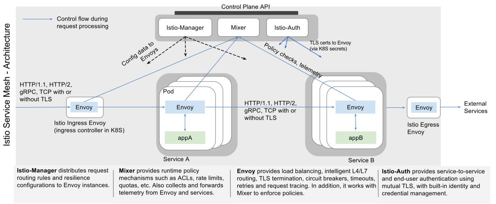


This page introduces Istio, a polyglot service mesh.




## Background

As monolithic applications transition towards a distributed microservice architecture they become more difficult to manage and understand. These 
architectures need basic necessities such as discovery, load balancing, failure recovery, metrics and monitoring, and more complex operational requirements 
such as A/B testing, canary releases, rate limiting, access control, and end-to-end authentication. The term service mesh is used to describe the network of
microservices that make up applications and the interactions between them. As the service mesh grows in size and complexity, it becomes harder to understand
and manage.

Istio provides a complete solution to satisfying these diverse requirements of microservice applications, by providing developers and operators with 
behavioral insights and operational control over the service mesh as a whole. Istio does this by providing a number of key capabilities uniformly across the
network of services:

- **Traffic Management**. Control the flow of traffic and API calls between services, make calls more reliable and make the network more robust in the face
of adverse conditions.
 
- **Observability**. Gain understanding of the dependencies between services, the nature and flow of traffic between them and be able to quickly identify 
issues.

- **Policy Enforcement**. Apply organizational policy to the interaction between services, ensure access policies are enforced and resources are fairly 
distributed among consumers. Policy changes are made by configuring the mesh, not by changing application code.

- **Service Identity and Security**. Provide services in the mesh with a verifiable identity [link] and provide the ability to protect [link] service traffic
as it flows over networks of varying degrees of trustability.

In addition to these behaviors, Istio is designed for extensibility to meet diverse deployment needs:

- **Platform Support**. Istio is designed to run in a variety of environments including ones that span Cloud, on-premise, Kubernetes, Mesos etc. We’re 
initially focused on Kubernetes but are working to support other environments soon.

- **Integration and Customization**. The policy enforcement component can be extended [link] and customized [link] to integrate with existing solutions for 
ACLs, logging, monitoring, quotas, auditing and more.

These capabilities greatly decrease the coupling between application code, the underlying platform and policy. This decreased coupling not only makes 
services easier to implement but also makes it simpler for operators to move application deployments between environments or to new policy schemes. 
Applications become inherently more portable as a result.

Istio’s service mesh is logically split into a *data plane* and a *control plane*. The data plane is composed of a set of intelligent (http|grpc|tcp|udp) 
proxies deployed as sidecars that mediate and control all network communication between microservices. The control plane is responsible for managing and 
configuring proxies to route traffic, as well as enforce policies at runtime. 

## Design goals

Istio’s architecture is informed by a few key design goals that are essential to making the system capable of dealing with services at scale and with high 
performance.

- **Maximize Transparency**.
To adopt Istio an operator or developer should be required to do the minimum amount of work possible to get real value from the system. To this end Istio 
can automatically inject itself into all the network paths between services. Istio uses sidecar proxies to capture traffic and where possible automatically 
program the networking layer to route traffic through those proxies without any changes to the deployed application code. In Kubernetes the proxies are 
injected into pods and traffic is captured by programming iptables rules. Once the sidecar proxies are injected and traffic routing is programmed Istio is 
able to mediate all traffic. This principle also applies to performance. When applying Istio to a deployment operators should see a minimal increase in 
resource costs for the 
functionality being provided. Components and APIs must all be designed with performance and scale in mind.

- **Incrementality**.
As operators and developers become more dependent on the functionality that Istio provides, the system must grow with their needs. While we expect to 
continue adding new features ourselves, we expect the greatest need will be the ability to extend the policy system, to integrate with other sources of policy and control and to propagate signals about mesh behavior to other systems for analysis. The policy runtime supports a standard extension mechanism for plugging in other services. In addition it allows for the extension of its vocabulary [[link]] to allow policies to be enforced based on new signals that the mesh produces. 

- **Portability**.
The ecosystem in which Istio will be used varies along many dimensions. Istio must run on any cloud or on-prem environment with minimal effort. The task of 
porting Istio-based services to new environments should be trivial, and it should be possible to operate a single service deployed into multiple 
environments (on multiple clouds for redundancy for example) using Istio.

- **Policy Uniformity**.
The application of policy to API calls between services provides a great deal of control over mesh behavior but it can be equally important to apply 
policies to resources which are not necessarily expressed at the API level. For example applying quota to the amount of CPU consumed by an ML training task 
is more useful than applying quota to the call which initiated the work. To this end the policy system is maintained as a distinct service with its own API 
rather than being baked into the proxy, allowing services to directly integrate with it as needed.

## High-level architecture

### The sidecar model

As monolithic applications are decomposed into a distributed system of microservices that scale dynamically, classic distributed system problems such as 
service discovery, load balancing, and failure recovery become increasingly import to solve uniformly. As the application gains more agility, it transitions
towards a process wherein updates are made to different parts of the application at different times. Developers need the ability to experiment with 
different features in production, or deploy canary releases, without impacting the system as a whole. Operators need to enforce organization-wide policies, 
such as global rate limits, ACLs, etc., without requiring updates to each microservice.

Today, these problems are tackled piecemeal within the industry. Language-specific libraries, such as Ribbon/Hystrix from Netflix’s OSS stack, are used to 
satisfy basic necessities such as discovery, load balancing and circuit breaking. In a polyglot application, organizations need to maintain 
language-specific libraries for every language being used, dramatically increasing the maintenance cost.

A host of API management tools are typically bolted onto the edge of the infrastructure to provide subscription, metering, API metrics monitoring, rate 
limiting, etc. Continuous delivery and experimentation of new features in production is restricted to edge services using an edge proxy (e.g., Zuul/Nginx). 
Policy enforcement between mid-tier services is difficult or impossible as libraries provide little control over how traffic flows between microservices.

Compared to using language-specific libraries, the out-of-process transparent proxy approach has a much lower maintenance overhead. A single proxy 
implementation can be shared across all services in an organization. This single  implementation can be optimized for performance while providing a variety 
of functions beneficial to all services in the application. It eliminates the need for applications to be rebuilt whenever new functionality is available. 
Support for continuous delivery, policy enforcement, and in-depth monitoring of service health can be engineered into the proxy and leveraged across 
different services (edge & middle-tier) with minimal effort on behalf of the application developer.  As the proxy can act as both an edge proxy as well as a
middle-tier router, middle-tier services can also take advantage of the continuous delivery and policy enforcement features provided. By offloading all 
aspects of communication, failure recovery, and policy enforcement to the proxy, the application logic is dramatically simplified.

### Envoy

Istio uses the Envoy proxy, a high-performance proxy developed in C++, to mediate all inbound and outbound traffic for all services in the service mesh. 
Istio leverages Envoy’s many built-in features such as dynamic service discovery, load balancing, TLS termination, HTTP/2 & gRPC proxying, circuit breakers,
health checks, staged rollouts with %-based traffic split, fault injection, and rich metrics. In addition, Istio extends Envoy to interact with Mixer to 
enable policy enforcement and to report telemetry.

### Mixer

Mixer is responsible for enforcing access control and usage policies across the service mesh and collects telemetry data from the Envoy proxy and other 
services. The proxy extracts request level attributes which are sent to Mixer for evaluation. More information on the attribute extraction and policy 
evaluation can be found here. Mixer includes a flexible plugin model enabling it to interface with a variety of host environments and backends, abstracting 
the proxy and Istio-managed services from these details.

### Istio Manager

The Manager serves as an interface between the user and Istio, collecting and validating configuration and propagating it to the various Istio components. 
It abstracts environment-specific implementation details from the Mixer and Proxy, providing them with an abstract representation of the user’s services 
that is independent of the underlying platform. In addition, traffic management rules (i.e. generic layer-4 rules and layer-7 HTTP/gRPC routing rules) can 
be programmed at runtime via the Istio Manager.

### Istio Auth

Istio supports strong service-to-service and end-user authentication using mutual TLS, with built-in identity and credential management.
Istio Auth can be used to upgrade unencrypted traffic in the service mesh, and provides operators the ability to enforce policy based
on service identity rather than network controls. Future releases of Istio will add fine-grained access control and auditing to control
and monitor who accesses your service, API, or resource, using a variety of access control mechanisms, including attribute and
role-based access control as well as authorization hooks.




