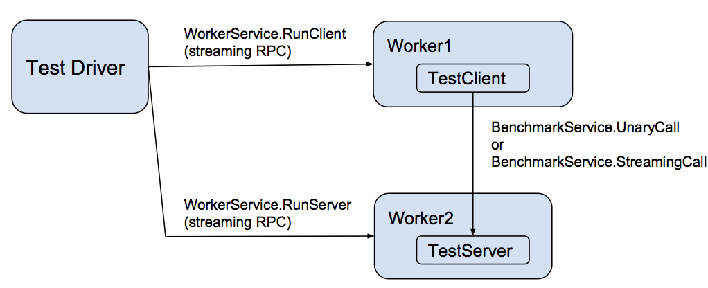

gRPC is designed to support high-performance
open-source RPCs in many languages. This document describes the
performance benchmarking tools, the scenarios considered by the tests,
and the testing infrastructure.

## Overview

gRPC is designed for both high-performance and high-productivity
design of distributed applications. Continuous performance
benchmarking is a critical part of the gRPC development
workflow. Multi-language performance tests run hourly against
the master branch, and these numbers are reported to a dashboard for
visualization.

  * [Multi-language performance dashboard @latest_release (lastest available stable release)](https://performance-dot-grpc-testing.appspot.com/explore?dashboard=5636470266134528) 
  * [Multi-language performance dashboard @master (latest dev version)](https://performance-dot-grpc-testing.appspot.com/explore?dashboard=5652536396611584)
  * [C++ detailed performance dashboard @master (latest dev version)](https://performance-dot-grpc-testing.appspot.com/explore?dashboard=5632763172487168)

Additional benchmarking provides fine grained insights into where
CPU is spent.

  * [C++ full-stack microbenchmarks](https://performance-dot-grpc-testing.appspot.com/explore?dashboard=5684961520648192)
  * [C Core filter benchmarks](https://performance-dot-grpc-testing.appspot.com/explore?dashboard=5740240702537728)
  * [C Core shared component benchmarks](https://performance-dot-grpc-testing.appspot.com/explore?dashboard=5641826627223552&container=789696829&widget=512792852)

## Performance testing design

Each language implements a performance testing worker that implements
a gRPC
[WorkerService](https://github.com/grpc/grpc/blob/master/src/proto/grpc/testing/services.proto). This
service directs the worker to act as either a client or a server for
the actual benchmark test, represented as
[BenchmarkService](https://github.com/grpc/grpc/blob/master/src/proto/grpc/testing/services.proto). That
service has two methods:

  * UnaryCall - a unary RPC of a simple request that specifies the number of bytes to return in the response
  * StreamingCall - a streaming RPC that allows repeated ping-pongs of request and response messages akin to the UnaryCall

These workers are controlled by a
[driver](https://github.com/grpc/grpc/blob/master/test/cpp/qps/qps_json_driver.cc)
that takes as input a scenario description (in JSON format) and an
environment variable specifying the host:port of each worker process.

## Languages under test

The following languages have continuous performance testing as both
clients and servers at master:

  * C++
  * Java
  * Go
  * C#
  * node.js
  * Python
  * Ruby

PHP does not have any performance testing because our performance
tests are implemented as gRPC servers, which are not supported in
PHP. Mobile performance testing is also currently not supported.

Additionally, all languages derived from C core have limited
performance testing (smoke testing) conducted at every pull request.

In addition to running as both the client-side and server-side of
performance tests, all languages are tested as clients against a C++
server, and as servers against a C++ client. This test aims to provide
the current upper bound of performance for a given language's client or
server implementation without testing the other side.

## Scenarios under test

There are several important scenarios under test and displayed in the dashboards
above, including the following:

   * Contentionless latency - the median and tail response latencies seen with only 1 client sending a single message at a time using StreamingCall
   * QPS - the messages/second rate when there are 2 clients and a total of 64 channels, each of which has 100 outstanding messages at a time sent using StreamingCall
   * Scalability (for selected languages) - the number of messages/second per server core

Most performance testing is using secure communication and
protobufs. Some C++ tests additionally use insecure communication and
the generic (non-protobuf) API to display peak performance. Additional
scenarios may be added in the future.

## Testing infrastructure

All performance benchmarks are run as instances in GCE through our
Jenkins testing infrastructure. In addition to the gRPC performance
scenarios described above, we also run baseline [netperf
TCP_RR](http://www.netperf.org) latency numbers in order to understand
the underlying network characteristics. These numbers are present on
our dashboard and sometimes vary depending on where our instances
happen to be allocated within GCE.

Most test instances are 8-core systems, and these are used for both
latency and QPS measurement. For C++ and Java, we additionally support
QPS testing on 32-core systems. All QPS tests use 2 identical client machines
for each server, to make sure that QPS measurement is not client-limited.

